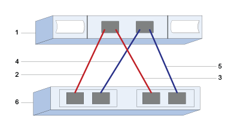

= SAS 구성을 기록합니다
:allow-uri-read: 
:icons: font
:imagesdir: ../media/

[role="lead"]
이 페이지의 PDF를 생성하여 인쇄한 다음 다음 다음 워크시트를 사용하여 SAS 스토리지 구성 정보를 기록할 수 있습니다. 프로비저닝 작업을 수행하려면 이 정보가 필요합니다.

== 호스트 식별자입니다

|===
| 속성 표시기 번호 | 호스트(이니시에이터) 포트 접속입니다 | SAS 주소입니다 

 a| 
1
 a| 
호스트
 a| 
_해당 사항 없음 _

 a| 
2
 a| 
컨트롤러 A, 포트 1에 연결된 호스트(이니시에이터) 포트 1
 a| 

 a| 
3
 a| 
호스트(이니시에이터) 포트 1이 컨트롤러 B, 포트 1에 연결됩니다
 a| 

 a| 
4
 a| 
컨트롤러 A, 포트 1에 연결된 호스트(이니시에이터) 포트 2
 a| 

 a| 
5
 a| 
컨트롤러 B, 포트 1에 연결된 호스트(이니시에이터) 포트 2
 a| 

|===

== 타겟 식별자

권장 구성은 두 개의 대상 포트로 구성됩니다.

== 호스트 매핑 중

|===

 a| 
호스트 이름 매핑
 a| 

 a| 
호스트 OS 유형입니다
 a| 

|===