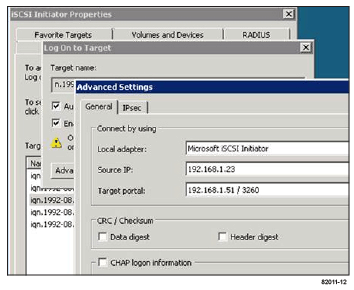

= iSCSI 관련 작업을 수행합니다
:allow-uri-read: 
:experimental: 
:icons: font
:imagesdir: ../media/

[role="lead"]
iSCSI 프로토콜의 경우 스위치를 구성하고, 스토리지 측과 호스트 측에서 네트워킹을 구성한 다음 IP 네트워크 연결을 확인합니다.

== 1단계: 스위치 구성 -- iSCSI, Windows

iSCSI에 대한 공급업체의 권장 사항에 따라 스위치를 구성합니다. 이러한 권장 사항에는 구성 지시문과 코드 업데이트가 모두 포함될 수 있습니다.

.필요한 것
* 고가용성을 위한 2개의 별도 네트워크. VLAN 또는 두 개의 별도 네트워크를 사용하여 iSCSI 트래픽을 분리하여 네트워크 세그먼트를 구분해야 합니다.
* 하드웨어 흐름 제어 전송 및 수신 * 엔드 투 엔드 * 를 활성화했습니다.
* 우선 순위 흐름 제어를 비활성화했습니다.
* 필요한 경우 점보 프레임을 사용하도록 설정합니다.

NOTE: 컨트롤러의 스위치 포트에서는 포트 채널/LACP가 지원되지 않습니다. 호스트측 LACP는 권장되지 않습니다. 다중 경로가 동일한 이점 이상을 제공합니다.

.단계
스위치 공급업체의 설명서를 참조하십시오.

== 2단계: 네트워킹 구성 -- iSCSI 창

데이터 저장소 요구 사항에 따라 여러 가지 방법으로 iSCSI 네트워크를 설정할 수 있습니다. 사용자 환경에 가장 적합한 구성을 선택하는 방법은 네트워크 관리자에게 문의하십시오.

기본 이중화를 사용하여 iSCSI 네트워크를 구성하는 효과적인 전략은 각 호스트 포트와 각 컨트롤러에서 포트 하나를 개별 스위치에 연결하고 VLAN을 사용하여 개별 네트워크 세그먼트에서 각 호스트 및 컨트롤러 포트 세트를 분할하는 것입니다.

.필요한 것
* 하드웨어 흐름 제어 전송 및 수신 * 엔드 투 엔드 * 를 활성화했습니다.
* 우선 순위 흐름 제어를 비활성화했습니다.
* 필요한 경우 점보 프레임을 사용하도록 설정합니다.
+
성능상의 이유로 IP SAN 내에서 점보 프레임을 사용하는 경우, 점보 프레임을 사용하도록 어레이, 스위치 및 호스트를 구성해야 합니다. 호스트와 스위치에서 점보 프레임을 활성화하는 방법에 대한 자세한 내용은 운영 체제 및 스위치 설명서를 참조하십시오. 어레이에서 점보 프레임을 활성화하려면 3단계의 절차를 완료하십시오.

.단계
스위치 공급업체의 설명서를 참조하십시오.

NOTE: 많은 네트워크 스위치는 IP 오버헤드를 위해 9,000바이트 이상으로 구성해야 합니다. 자세한 내용은 스위치 설명서를 참조하십시오.

== 3단계: 어레이 측 네트워킹 구성 -- iSCSI, Windows

SANtricity 시스템 관리자 GUI를 사용하여 어레이 측에서 iSCSI 네트워킹을 구성합니다.

.필요한 것
* 스토리지 어레이 컨트롤러 중 하나의 IP 주소 또는 도메인 이름입니다.
* 스토리지 어레이에 대한 적절한 보안 액세스를 위해 구성된 System Manager GUI, 즉 역할 기반 액세스 제어(RBAC) 또는 LDAP 및 디렉토리 서비스에 대한 암호입니다. 액세스 관리에 대한 자세한 내용은 SANtricity 시스템 관리자 온라인 도움말을 참조하십시오.

.이 작업에 대해
이 작업은 하드웨어 페이지에서 iSCSI 포트 구성에 액세스하는 방법을 설명합니다. 시스템 [설정 > iSCSI 포트 구성] 메뉴에서 구성에 액세스할 수도 있습니다.

.단계
. 브라우저에서 '+https://<DomainNameOrIPAddress>+` URL을 입력합니다
+
IPAddress는 스토리지 배열 컨트롤러 중 하나의 주소입니다.

+
구성되지 않은 어레이에서 SANtricity 시스템 관리자를 처음 열면 관리자 암호 설정 프롬프트가 나타납니다. 역할 기반 액세스 관리는 관리자, 지원, 보안 및 모니터링의 네 가지 로컬 역할을 구성합니다. 마지막 세 개의 역할에는 추측할 수 없는 임의의 암호가 있습니다. admin 역할의 암호를 설정한 후 admin 자격 증명을 사용하여 모든 암호를 변경할 수 있습니다. 4개의 로컬 사용자 역할에 대한 자세한 내용은 SANtricity 시스템 관리자 온라인 도움말을 참조하십시오.

. 관리자 암호 설정 및 암호 확인 필드에 관리자 역할에 대한 System Manager 암호를 입력한 다음 * 암호 설정 * 버튼을 선택합니다.
+
System Manager를 열고 풀, 볼륨 그룹, 워크로드 또는 알림이 구성되지 않은 경우 설정 마법사가 시작됩니다.

. 설정 마법사를 닫습니다.
+
나중에 마법사를 사용하여 추가 설정 작업을 완료합니다.

. 하드웨어 * 를 선택합니다.
. 그래픽에 드라이브가 표시되면 * 쉘프 뒷면 표시 * 를 클릭합니다.
+
그래픽이 변경되어 드라이브 대신 컨트롤러가 표시됩니다.

. 구성할 iSCSI 포트가 있는 컨트롤러를 클릭합니다.
+
컨트롤러의 상황에 맞는 메뉴가 나타납니다.

. iSCSI 포트 구성 * 을 선택합니다.
+
iSCSI 포트 구성 대화 상자가 열립니다.

. 드롭다운 목록에서 구성할 포트를 선택한 후 * 다음 * 을 클릭합니다.
. 구성 포트 설정을 선택한 후 * 다음 * 을 클릭합니다.
+
모든 포트 설정을 보려면 대화 상자 오른쪽에 있는 * 추가 포트 설정 표시 * 링크를 클릭합니다.

+
|===
| 포트 설정 | 설명 

 a| 
이더넷 포트 속도를 구성했습니다
 a| 
원하는 속도를 선택합니다. 드롭다운 목록에 표시되는 옵션은 네트워크에서 지원할 수 있는 최대 속도(예: 10Gbps)에 따라 달라집니다.

NOTE: E5700 및 EF570 컨트롤러의 선택적 iSCSI 호스트 인터페이스 카드는 속도를 자동 협상하지 않습니다. 각 포트의 속도를 10Gb 또는 25Gb로 설정해야 합니다. 모든 포트는 동일한 속도로 설정되어야 합니다.

 a| 
IPv4 사용/IPv6 사용
 a| 
IPv4 및 IPv6 네트워크에 대한 지원을 활성화하려면 하나 또는 두 옵션을 모두 선택하십시오.

 a| 
TCP 수신 대기 포트(* 추가 포트 설정 표시 * 를 클릭하여 사용 가능)
 a| 
필요한 경우 새 포트 번호를 입력합니다. 수신 대기 포트는 컨트롤러가 호스트 iSCSI 초기자의 iSCSI 로그인을 수신 대기하기 위해 사용하는 TCP 포트 번호입니다. 기본 수신 대기 포트는 3260입니다. 3260 또는 49152와 65535 사이의 값을 입력해야 합니다.

 a| 
MTU 크기(* 추가 포트 설정 표시 * 를 클릭하여 사용 가능)
 a| 
필요한 경우 MTU(Maximum Transmission Unit)에 대한 새 크기를 바이트 단위로 입력합니다. 기본 MTU(Maximum Transmission Unit) 크기는 프레임당 1,500바이트입니다. 1500에서 9000 사이의 값을 입력해야 합니다.

 a| 
ICMP Ping 응답을 활성화합니다
 a| 
ICMP(Internet Control Message Protocol)를 활성화하려면 이 옵션을 선택합니다. 네트워크로 연결된 컴퓨터의 운영 체제는 이 프로토콜을 사용하여 메시지를 전송합니다. 이러한 ICMP 메시지는 호스트에 연결할 수 있는지 여부와 해당 호스트와 패킷을 주고 받는 데 걸리는 시간을 결정합니다.

|===
+
IPv4 사용 * 을 선택한 경우 * 다음 * 을 클릭하면 IPv4 설정을 선택할 수 있는 대화 상자가 열립니다. IPv6 사용 * 을 선택한 경우 * 다음 * 을 클릭하면 IPv6 설정을 선택할 수 있는 대화 상자가 열립니다. 두 옵션을 모두 선택한 경우 IPv4 설정에 대한 대화 상자가 먼저 열리고 * 다음 * 을 클릭하면 IPv6 설정에 대한 대화 상자가 열립니다.

. IPv4 및/또는 IPv6 설정을 자동 또는 수동으로 구성합니다. 모든 포트 설정을 보려면 대화 상자 오른쪽에 있는 * 추가 설정 표시 * 링크를 클릭합니다.
+
|===
| 포트 설정 | 설명 

 a| 
자동으로 구성을 가져옵니다
 a| 
구성을 자동으로 가져오려면 이 옵션을 선택합니다.

 a| 
수동으로 정적 설정을 지정합니다
 a| 
이 옵션을 선택한 다음 필드에 정적 주소를 입력합니다. IPv4의 경우 네트워크 서브넷 마스크 및 게이트웨이를 포함합니다. IPv6의 경우 라우팅 가능한 IP 주소와 라우터 IP 주소를 포함합니다.

 a| 
VLAN 지원을 활성화합니다(* 추가 설정 표시 * 를 클릭하여 사용 가능).
 a| 

NOTE: 이 옵션은 iSCSI 환경에서만 사용할 수 있습니다. NVMe over RoCE 환경에서는 사용할 수 없습니다.

VLAN을 활성화하고 해당 ID를 입력하려면 이 옵션을 선택합니다. VLAN은 동일한 스위치, 동일한 라우터 또는 둘 다에서 지원되는 다른 물리적 LAN(가상 LAN)과 물리적으로 분리된 것처럼 동작하는 논리 네트워크입니다.

 a| 
이더넷 우선 순위 활성화(* 추가 설정 표시 * 를 클릭하여 사용 가능)
 a| 

NOTE: 이 옵션은 iSCSI 환경에서만 사용할 수 있습니다. NVMe over RoCE 환경에서는 사용할 수 없습니다.

네트워크 액세스 우선 순위를 결정하는 매개변수를 활성화하려면 이 옵션을 선택합니다. 슬라이더를 사용하여 1과 7 사이의 우선순위를 선택합니다. 이더넷과 같은 공유 LAN(Local Area Network) 환경에서는 많은 스테이션이 네트워크 액세스에 대해 경합할 수 있습니다. 액세스는 선착순으로 제공됩니다. 두 스테이션이 동시에 네트워크에 액세스하려고 시도할 수 있으며, 이로 인해 두 스테이션이 다시 꺼졌다가 다시 시도하기 전에 대기하게 됩니다. 스위치 포트에 하나의 스테이션만 연결되어 있는 스위치 이더넷의 경우 이 프로세스가 최소화됩니다.

|===
. 마침 * 을 클릭합니다.
. System Manager를 닫습니다.

== 4단계: 호스트측 네트워킹 구성 -- iSCSI

Microsoft iSCSI Initiator가 스토리지와 세션을 설정할 수 있도록 호스트 측에서 iSCSI 네트워킹을 구성해야 합니다.

.필요한 것
* iSCSI 스토리지 트래픽을 전송하는 데 사용되는 완전히 구성된 스위치입니다.
* 하드웨어 흐름 제어 전송 및 수신 * 엔드 투 엔드 * 를 활성화했습니다
* 우선 순위 흐름 제어를 비활성화했습니다.
* 스토리지 측 iSCSI 구성이 완료되었습니다.
* 컨트롤러에 있는 각 포트의 IP 주소입니다.

.이 작업에 대해
이 지침에서는 두 개의 NIC 포트가 iSCSI 트래픽에 사용되는 것으로 가정합니다.

.단계
. 사용하지 않는 네트워크 어댑터 프로토콜을 비활성화합니다.
+
이러한 프로토콜에는 QoS, 파일 및 인쇄 공유, NetBIOS 등이 포함되며 이에 국한되지 않습니다.

. 호스트의 터미널 창에서 ">iscsicpl.exe"를 실행하여 * iSCSI 초기자 속성 * 대화 상자를 엽니다.
. ** 검색** 탭에서 * 포털 검색 * 을 선택한 다음 iSCSI 대상 포트 중 하나의 IP 주소를 입력합니다.
. ** Targets** 탭에서 검색한 첫 번째 대상 포털을 선택한 다음 * Connect * 를 선택합니다.
. 다중 경로 사용 * 을 선택하고 * 즐겨찾기 대상 목록에 이 연결 추가 * 를 선택한 다음 ** 고급** 을 선택합니다.
. 로컬 어댑터 * 의 경우 * Microsoft iSCSI 초기자 * 를 선택합니다.
. 초기자 IP * 의 경우 iSCSI 대상 중 하나와 동일한 서브넷 또는 VLAN에 있는 포트의 IP 주소를 선택합니다.
. 대상 IP * 의 경우 위 단계에서 선택한 * 초기자 IP * 와 동일한 서브넷에 있는 포트의 IP 주소를 선택합니다.
. 나머지 확인란에 대한 기본값을 그대로 유지한 다음 * 확인 * 을 선택합니다.
. 대상에 연결 * 대화 상자로 돌아갈 때 * 확인 * 을 다시 선택합니다.
. 설정할 스토리지 시스템에 대한 각 이니시에이터 포트 및 세션(논리 경로)에 대해 이 절차를 반복합니다.
+

== 5단계: IP 네트워크 연결 확인 -- iSCSI, Windows

ping 테스트를 사용하여 호스트와 어레이가 통신할 수 있는지 확인하여 IP(인터넷 프로토콜) 네트워크 연결을 확인합니다.

. 메뉴: 시작 [모든 프로그램 > 보조프로그램 > 명령 프롬프트]를 선택한 다음 점보 프레임 활성화 여부에 따라 Windows CLI를 사용하여 다음 명령 중 하나를 실행합니다.
+
** 점보 프레임이 활성화되어 있지 않으면 다음 명령을 실행합니다.
+
[listing]
----
ping -s <hostIP\> <targetIP\>
----
** 점보 프레임이 활성화된 경우 페이로드 크기가 8,972바이트인 ping 명령을 실행합니다. IP 및 ICMP 결합된 헤더는 28바이트로, 페이로드에 추가되면 9,000바이트입니다. f 스위치는 Ddf(조각 안 함) 비트를 설정합니다. l 스위치를 사용하여 크기를 설정할 수 있습니다. 이러한 옵션을 사용하면 9,000바이트의 점보 프레임을 iSCSI 이니시에이터와 타겟 간에 성공적으로 전송할 수 있습니다.
+
[listing]
----
ping -l 8972 -f <iSCSI_target_IP_address\>
----
+
이 예에서 iSCSI 대상 IP 주소는 192.0.2.8 입니다.

+
[listing]
----
C:\>ping -l 8972 -f 192.0.2.8
Pinging 192.0.2.8 with 8972 bytes of data:
Reply from 192.0.2.8: bytes=8972 time=2ms TTL=64
Reply from 192.0.2.8: bytes=8972 time=2ms TTL=64
Reply from 192.0.2.8: bytes=8972 time=2ms TTL=64
Reply from 192.0.2.8: bytes=8972 time=2ms TTL=64
Ping statistics for 192.0.2.8:
  Packets: Sent = 4, Received = 4, Lost = 0 (0% loss),
Approximate round trip times in milli-seconds:
  Minimum = 2ms, Maximum = 2ms, Average = 2ms
----

. 각 호스트의 이니시에이터 주소(iSCSI에 사용되는 호스트 이더넷 포트의 IP 주소)에서 각 컨트롤러의 iSCSI 포트로 'ping' 명령을 실행합니다. 구성에 있는 각 호스트 서버에서 이 작업을 수행하고 필요에 따라 IP 주소를 변경합니다.
+

NOTE: 명령이 실패한 경우(예: 패킷이 조각화되어야 하지만 DF 집합을 반환함) 호스트 서버, 스토리지 컨트롤러 및 스위치 포트의 이더넷 인터페이스에 대한 MTU 크기(점보 프레임 지원)를 확인합니다.

== 6단계: 구성을 기록합니다

이 페이지의 PDF를 생성하여 인쇄한 다음 다음 워크시트를 사용하여 iSCSI 스토리지 구성 정보를 기록할 수 있습니다. 프로비저닝 작업을 수행하려면 이 정보가 필요합니다.

=== 권장 구성

권장 구성은 2개의 이니시에이터 포트와 1개 이상의 VLAN이 있는 4개의 타겟 포트로 구성됩니다.

image::../media/50001_01_conf-win.gif[50001 conf win]

=== 타겟 IQN입니다

|===
| 속성 표시기 번호 | 대상 포트 연결입니다 | IQN을 선택합니다 

 a| 
2
 a| 
대상 포트
 a| 

|===

=== 호스트 이름 매핑 중

|===
| 속성 표시기 번호 | 호스트 정보입니다 | 이름 및 유형 

 a| 
1
 a| 
호스트 이름 매핑 중
 a| 

 a| 
 a| 
호스트 OS 유형입니다
 a| 

|===