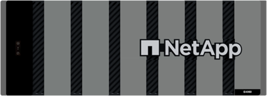

= E-Series 하드웨어 개요
:allow-uri-read: 
:icons: font
:imagesdir: ../media/

[role="lead"]
E-Series 스토리지 어레이는 다양한 구성과 모델로 제공됩니다.

스토리지 어레이에는 쉘프, 컨트롤러, 드라이브, 소프트웨어 및 펌웨어가 포함되어 있습니다. 어레이는 랙 또는 캐비닛에 설치할 수 있으며 12, 24 또는 60 드라이브 쉘프에 1개 또는 2개의 컨트롤러에 맞게 사용자 지정 가능한 하드웨어를 제공합니다. 여러 인터페이스 유형 및 다양한 호스트 운영 체제에서 스토리지 어레이를 SAN에 연결할 수 있습니다.

E-Series 어레이는 다음 모델에서 제공됩니다.

* E2800 시리즈 - 엔트리 레벨 하이브리드
* EF280 시리즈 -- 엔트리 레벨 All 플래시
* EF300 시리즈 -- 엔트리 레벨 All-Flash, All NVMe
* E4000 시리즈 - 엔트리 레벨 하이브리드
* E5700 시리즈 -- 미드레인지 하이브리드
* EF570 시리즈 -- 미드레인지 All-Flash
* EF600 시리즈 -- 미드레인지 All-Flash, All NVMe
* EF600C 시리즈 -- 미드레인지 All-Flash, All NVMe
* EF300C 시리즈 -- 미드레인지 All-Flash, All NVMe

NOTE: SANtricity OS 11.80GA 이상의 경우 E2800, EF280, E5700, EF570, EF600, 및 EF300 스토리지.

[role="tabbed-block"]
====
.E2800 모델
--
랙 크기::
+
--
* 2U12(랙 유닛 2개, 드라이브 12개)
* 2U24(랙 유닛 2개, 드라이브 24개)
+
image::../media/e2800_2u_front.gif[E2800 2U]

* 4U60(랙 유닛 4개, 드라이브 60개)
+
image::../media/e2860_front.gif["E2800 4U"]

--
드라이브::
+
--
에서는 다음 드라이브 유형을 지원합니다.

* 3.5" NL-SAS(최대 180)
* 2.5인치 SAS SSD(최대 120개)
* 2.5" SAS HDD(최대 180)

--
인터페이스::
+
--
다음 인터페이스에서 사용 가능:

* 12Gb SAS
* 10Gb 또는 25Gb iSCSI
* 16Gb 또는 32Gb 파이버 채널

--

--
.EF280 모델
--
랙 크기::
+
--
2U24(랙 유닛 2개, 드라이브 24개)

image:../media/ef570_front.gif["EF280 2U"]

--
드라이브::
+
--
최대 96개의 SSD 2.5" 드라이브를 지원합니다

--
인터페이스::
+
--
다음 인터페이스에서 사용 가능:

* 12Gb SAS
* 10Gb 또는 25Gb iSCSI
* 16Gb 또는 32Gb 파이버 채널

--

--
.EF300 모델
--
랙 크기::
+
--
2U24(랙 유닛 2개, 드라이브 24개)

image:../media/ef570_front.gif["EF300 2U"]

--
드라이브::
+
--
컨트롤러당 단일 HIC(호스트 인터페이스 카드)를 통해 다음 드라이브 지원

* NVMe SSD 드라이브: 컨트롤러 쉘프에 최대 24개의 NVMe SSD 드라이브 장착 가능
* NL-SAS 드라이브 및 확장 셸프: DE212C 및 DE460C 셸프의 혼합은 DE212C 쉘프만 사용하지 않는 한 총 240개의 NL-SAS 드라이브 슬롯과 4개의 확장 셸프를 초과할 수 없으며, 8개의 DE212C 쉘프가 허용됩니다. 예를 들어, DE460C 쉘프 4개, DE212C 쉘프 8개, DE460C 쉘프 2개, 쉘프 2개 등 쉘프 2개.
* 확장 쉘프가 포함된 SAS SSD 드라이브: DE212C, DE224C 및 DE460C 쉘프의 모든 혼합이 DE212C 쉘프만 사용하지 않는 한 총 96개의 SAS SSD 드라이브 슬롯 및 4개의 확장 쉘프를 초과할 수 없습니다. 따라서 DE212C 쉘프 8개가 허용됩니다. 예를 들어, DE460C 쉘프 1개 + DE224C 쉘프 1개 + DE212C 쉘프 1개 또는 DE224C 쉘프 4개 또는 DE212C 쉘프 8개.

NOTE: SANtricity OS 11.80GA 이상의 경우 EF300은 기본 트레이에 드라이브가 없는 확장 쉘프 구성을 지원합니다 이 구성을 사용할 경우 시스템 전원을 켜기 전에 확장 쉘프 내에 드라이브가 장착되어 있고 기본 트레이에 올바르게 연결되어 있는지 확인하십시오.

--
인터페이스::
+
--
다음 인터페이스에서 사용 가능:

* 25GB iSCSI
* 32Gb NVMe/파이버 채널
* 32Gb SCSI/파이버 채널
* 100GB iSER/IB
* 100GB SRP/IB
* 100Gb NVMe/IB
* 100Gb NVMe/RoCE

--

--
.EF300C 모델
--
랙 크기::
+
--
2U24(랙 유닛 2개, 드라이브 24개)

image:../media/ef570_front.gif["EF300 2U"]

--
드라이브::
+
--
* 30TB 및 60TB 용량 NVMe SSD 드라이브 지원
* NVMe SSD 드라이브: 컨트롤러 쉘프에 최대 24개의 NVMe SSD 드라이브 장착 가능
* NL-SAS 드라이브 및 확장 셸프: DE212C 및 DE460C 셸프의 혼합은 DE212C 쉘프만 사용하지 않는 한 총 240개의 NL-SAS 드라이브 슬롯과 4개의 확장 셸프를 초과할 수 없으며, 8개의 DE212C 쉘프가 허용됩니다. 예를 들어, DE460C 쉘프 4개, DE212C 쉘프 8개, DE460C 쉘프 2개, 쉘프 2개 등 쉘프 2개.
* 확장 쉘프가 포함된 SAS SSD 드라이브: DE212C, DE224C 및 DE460C 쉘프의 모든 혼합이 DE212C 쉘프만 사용하지 않는 한 총 96개의 SAS SSD 드라이브 슬롯 및 4개의 확장 쉘프를 초과할 수 없습니다. 따라서 DE212C 쉘프 8개가 허용됩니다. 예를 들어, DE460C 쉘프 1개 + DE224C 쉘프 1개 + DE212C 쉘프 1개 또는 DE224C 쉘프 4개 또는 DE212C 쉘프 8개.
+

NOTE: SANtricity OS 11.80GA 이상의 경우 EF300은 기본 트레이에 드라이브가 없는 확장 쉘프 구성을 지원합니다 이 구성을 사용할 경우 시스템 전원을 켜기 전에 확장 쉘프 내에 드라이브가 장착되어 있고 기본 트레이에 올바르게 연결되어 있는지 확인하십시오. *

--
인터페이스::
+
--
다음 인터페이스에서 사용 가능:

* 25GB iSCSI
* 32Gb NVMe/파이버 채널
* 32Gb SCSI/파이버 채널
* 100GB iSER/IB
* 100GB SRP/IB
* 100Gb NVMe/IB
* 100Gb NVMe/RoCE

--

--
.E5700 모델
--
랙 크기::
+
--
* 2U24(랙 유닛 2개, 드라이브 24개)
+
image::../media/e2800_2u_front.gif[E5700 2U]

* 4U60(랙 유닛 4개, 드라이브 60개)
+
image::../media/e2860_front.gif[E5700 4U]

--
드라이브::
+
--
최대 480개의 다음 드라이브 유형을 지원합니다.

* 3.5" NL-SAS 드라이브
* 2.5인치 SAS SSD 드라이브
* 2.5인치 SAS HDD 드라이브

--
인터페이스::
+
--
다음 인터페이스에서 사용 가능:

* 12Gb SAS
* 10Gb 또는 25Gb iSCSI
* 16Gb 또는 32Gb 파이버 채널
* 32Gb NVMe/파이버 채널
* 100GB iSER/IB
* 100GB SRP/IB
* 100Gb NVMe/IB
* 100Gb NVMe/RoCE

--

--
.EF570 모델
--
랙 크기::
+
--
2U24(랙 유닛 2개, 드라이브 24개)

image:../media/ef570_front.gif["EF570 2U"]

--
드라이브::
+
--
최대 120개의 SSD 2.5" 드라이브를 지원합니다

--
인터페이스::
+
--
다음 인터페이스에서 사용 가능:

* 12Gb SAS
* 10Gb 또는 25Gb iSCSI
* 16Gb 또는 32Gb 파이버 채널
* 32Gb NVMe/파이버 채널
* 100GB iSER/IB
* 100GB SRP/IB
* 100Gb NVMe/IB
* 100Gb NVMe/RoCE

--

--
.EF600 모델
--
랙 크기::
+
--
2U24(랙 유닛 2개, 드라이브 24개)

image:../media/ef570_front.gif["EF600 2U"]

--
드라이브::
+
--
컨트롤러당 단일 HIC(호스트 인터페이스 카드)를 통해 다음 드라이브 지원

* NVMe SSD 드라이브: 컨트롤러 쉘프에 최대 24개의 NVMe SSD 드라이브 장착 가능
* NL-SAS 드라이브 및 확장 셸프: DE212C 및 DE460C 셸프의 혼합은 DE212C 쉘프만 사용하지 않는 한 총 420개의 NL-SAS 드라이브 슬롯과 7개의 확장 셸프를 초과할 수 없으며, 8개의 DE212C 쉘프가 허용됩니다. 예를 들어, DE460C 쉘프 7개, DE212C 쉘프 8개, DE460C 쉘프 5개, 쉘프 2개 등.
* 확장 쉘프가 포함된 SAS SSD 드라이브: DE212C, DE224C 및 DE460C 쉘프의 모든 혼합이 DE212C 쉘프만 사용하지 않는 한 총 96개의 SAS SSD 드라이브 슬롯 및 7개의 확장 쉘프를 초과할 수 없습니다. 따라서 DE212C 쉘프 8개가 허용됩니다. 예를 들어, DE460C 쉘프 1개 + DE224C 쉘프 1개 + DE212C 쉘프 1개 또는 DE224C 쉘프 4개 또는 DE212C 쉘프 8개

NOTE: SANtricity OS 11.80GA 이상의 경우 EF600은 기본 트레이에 드라이브가 없는 확장 쉘프 구성을 지원합니다 이 구성을 사용할 경우 시스템 전원을 켜기 전에 확장 쉘프 내에 드라이브가 장착되어 있고 기본 트레이에 올바르게 연결되어 있는지 확인하십시오.

--
인터페이스::
+
--
다음 인터페이스에서 사용 가능:

* 25GB iSCSI
* 32Gb NVMe/파이버 채널
* 32Gb SCSI/파이버 채널
* 100GB iSER/IB
* 100GB SRP/IB
* 100Gb NVMe/IB
* 100Gb NVMe/RoCE
* 200GB iSER/IB
* 200GB NVMe/IB
* 200GB NVMe/RoCE

--

--
.EF600C 모델
--
랙 크기::
+
--
2U24(랙 유닛 2개, 드라이브 24개)

image:../media/ef570_front.gif["EF600 2U"]

--
드라이브::
+
--
컨트롤러당 단일 HIC(호스트 인터페이스 카드)를 통해 다음 드라이브 지원

* 30TB 및 60TB 용량 NVMe SSD 드라이브 지원
* NVMe SSD 드라이브: 컨트롤러 쉘프에 최대 24개의 NVMe SSD 드라이브 장착 가능
* NL-SAS 드라이브 및 확장 셸프: DE212C 및 DE460C 셸프의 혼합은 DE212C 쉘프만 사용하지 않는 한 총 420개의 NL-SAS 드라이브 슬롯과 7개의 확장 셸프를 초과할 수 없으며, 8개의 DE212C 쉘프가 허용됩니다. 예를 들어, DE460C 쉘프 7개, DE212C 쉘프 8개, DE460C 쉘프 5개, 쉘프 2개 등.
* 확장 쉘프가 포함된 SAS SSD 드라이브: DE212C, DE224C 및 DE460C 쉘프의 모든 혼합이 DE212C 쉘프만 사용하지 않는 한 총 96개의 SAS SSD 드라이브 슬롯 및 7개의 확장 쉘프를 초과할 수 없습니다. 따라서 DE212C 쉘프 8개가 허용됩니다. 예를 들어, DE460C 쉘프 1개 + DE224C 쉘프 1개 + DE212C 쉘프 1개 또는 DE224C 쉘프 4개 또는 DE212C 쉘프 8개

NOTE: SANtricity OS 11.80GA 이상의 경우 EF600은 기본 트레이에 드라이브가 없는 확장 쉘프 구성을 지원합니다 이 구성을 사용할 경우 시스템 전원을 켜기 전에 확장 쉘프 내에 드라이브가 장착되어 있고 기본 트레이에 올바르게 연결되어 있는지 확인하십시오.

--
인터페이스::
+
--
다음 인터페이스에서 사용 가능:

* 25GB iSCSI
* 32Gb NVMe/파이버 채널
* 32Gb SCSI/파이버 채널
* 100GB iSER/IB
* 100GB SRP/IB
* 100Gb NVMe/IB
* 100Gb NVMe/RoCE
* 200GB iSER/IB
* 200GB NVMe/IB
* 200GB NVMe/RoCE

--

--
.E4000 모델
--
랙 크기::
+
--
* 2U12(랙 유닛 2개, 드라이브 12개)
+
image::../media/e4000_2u_front.png[E4000 2U]

* 4U60(랙 유닛 4개, 드라이브 60개)
+

--
드라이브::
+
--
에서는 다음 드라이브 유형을 지원합니다.

* 3.5" NL-SAS(최대 300)
* 2.5인치 SAS SSD(최대 120개)

--
인터페이스::
+
--
다음 인터페이스에서 사용 가능:

* 12Gb SAS
* 1GB 또는 10GBASE-T iSCSI
* 1GB, 10Gb 또는 25GB iSCSI
* 8GB, 16Gb 또는 32Gb FC
* 12gb SAS를 사용합니다

--

--
====