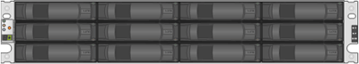

= E-Series 쉘프 유형
:allow-uri-read: 
:icons: font
:imagesdir: ../media/

[role="lead"]
E-Series 시스템은 다양한 쉘프 크기로 제공됩니다.

|===
| 쉘프 유형 | 그림 

 a| 
* DE212C: *

* 2u12(랙 유닛 2개, 드라이브 12개)
* 3.5" HDD 및/또는 2.5" SSD(어댑터 포함)
* E2800 컨트롤러만 해당합니다

 a| 

 a| 
* DE224C: *

* 2u24(랙 유닛 2개, 드라이브 24개)
* 2.5인치 HDD 및/또는 2.5인치 SSD 드라이브
* E2800, EF280, E5700 및 EF570 컨트롤러

 a| 
image:../media/e2824_front.gif[""]

 a| 
* DE460C: *

* 4u60(랙 유닛 4개, 드라이브 60개)
* 3.5" 및 2.5" 드라이브(NL-SAS, SAS 및 SSD)
* E2800 및 E5700 컨트롤러

 a| 
image:../media/de460c.gif[""]

 a| 
* NE224: *

* 2u24(랙 유닛 2개, 드라이브 24개)
* 2.5인치 NVMe SSD 드라이브
* EF300 및 EF600 컨트롤러

 a| 
image:../media/ne224.gif[""]

|===