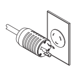

= 필요한 도구와 장비를 수집합니다
:allow-uri-read: 
:icons: font
:imagesdir: ../media/

[role="lead"]
3040 40U 캐비닛을 설치하기 전에 필요한 도구와 장비가 있는지 확인하십시오.

.단계
. 다음 표에 나열된 모든 항목을 수집합니다.
+
|===
|  | 항목 | 캐비닛에 포함되어 있습니다 

 a| 
image:../media/83009_02.gif[""]
 a| 
* 3/4인치 렌치 * (운송 상자에 제공됨) -- 캐비닛 아래에 있는 수평 조정 받침대를 올리거나 내립니다.

* 1/4인치 앨런 렌치 * -- 캐비닛 전면에서 안정성 받침대를 올리고 내립니다.
 a| 

 a| 
* NEMA L6-30 *

 a| 
* AC 전원 코드 * -- 캐비닛을 외부 전원(벽면 플러그)에 연결합니다.

** NEMA L6-30 커넥터는 미국 및 캐나다에서 사용할 수 있습니다.
** IEC-60309 커넥터는 미국 및 캐나다를 제외한 전 세계에서 사용됩니다.

NOTE: 각 PDU는 독립 전원에 연결해야 합니다.
 a| 

 a| 
** IEC-60309**

image:../media/73122_01_dwg_iec_60309_power_cord.gif[""]

 a| 
image:../media/78038_21.png[""]
 a| 
** SAS 케이블**(선택 사항) – 각 드라이브 트레이에는 2개의 케이블이 포함되어 있으며 호스트측 케이블은 별도로 구입해야 합니다.

** 통신 케이블**(선택 사항) – 트레이를 호스트에 연결합니다.

필요한 추가 항목은 해당 컨트롤러 드라이브 트레이 설치 가이드를 참조하십시오.
 a| 

 a| 

 a| 
** 장착 가능한 케이블 스풀** – 과도한 케이블 길이와 케이블 라우팅을 수용하기 위해 수직 전원 분배 콘센트의 양쪽에 설치되어 있습니다. 각 컨트롤러 드라이브 트레이에는 케이블 스풀 2개가 포함되어 있습니다 케이블 스풀이 독립형 드라이브 트레이와 함께 제공됩니다.
 a| 

 a| 
 a| 
** 전단기** – 운송 상자에 있는 금속 밴드를 잘라냅니다.
 a| 

 a| 
 a| 
지게차**(옵션) – 선적 팔레트에서 캐비닛을 제거합니다.
 a| 

 a| 
 a| 
** 전면 패널 키트**(선택 사항) – 캐비닛 전면의 빈 베이를 덮습니다.
 a| 

 a| 
 a| 
** 정전기 방지 가방**(선택 사항) – 캐비닛의 설치 과정에서 분리되는 구성요소를 보호합니다.
 a| 

|===

