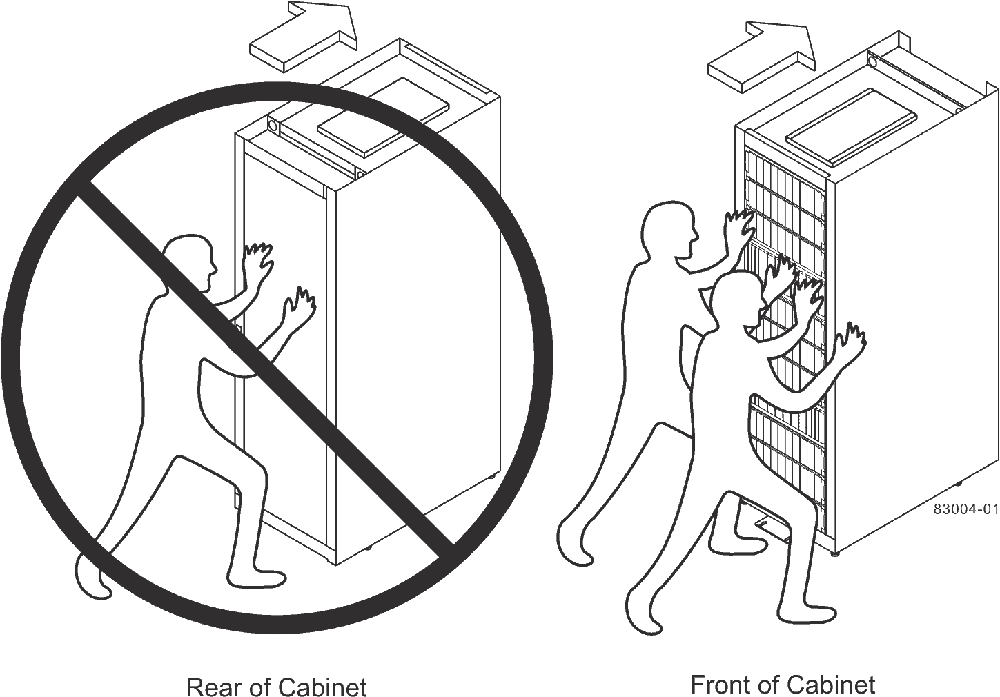

= 캐비닛을 영구 위치로 이동합니다
:allow-uri-read: 
:icons: font
:imagesdir: ../media/

[role="lead"]
3040 40U 캐비닛에는 캐비닛을 영구 위치로 이동할 수 있는 고성능 캐스터가 있습니다.

.시작하기 전에
* 지게차를 사용하지 않고 캐비닛을 팔레트 밖으로 굴리는 지침을 검토합니다.
+
배송 크래츠는 내장 램프와 지침을 제공합니다. 배송 상자 전면에 있는 포장 풀기 지침을 참조하십시오.

* 적재 도크와 캐비닛의 최종 목적지 사이의 모든 램프를 평가합니다.
+
모든 램프를 평가하여 캐비닛의 무게 중심(캐비닛이 램프 위에 있고 비스듬히 앉아 있는 경우)이 캐비닛의 설치 공간 이상으로 확장되지 않는지 확인해야 합니다.

.이 작업에 대해
대부분의 캐비닛에는 드라이브 트레이가 장착됩니다. 이 경우 캐비닛 전면 부분의 무게가 대부분 가벼워 무게 중심이 전면과 더 가깝게 됩니다.

.단계
. 캐비닛에서 가장 위에 있는 장치를 제거하여 캐비닛이 최종 위치로 안전하게 운반되도록 합니다. 경사가 있거나 경사가 10도를 초과하는 경사가 있는 경우 특히 중요합니다.
. 다음 그림에 표시된 올바른 방법을 사용하여 캐비닛을 영구 위치로 이동합니다. 캐비닛 전면이 아니라 앞쪽을 눌러야 합니다.
+

