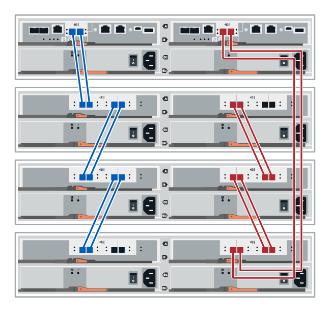

= 드라이브 쉘프 케이블링
:allow-uri-read: 
:icons: font
:imagesdir: ../media/

[role="lead"]
컨트롤러 쉘프의 각 컨트롤러를 드라이브 쉘프의 I/O 모듈(IOM)에 연결해야 합니다.

이 절차는 IOM12 및 IOM12B 드라이브 쉘프에 적용됩니다.

NOTE: IOM12B 모듈은 SANtricity OS 11.70.2 이상에서만 지원됩니다. IOM12B를 설치하거나 업그레이드하기 전에 컨트롤러의 펌웨어가 업데이트되었는지 확인합니다.

NOTE: 이 절차는 쉘프 IOM 핫 스왑 또는 교체와 유사할 경우 적용됩니다. 즉, IOM12 모듈을 다른 IOM12 모듈로 교체하거나 IOM12B 모듈을 다른 IOM12B 모듈로 교체할 수 있습니다. (이 쉘프는 IOM12 모듈 2개를 포함할 수 있으며, 또는 IOM12B 모듈 2개를 포함할 수 있습니다.)

구형 컨트롤러 쉘프를 DE212C, DE224C 또는 DE460에 케이블로 연결하는 경우 를 참조하십시오 https://mysupport.netapp.com/ecm/ecm_download_file/ECMLP2859057["기존 E27XX, E56XX 또는 EF560 컨트롤러 쉘프에 IOM 드라이브 쉘프를 추가합니다"^].

== E2800 및 E5700 케이블 연결

다음 정보는 E2800, E2800B, EF280, E5700, EF5700B 케이블 연결에 적용됩니다. 또는 EF570 컨트롤러 쉘프: DE212C, DE224C 또는 DE460 드라이브 쉘프

=== 12-드라이브 또는 24-드라이브 쉘프의 케이블 연결

컨트롤러 쉘프를 하나 이상의 12 드라이브 또는 24 드라이브 쉘프에 연결할 수 있습니다.

다음 이미지는 컨트롤러 쉘프와 드라이브 쉘프를 나타냅니다. 모델에서 포트를 찾으려면 를 참조하십시오 https://hwu.netapp.com/Controller/Index?platformTypeId=2357027["Hardware Universe"^].

==== 컨트롤러 쉘프, 12 드라이브 또는 24 드라이브 쉘프

=== 60-드라이브 쉘프의 케이블 연결

컨트롤러 쉘프를 하나 이상의 60-드라이브 쉘프에 연결할 수 있습니다.

다음 이미지는 컨트롤러 쉘프와 드라이브 쉘프를 나타냅니다. 모델에서 포트를 찾으려면 를 참조하십시오 https://hwu.netapp.com/Controller/Index?platformTypeId=2357027["Hardware Universe"^].

==== 컨트롤러 쉘프 및 60-드라이브 쉘프

image::../media/60_cabling.png[60 케이블 연결]

== EF300 및 EF600 케이블 연결

다음 정보는 EF300 또는 EF600 컨트롤러 쉘프를 DE212C, DE224C 또는 DE460 드라이브 쉘프에 연결하는 데 적용됩니다.

.시작하기 전에
EF300 또는 EF600을 케이블로 연결하기 전에 펌웨어를 최신 버전으로 업데이트해야 합니다. 펌웨어를 업데이트하려면 의 지침을 따르십시오 link:../upgrade-santricity/index.html["SANtricity OS 업그레이드 중"^].

=== 12-드라이브 또는 24-드라이브 쉘프의 케이블 연결

컨트롤러 쉘프를 하나 이상의 12 드라이브 또는 24 드라이브 쉘프에 연결할 수 있습니다.

다음 이미지는 컨트롤러 쉘프와 드라이브 쉘프를 나타냅니다. 모델에서 포트를 찾으려면 를 참조하십시오 https://hwu.netapp.com/Controller/Index?platformTypeId=2357027["Hardware Universe"^].

==== 컨트롤러 쉘프, 12 드라이브 또는 24 드라이브 쉘프

image::../media/ef_to_de224c_four_shelves.png[EF에서 de224c 4개 쉘프]

=== 60-드라이브 쉘프의 케이블 연결

컨트롤러 쉘프를 하나 이상의 60-드라이브 쉘프에 연결할 수 있습니다.

다음 이미지는 컨트롤러 쉘프와 드라이브 쉘프를 나타냅니다. 모델에서 포트를 찾으려면 를 참조하십시오 https://hwu.netapp.com/Controller/Index?platformTypeId=2357027["Hardware Universe"^].

==== 컨트롤러 쉘프 및 60-드라이브 쉘프

image::../media/ef_to_de460c.png[EF에서 de460c로]
