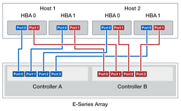

= 호스트를 컨트롤러 또는 스위치에 연결하기 위한 케이블 연결(E-Series)
:allow-uri-read: 
:icons: font
:imagesdir: ../media/

[role="lead"]
호스트를 컨트롤러에 직접 연결하거나(직접 연결 토폴로지) 스위치(스위치 토폴로지)를 사용하여 호스트를 컨트롤러에 연결할 수 있습니다.

== 직접 연결 토폴로지의 케이블 연결

직접 연결 토폴로지는 호스트 어댑터를 스토리지 시스템의 컨트롤러에 직접 연결합니다.

최대 성능을 보장하려면 사용 가능한 모든 호스트 어댑터 포트를 사용하십시오.

.HBA가 2개인 호스트 1개
다음 그림에서는 두 개의 HBA가 설치된 한 호스트의 예를 보여 줍니다.

image::../media/1host_2hbas_ieops-2145.svg[호스트 1개/HBA 2개 및 컨트롤러 케이블 연결 2개]

.HBA 2개가 있는 호스트 1개(대체 케이블 연결)
다음 그림에서는 두 개의 HBA가 설치된 한 호스트의 예를 보여 줍니다.

image::../media/1host_2hbas_alternate_wkflw_ieops-2147.svg[호스트 1개/HBA 2개 및 컨트롤러 케이블 연결 2개(대체 케이블 연결)]

.호스트당 2개의 HBA가 있는 호스트 2개
다음 그림에서는 각각 두 개의 HBA가 설치된 두 호스트의 예를 보여 줍니다.

== 스위치 토폴로지의 케이블 연결

스위치 토폴로지는 스위치를 사용하여 스토리지 시스템의 컨트롤러에 호스트를 연결합니다. 스위치는 호스트와 컨트롤러 사이에 사용되는 연결 유형을 지원해야 합니다.

다음 그림에서는 연결 예를 보여 줍니다. 프로비저닝 기능을 제공하는 스위치의 경우 각 이니시에이터와 타겟 쌍을 격리해야 합니다.

.호스트 2개 및 스위치 2개
image::../media/topology_host_fabric_generic.png[호스트 2개와 스위치 2개를 케이블로 연결합니다]

* (1) * _ 각 호스트 어댑터를 스위치에 직접 연결합니다. _

* (2) * _ 각 스위치를 컨트롤러의 호스트 포트에 직접 연결합니다. 최대 성능을 보장하려면 사용 가능한 모든 호스트 어댑터 포트를 사용하십시오. _
