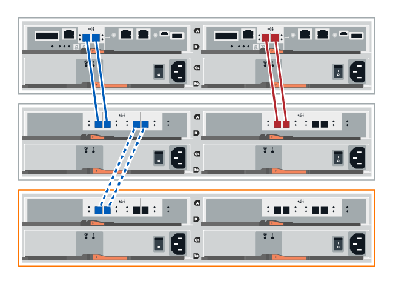

= 드라이브 쉘프 핫 추가
:allow-uri-read: 
:icons: font
:imagesdir: ../media/

[role="lead"]
스토리지 시스템의 다른 구성요소에 전원이 계속 공급되는 동안 새 드라이브 쉘프를 추가할 수 있습니다. 데이터에 대한 사용자 액세스를 중단하지 않고 스토리지 시스템 용량을 구성, 재구성, 추가 또는 재배치할 수 있습니다.

.시작하기 전에
이 절차가 복잡하기 때문에 다음을 사용하는 것이 좋습니다.

* 절차를 시작하기 전에 모든 단계를 읽으십시오.
* 필요한 경우 드라이브 쉘프 핫 추가가 반드시 필요합니다.

.이 작업에 대해
이 절차는 DE212C, DE224C 또는 DE460C 드라이브 쉘프를 E2800, E2800B, EF280, E5700, E5500B, EF570, EF300 또는 EF600 컨트롤러 쉘프

이 절차는 IOM12 및 IOM12B 드라이브 쉘프에 적용됩니다.

NOTE: IOM12B 모듈은 SANtricity OS 11.07.2 이상에서만 지원됩니다. IOM12B를 설치하거나 업그레이드하기 전에 컨트롤러의 펌웨어가 업데이트되었는지 확인합니다.

NOTE: 이 절차는 쉘프 IOM 핫 스왑 또는 교체와 유사할 경우 적용됩니다. 즉, IOM12 모듈을 다른 IOM12 모듈로 교체하거나 IOM12B 모듈을 다른 IOM12B 모듈로 교체할 수 있습니다. (이 쉘프는 IOM12 모듈 2개를 포함할 수 있으며, 또는 IOM12B 모듈 2개를 포함할 수 있습니다.)

구형 컨트롤러 쉘프를 DE212C, DE224C 또는 DE460에 케이블로 연결하는 경우 를 참조하십시오 https://mysupport.netapp.com/ecm/ecm_download_file/ECMLP2859057["기존 E27XX, E56XX 또는 EF560 컨트롤러 쉘프에 IOM 드라이브 쉘프를 추가합니다"^].

NOTE: 시스템 무결성을 유지하려면 제시된 순서대로 절차를 정확히 따라야 합니다.

== 1단계: 드라이브 쉘프 추가를 준비합니다

드라이브 쉘프를 핫 애드할 준비를 하려면 중요 이벤트를 확인하고 IOM 상태를 확인해야 합니다.

.시작하기 전에
* 스토리지 시스템의 전원을 새 드라이브 쉘프의 전원 요구사항을 수용할 수 있어야 합니다. 드라이브 쉘프의 전원 사양은 을 참조하십시오 https://hwu.netapp.com/Controller/Index?platformTypeId=2357027["Hardware Universe"^].
* 기존 스토리지 시스템의 케이블 연결 패턴은 이 절차에서 설명하는 적용 가능한 구성표 중 하나와 일치해야 합니다.

.단계
. SANtricity 시스템 관리자에서 * 지원 * > * 지원 센터 * > * 진단 * 을 선택합니다.
. 지원 데이터 수집 * 을 선택합니다.
+
지원 데이터 수집 대화 상자가 나타납니다.

. 수집 * 을 클릭합니다.
+
파일은 브라우저의 다운로드 폴더에 support-data.7z라는 이름으로 저장됩니다. 데이터가 기술 지원 부서에 자동으로 전송되지 않습니다.

. 지원 * > * 이벤트 로그 * 를 선택합니다.
+
이벤트 로그 페이지에는 이벤트 데이터가 표시됩니다.

. 중요 이벤트를 목록 맨 위로 정렬하려면 * Priority * 열의 머리글을 선택합니다.
. 지난 2-3주 동안 발생한 이벤트에 대해 시스템 중요 이벤트를 검토하고 최근 중요 이벤트가 해결되었거나 기타 방법으로 해결되었는지 확인합니다.
+

NOTE: 이전 2-3주 내에 해결되지 않은 중요 이벤트가 발생한 경우 절차를 중지하고 기술 지원 부서에 문의하십시오. 문제가 해결된 경우에만 절차를 계속합니다.

. 하드웨어 * 를 선택합니다.
. IOM(ESM) * 아이콘을 선택합니다.
+
image::../media/sam1130_ss_hardware_iom_icon.gif[sam1130 ss 하드웨어 IOM 아이콘]

+
Shelf Component Settings 대화 상자가 * IOMs(ESM) * 탭이 선택된 상태로 나타납니다.

. 각 IOM/ESM에 대해 표시된 상태가 _Optimal_인지 확인합니다.
. 추가 설정 표시 * 를 클릭합니다.
. 다음 조건이 존재하는지 확인하십시오.
+
** 감지된 ESM의 수는 시스템에 설치된 ESM 수와 각 드라이브 쉘프에 대한 ESM의 수와 일치합니다.
** 두 ESM 모두 통신이 정상임을 나타냅니다.
** 데이터 속도는 DE212C, DE224C 및 DE460C 드라이브 쉘프의 12Gb/s이고 기타 드라이브 트레이의 경우 6Gb/s입니다.

== 2단계: 드라이브 쉘프를 설치하고 전원을 켭니다

새 드라이브 쉘프 또는 이전에 설치된 드라이브 쉘프를 설치하고 전원을 켠 다음 주의가 필요한 LED가 있는지 확인합니다.

.단계
. 이전에 스토리지 시스템에 설치된 드라이브 쉘프를 설치하는 경우, 드라이브를 제거하십시오. 이 절차의 뒷부분에서 드라이브를 한 번에 하나씩 설치해야 합니다.
+
설치하려는 드라이브 쉘프의 설치 기록을 알 수 없는 경우, 이전에 스토리지 시스템에 설치된 것으로 가정해야 합니다.

. 스토리지 시스템 구성 요소를 보관하는 랙에 드라이브 쉘프를 설치합니다.
+

NOTE: 실제 설치 및 전원 케이블 연결에 대한 전체 절차는 해당 모델의 설치 지침을 참조하십시오. 해당 모델의 설치 지침에는 드라이브 쉘프를 안전하게 설치하기 위해 고려해야 하는 참고 사항 및 경고가 포함되어 있습니다.

. 새 드라이브 쉘프의 전원을 켜고 드라이브 쉘프에 있는 주황색 주의 LED가 켜져 있지 않은지 확인합니다. 가능한 경우 이 절차를 계속하기 전에 모든 고장 상태를 해결하십시오.

== 3단계: 시스템에 케이블을 연결합니다

다음 옵션 중 하나를 선택합니다.

* <<옵션 1: E2800 또는 E5700용 드라이브 쉘프 연결>>
* <<옵션 2: EF300 또는 EF600의 드라이브 쉘프 연결>>

구형 컨트롤러 쉘프를 DE212C, DE224C 또는 DE460에 케이블로 연결하는 경우 를 참조하십시오 https://mysupport.netapp.com/ecm/ecm_download_file/ECMLP2859057["기존 E27XX, E56XX 또는 EF560 컨트롤러 쉘프에 IOM 드라이브 쉘프를 추가합니다"^].

=== 옵션 1: E2800 또는 E5700용 드라이브 쉘프 연결

드라이브 쉘프를 컨트롤러 A에 연결하고 IOM 상태를 확인한 다음, 드라이브 쉘프를 컨트롤러 B에 연결합니다

.단계
. 드라이브 쉘프를 컨트롤러 A에 연결합니다
+
다음 그림은 추가 드라이브 쉘프와 컨트롤러 A 사이의 연결 예를 보여줍니다 모델에서 포트를 찾으려면 을 참조하십시오 https://hwu.netapp.com/Controller/Index?platformTypeId=2357027["Hardware Universe"^].

+
image::../media/hot_e5700_0.png[뜨거운 e5700 0]

+

. SANtricity 시스템 관리자에서 * 하드웨어 * 를 클릭합니다.
+

NOTE: 이 절차에서는 컨트롤러 쉘프에 대한 활성 경로가 하나만 있습니다.

. 필요에 따라 아래로 스크롤하여 새 스토리지 시스템의 모든 드라이브 쉘프를 확인합니다. 새 드라이브 쉘프가 표시되지 않으면 연결 문제를 해결하십시오.
. 새 드라이브 쉘프의 * ESM * 아이콘을 선택합니다.
+
image::../media/sam1130_ss_hardware_iom_icon.gif[sam1130 ss 하드웨어 IOM 아이콘]

+
Shelf Component Settings * 대화 상자가 나타납니다.

. Shelf Component Settings * 대화 상자에서 * ESM/IOMs * 탭을 선택합니다.
. 더 많은 옵션 표시 * 를 선택하고 다음을 확인합니다.
+
** IOM/ESM A가 나열됩니다.
** SAS-3 드라이브 쉘프의 현재 데이터 속도는 12GBps입니다.
** 카드 통신이 정상입니다.

. 컨트롤러 B에서 모든 확장 케이블을 분리합니다
. 드라이브 쉘프를 컨트롤러 B에 연결합니다
+
다음 그림에서는 추가 드라이브 쉘프와 컨트롤러 B 사이의 연결 예를 보여 줍니다 모델에서 포트를 찾으려면 을 참조하십시오 https://hwu.netapp.com/Controller/Index?platformTypeId=2357027["Hardware Universe"^].

+
image::../media/hot_e5700_2.png[뜨거운 e5700 2]

. 아직 선택하지 않은 경우 * Shelf Component Settings * 대화 상자에서 * ESM/IOMs * 탭을 선택한 다음 * Show More options * 를 선택합니다. 카드 통신이 * 예 * 인지 확인합니다.
+

NOTE: Optimal(최적) 상태는 새 드라이브 쉘프와 관련된 이중화 오류가 해결되었으며 스토리지 시스템이 안정화되었음을 나타냅니다.

=== 옵션 2: EF300 또는 EF600의 드라이브 쉘프 연결

드라이브 쉘프를 컨트롤러 A에 연결하고 IOM 상태를 확인한 다음, 드라이브 쉘프를 컨트롤러 B에 연결합니다

.시작하기 전에
* 펌웨어를 최신 버전으로 업데이트했습니다. 펌웨어를 업데이트하려면 의 지침을 따르십시오 link:../upgrade-santricity/index.html["SANtricity OS 업그레이드 중"].

.단계
. 스택의 이전 마지막 쉘프에서 IOM12 포트 1 및 2에서 A 측 컨트롤러 케이블을 모두 분리한 다음 새 쉘프 IOM12 포트 1 및 2에 연결합니다.
+
image::../media/de224c_sides.png[de224c 측면]

. 케이블을 새 쉘프에서 이전 마지막 셸프 IOM12 포트 1과 2에 있는 A 측 IOM12 포트 3과 4에 연결합니다.
+
다음 그림에서는 추가 드라이브 쉘프와 이전 마지막 쉘프 사이의 연결을 보여 줍니다. 모델에서 포트를 찾으려면 을 참조하십시오 https://hwu.netapp.com/Controller/Index?platformTypeId=2357027["Hardware Universe"^].

+
image::../media/hot_ef_0.png[핫 리프 0]

+
image::../media/hot_ef_1.png[핫 리프 1]

. SANtricity 시스템 관리자에서 * 하드웨어 * 를 클릭합니다.
+

NOTE: 이 절차에서는 컨트롤러 쉘프에 대한 활성 경로가 하나만 있습니다.

. 필요에 따라 아래로 스크롤하여 새 스토리지 시스템의 모든 드라이브 쉘프를 확인합니다. 새 드라이브 쉘프가 표시되지 않으면 연결 문제를 해결하십시오.
. 새 드라이브 쉘프의 * ESM * 아이콘을 선택합니다.
+
image::../media/sam1130_ss_hardware_iom_icon.gif[sam1130 ss 하드웨어 IOM 아이콘]

+
Shelf Component Settings * 대화 상자가 나타납니다.

. Shelf Component Settings * 대화 상자에서 * ESM/IOMs * 탭을 선택합니다.
. 더 많은 옵션 표시 * 를 선택하고 다음을 확인합니다.
+
** IOM/ESM A가 나열됩니다.
** SAS-3 드라이브 쉘프의 현재 데이터 속도는 12GBps입니다.
** 카드 통신이 정상입니다.

. IOM12 포트 1과 2에서 B 측 컨트롤러 케이블을 스택의 이전 마지막 쉘프에서 분리한 다음, 새 쉘프 IOM12 포트 1과 2에 연결합니다.
. 케이블을 새 쉘프의 B측 IOM12 포트 3 및 4와 이전 쉘프 IOM12 포트 1 및 2에 연결합니다.
+
다음 그림에서는 추가 드라이브 쉘프와 이전 마지막 쉘프 사이의 B측 연결을 보여 줍니다. 모델에서 포트를 찾으려면 을 참조하십시오 https://hwu.netapp.com/Controller/Index?platformTypeId=2357027["Hardware Universe"^].

+
image::../media/hot_ef_2.png[핫 리프 2]

. 아직 선택하지 않은 경우 * Shelf Component Settings * 대화 상자에서 * ESM/IOMs * 탭을 선택한 다음 * Show More options * 를 선택합니다. 카드 통신이 * 예 * 인지 확인합니다.
+

NOTE: Optimal(최적) 상태는 새 드라이브 쉘프와 관련된 이중화 오류가 해결되었으며 스토리지 시스템이 안정화되었음을 나타냅니다.

== 4단계: 핫 애드 완료

오류가 있는지 확인하고 새로 추가된 드라이브 쉘프에서 최신 펌웨어를 사용하는지 확인하여 핫 애드 기능을 완료합니다.

.단계
. SANtricity 시스템 관리자에서 * 홈 * 을 클릭합니다.
. 페이지 상단 중앙에 * Recover from Problems * 라는 링크가 표시되면 링크를 클릭하여 Recovery Guru에 표시된 문제를 해결합니다.
. SANtricity 시스템 관리자에서 * 하드웨어 * 를 클릭하고 필요한 경우 아래로 스크롤하여 새로 추가된 드라이브 쉘프를 확인합니다.
. 이전에 다른 스토리지 시스템에 설치된 드라이브의 경우, 새로 설치된 드라이브 쉘프에 드라이브를 한 번에 하나씩 추가합니다. 다음 드라이브를 삽입하기 전에 각 드라이브가 인식될 때까지 기다립니다.
+
스토리지 시스템에서 드라이브를 인식하면 * Hardware * 페이지의 드라이브 슬롯이 파란색 직사각형으로 표시됩니다.

. 지원 * > * 지원 센터 * > * 지원 리소스 * 탭을 선택합니다.
. 소프트웨어 및 펌웨어 인벤토리 * 링크를 클릭하고 새 드라이브 쉘프에 설치된 IOM/ESM 펌웨어 및 드라이브 펌웨어의 버전을 확인합니다.
+

NOTE: 이 링크를 찾으려면 페이지를 아래로 스크롤해야 할 수 있습니다.

. 필요한 경우 드라이브 펌웨어를 업그레이드합니다.
+
업그레이드 기능을 해제하지 않으면 IOM/ESM 펌웨어가 최신 버전으로 자동 업그레이드됩니다.

핫 애드 절차가 완료되었습니다. 일반 작업을 다시 시작할 수 있습니다.
