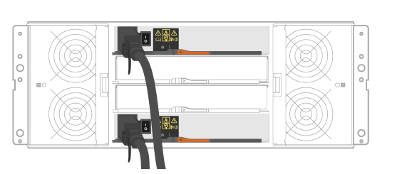

= 케이블을 연결합니다
:allow-uri-read: 
:icons: font
:imagesdir: ../media/

[role="lead"]
전원 케이블을 연결하고 드라이브 쉘프의 전원을 켜는 방법을 알아봅니다.

.시작하기 전에
* 하드웨어를 설치합니다.
* 정전기 방지 예방 조치를 취하십시오.

이 절차는 IOM12 및 IOM12B 드라이브 쉘프에 적용됩니다.

NOTE: IOM12B 모듈은 SANtricity OS 11.70.2 이상에서만 지원됩니다. IOM12B를 설치하거나 업그레이드하기 전에 컨트롤러의 펌웨어가 업데이트되었는지 확인합니다.

NOTE: 이 절차는 쉘프 IOM 핫 스왑 또는 교체와 유사할 경우 적용됩니다. 즉, IOM12 모듈을 다른 IOM12 모듈로 교체하거나 IOM12B 모듈을 다른 IOM12B 모듈로 교체할 수 있습니다. (이 쉘프는 IOM12 모듈 2개를 포함할 수 있으며, 또는 IOM12B 모듈 2개를 포함할 수 있습니다.)

.단계
. 선반에 케이블 연결
+
구성에 따라 시스템에 케이블을 연결합니다. 표시된 예보다 더 많은 케이블 연결 옵션이 필요한 경우 를 참조하십시오 link:../install-hw-cabling/index.html["케이블 연결"].

+
표시된 예는 다음 케이블이 필요합니다.

+
|===

 a| 
image:../media/sas_cable.png["SAS 케이블"]
 a| 
SAS 케이블 *

|===
+
.예 A: 표준 SAS 구성의 DE212C/DE224 디스크 쉘프 3개가 포함된 E5700 컨트롤러 쉘프
image:../media/example_a_28_57.png["SAS 구성의 E5700 컨트롤러"]

+
.. 컨트롤러 A를 첫 번째 드라이브 쉘프의 IOM A에 연결합니다.
.. 첫 번째 드라이브 쉘프의 IOM A를 두 번째 드라이브 쉘프의 IOM A에 연결합니다.
.. 두 번째 드라이브 쉘프의 IOM A를 세 번째 드라이브 쉘프의 IOM A에 연결합니다.
.. 컨트롤러 B를 세 번째 드라이브 쉘프의 IOM B에 연결합니다.
.. 두 번째 드라이브 쉘프의 케이블 IOM B를 세 번째 드라이브 쉘프의 IOM B에 연결합니다.
.. 첫 번째 드라이브 쉘프의 케이블 IOM B를 두 번째 드라이브 쉘프의 IOM B에 연결합니다.

+
.예 B: 표준 SAS 구성의 DE212C/DE224 디스크 쉘프 1개가 있는 E5700 컨트롤러 쉘프

+
.. 컨트롤러 A를 IOM A에 연결합니다
.. 컨트롤러 B를 IOM B에 연결합니다

. 드라이브 쉘프의 전원을 켭니다.
+
다음 케이블이 필요합니다.

+
|===

 a| 

 a| 
* 전원 케이블 *

|===
+

CAUTION: 드라이브 쉘프의 전원 스위치가 꺼져 있는지 확인합니다.

+
.. 각 셸프의 전원 케이블 2개를 캐비닛이나 랙의 서로 다른 PDU(Power Distribution Unit)에 연결합니다.
.. 드라이브 쉘프가 있는 경우, 먼저 2개의 전원 스위치를 켜십시오. 컨트롤러 쉘프에 전원을 연결하기 전에 2분 정도 기다리십시오.
.. 컨트롤러 쉘프에 있는 2개의 전원 스위치를 켭니다.
.. 각 컨트롤러에서 LED 및 7세그먼트 디스플레이를 확인합니다.
+
부팅 중에 7개 세그먼트 디스플레이에 OS, SD, 블랭크의 반복 시퀀스가 표시되어 컨트롤러가 당일(start-of-day) 처리를 수행하고 있음을 나타냅니다. 컨트롤러가 부팅되면 쉘프 ID가 표시됩니다.

+
|===

 a| 
* 예: 전원 연결은 선반 뒤쪽에 있습니다. * image:../media/trafford_power.png["전원 선반 연결"]

|===

