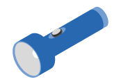

= 설치 준비
:allow-uri-read: 
:icons: font
:imagesdir: ../media/

[role="lead"]
E5724, EF570, EF280, E2812, E2824, 설치 준비 방법에 대해 알아보십시오. DE212C 또는 DE224C 시리즈 스토리지 시스템.

.단계
. 에서 계정을 만들고 하드웨어를 등록합니다 http://mysupport.netapp.com/["NetApp 지원"^].
. 받은 상자에 다음 항목이 있는지 확인합니다.
+
|===

 a| 
image:../media/trafford_overview.png["드라이브 및 베젤이 설치된 쉘프"]
 a| 
드라이브가 설치된 쉘프(베젤 별도 패키지)

 a| 
image:../media/superrails_inst-hw-e2800-e5700.png["랙 마운트 하드웨어"]
 a| 
랙 마운트 하드웨어

|===
+
다음 표에서는 수신할 수 있는 케이블 유형을 보여 줍니다. 표에 나와 있지 않은 케이블을 받은 경우 를 참조하십시오 https://hwu.netapp.com/["Hardware Universe"^] 케이블을 찾아 사용 여부를 확인합니다.

+
|===
| 커넥터 유형 | 케이블 유형 | 사용 

 a| 
image:../media/cable_ethernet_inst-hw-e2800-e5700.png["이더넷 케이블"]
 a| 
이더넷 케이블

(주문한 경우)
 a| 
관리 연결

 a| 
image:../media/cable_io_inst-hw-e2800-e5700.png["I/O 케이블"]
 a| 
I/O 케이블

(주문한 경우)
 a| 
데이터 호스트 케이블 연결

 a| 
image:../media/cable_power_inst-hw-e2800-e5700.png["전원 케이블"]
 a| 
전원 케이블

(주문한 경우)
 a| 
스토리지 시스템의 전원을 켭니다

 a| 
image:../media/sas_cable.png["SAS 케이블"]
 a| 
SAS 케이블은 드라이브 쉘프에만 포함됩니다
 a| 
SAS 케이블

|===
. 다음 항목을 제공해야 합니다.
+
|===

 a| 
image:../media/screwdriver_inst-hw-e2800-e5700.png["Phillips #2 드라이버"]
 a| 
Phillips #2 드라이버

 a| 

 a| 
플래시

 a| 
image:../media/wrist_strap_inst-hw-e2800-e5700.png["ESD 스트랩"]
 a| 
ESD 스트랩

 a| 
image:../media/2u_rackspace_inst-hw-e2800-e5700.png["2U 랙\""]
 a| 
2U 랙 공간: 의 표준 19인치 (48.30cm) 랙에 장착할 수 있습니다.

* 깊이 *:19.0in. (48.3cm)

* 너비 *:17.6인치 (44.7cm)

* 높이 *: 3.34in. (8.48cm)

* 쉘프 *: 24 드라이브

* 최대 중량 *: 27.4kg(60.5lb)

 a| 
image:../media/management_station_inst-hw-e2800-e5700_g60b3.png["관리 소프트웨어를 위해 지원되는 브라우저가 있는 관리 스테이션"]
 a| 
관리 소프트웨어에 대해 지원되는 브라우저:

** Google Chrome(버전 89 이상)
** Microsoft Edge(버전 90 이상)
** Mozilla Firefox(버전 80 이상)
** Safari(버전 14 이상)

|===

