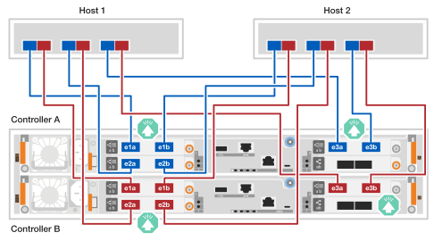

= 하드웨어 케이블 연결 - EF50 및 EF80
:allow-uri-read: 
:icons: font
:imagesdir: ../media/

[role="lead"]
EF50 또는 EF80 스토리지 시스템 하드웨어를 설치한 후 컨트롤러 간 미러링 및 호스트 네트워크 연결을 케이블로 연결하십시오. (관리 포트는 나중에 스토리지 시스템 설정 완료 섹션에서 케이블로 연결합니다.)

.이 작업에 대해
* 이 절차에서 _I/O 모듈_이라는 용어는 호스트 인터페이스 카드(HIC)를 지칭하는 데 사용됩니다.
* 케이블 연결 그래픽에는 포트에 커넥터를 삽입할 때 케이블 커넥터 풀 탭의 올바른 방향(위 또는 아래)을 나타내는 화살표 아이콘이 있습니다.
+
커넥터를 삽입할 때 딸깍 소리가 나면서 제자리에 고정되는 느낌이 들어야 합니다. 딸깍 소리가 나지 않으면 커넥터를 빼내어 뒤집어서 다시 시도하십시오.

+
image:../media/drw_cable_pull_tab_direction_ieops-1699.svg["케이블 당김 탭 방향"]

== 1단계: 컨트롤러 간 미러링 연결 케이블 연결

컨트롤러 간 미러링을 활성화하려면 컨트롤러를 서로 케이블로 연결하십시오. 컨트롤러 간 미러링 연결은 완벽한 시스템 이중화를 보장하며 캐시 미러링 및 I/O 전송에 사용됩니다. 케이블 연결은 EF50 및 EF80 스토리지 시스템에서 동일합니다.

NOTE: 스토리지 시스템에 설치된 컨트롤러 간 미러링 I/O 모듈의 속도(스토리지 시스템에서 지원하는 100 GbE 또는 200 GbE)에 관계없이 제공된 200 GbE 케이블을 사용합니다. 컨트롤러 간 미러링 I/O 모듈의 속도가 100 GbE인 경우 연결은 더 낮은 속도(100 GbE)로 작동합니다.

.단계
. 컨트롤러를 서로 연결합니다.
+
.. 컨트롤러 A 포트 e4a를 컨트롤러 B 포트 e4a에 케이블로 연결합니다.
.. 케이블 컨트롤러 A 포트 e4b를 컨트롤러 B 포트 e4b에 연결합니다.
+
*200 GbE 이더넷 케이블*

+
image::../media/oie_cable100_gbe_qsfp28.png[미러링 연결에 사용되는 100 GbE 이더넷 케이블]

+
image:../media/drw_ef50-ef80_mirroring_2p_100gbe_ieops-2659.svg["ef50 및 ef80 컨트롤러 간 미러링 연결 케이블링"]

== 2단계: 호스트 연결 케이블 연결

네트워크 토폴로지에 따라 스토리지 시스템의 호스트 연결을 케이블로 연결하십시오: 직접 연결 또는 패브릭 연결.

.이 작업에 대해
* 스토리지 시스템 모델에 따라 스토리지 시스템에 설치된 호스트 I/O 모듈 유형은 이더넷 또는 파이버 채널(FC)일 수 있습니다. 이 절차의 케이블 연결 예시는 스토리지 시스템 모델에서 지원하는 두 가지 유형의 호스트 I/O 모듈을 모두 보여줍니다.
* 케이블 연결 예시에는 호스트 1과 호스트 2에 4포트 64Gb FC HBA가 표시되어 있지 않지만, 이러한 HBA가 설치되어 있는 경우 2포트 HBA에 표시된 것과 동일한 방식으로 다른 모든 포트에 케이블을 연결합니다.

[role="tabbed-block"]
====
.직접 연결 토폴로지
--
다음 예시는 직접 연결 토폴로지를 사용하여 스토리지 시스템을 호스트에 케이블로 연결하는 방법을 보여줍니다.

.2개의 4포트 64Gb FC I/O 모듈이 있는 EF50
[%collapsible]
=====
.이 작업에 대해
* 케이블 연결 예시에서는 호스트 I/O 모듈이 슬롯 1과 2에 장착된 것을 보여줍니다. 이는 EF50 스토리지 시스템에서 지원되는 최대 호스트 I/O 모듈 수입니다. 하지만 슬롯 1의 호스트 I/O 모듈만 필수이며, 슬롯 2의 호스트 I/O 모듈은 선택 사항입니다.
+
스토리지 시스템에 호스트 I/O 모듈이 하나만 설치되어 있는 경우 추가 호스트 I/O 모듈에 대한 케이블 연결은 무시하고 설치된 호스트 I/O 모듈에만 케이블을 연결하면 됩니다.

* 직접 연결 스토리지 시스템에는 이중화를 위해 경로 A와 경로 B라는 두 개의 별도 경로가 있습니다.
+
** 경로 A 연결은 호스트와 컨트롤러의 파란색 케이블과 파란색 포트로 표시됩니다. 각 호스트의 HBA 포트를 컨트롤러 A 포트 a 및 c에 연결합니다.
** 경로 B 연결은 호스트와 컨트롤러의 빨간색 케이블과 빨간색 포트로 표시됩니다. 각 호스트의 HBA 포트를 컨트롤러 B 포트 a 및 c에 연결합니다.

* 케이블 연결 예시에서는 I/O 모듈 포트 a와 c가 호스트에 연결된 것으로 나와 있지만, 포트 a와 b 또는 포트 c와 d를 사용할 수도 있습니다.

.단계
. 호스트를 컨트롤러에 케이블로 연결합니다.
+
.. 케이블 호스트 1 경로 A(파란색) HBA 포트를 컨트롤러 A의 a 포트(1a 및 2a)에 연결합니다.
.. 케이블 호스트 1 경로 B(빨간색) HBA 포트를 컨트롤러 B의 a 포트(1a 및 2a)에 연결합니다.
.. 케이블 호스트 2 경로 A(파란색) HBA 포트를 컨트롤러 A의 c 포트(1c 및 2c)에 연결합니다.
.. 케이블 호스트 2 경로 B(빨간색) HBA 포트를 컨트롤러 B의 c 포트(1c 및 2c)에 연결합니다.
+
*64 Gb/s FC 케이블*

+
image:../media/oie_cable_sfp_gbe_copper.png["64 Gb FC 케이블"]

+
image:../media/drw_ef50_4p_64gb_fc_2hic_direct_ieops-2670.svg["2개의 4포트 64GB FC IO 모듈을 사용하여 호스트에 직접 연결된 EF50 토폴로지"]

=====
.3개의 2포트 200GbE I/O 모듈이 있는 EF80
[%collapsible]
=====
.이 작업에 대해
* 케이블 연결 예시에서는 호스트 I/O 모듈이 슬롯 1, 2, 3에 장착된 것을 보여줍니다. 이는 EF80 스토리지 시스템에서 지원되는 최대 호스트 I/O 모듈 수입니다. 하지만 슬롯 1의 호스트 I/O 모듈만 필수이며, 슬롯 2와 슬롯 3의 호스트 I/O 모듈은 선택 사항입니다.
+
스토리지 시스템에 설치된 호스트 I/O 모듈의 수가 더 적은 경우, 추가 호스트 I/O 모듈에 대한 케이블 연결은 무시하고 이미 설치된 호스트 I/O 모듈에만 케이블을 연결하면 됩니다.

* 직접 연결 스토리지 시스템에는 이중화를 위해 경로 A와 경로 B라는 두 개의 별도 경로가 있습니다.
+
** 경로 A 연결은 호스트와 컨트롤러의 파란색 케이블과 파란색 포트로 표시됩니다. 각 호스트의 HBA 포트를 컨트롤러 A 포트 a 및 b에 연결합니다.
** 경로 B 연결은 호스트와 컨트롤러의 빨간색 케이블과 빨간색 포트로 표시됩니다. 각 호스트의 HBA 포트를 컨트롤러 B 포트 a 및 b에 연결합니다.

.단계
. 호스트를 컨트롤러에 케이블로 연결합니다.
+
.. 케이블 호스트 1 경로 A(파란색) HBA 포트를 컨트롤러 A의 a 포트(e1a, e2a 및 e3a)에 연결합니다.
.. 케이블 호스트 1 경로 B(빨간색) HBA 포트를 컨트롤러 B의 a 포트(e1a, e2a 및 e3a)에 연결합니다.
.. 케이블 호스트 2 경로 A(파란색) HBA 포트를 컨트롤러 A의 b 포트(e1b, e2b 및 e3b)에 연결합니다.
.. 케이블 호스트 2 경로 B(빨간색) HBA 포트를 컨트롤러 B의 b 포트(e1b, e2b 및 e3b)에 연결합니다.
+
*200 GbE 케이블*

+
image::../media/oie_cable_sfp_gbe_copper.png[200 GbE 케이블]

+

=====
.3개의 4포트 64Gb FC I/O 모듈이 장착된 EF80
[%collapsible]
=====
.이 작업에 대해
* 케이블 연결 예시에서는 호스트 I/O 모듈이 슬롯 1, 2, 3에 장착된 것을 보여줍니다. 이는 EF80 스토리지 시스템에서 지원되는 최대 호스트 I/O 모듈 수입니다. 하지만 슬롯 1의 호스트 I/O 모듈만 필수이며, 슬롯 2와 슬롯 3의 호스트 I/O 모듈은 선택 사항입니다.
+
스토리지 시스템에 설치된 호스트 I/O 모듈의 수가 더 적은 경우, 추가 호스트 I/O 모듈에 대한 케이블 연결은 무시하고 이미 설치된 호스트 I/O 모듈에만 케이블을 연결하면 됩니다.

* 직접 연결 스토리지 시스템에는 이중화를 위해 경로 A와 경로 B라는 두 개의 별도 경로가 있습니다.
+
** 경로 A 연결은 호스트와 컨트롤러의 파란색 케이블과 파란색 포트로 표시됩니다. 각 호스트의 HBA 포트를 컨트롤러 A 포트 a 및 c에 연결합니다.
** 경로 B 연결은 호스트와 컨트롤러의 빨간색 케이블과 빨간색 포트로 표시됩니다. 각 호스트의 HBA 포트를 컨트롤러 B 포트 a 및 c에 연결합니다.

* 케이블 연결 예시에서는 I/O 모듈 포트 a와 c가 호스트에 연결된 것으로 나와 있지만, 포트 a와 b 또는 포트 c와 d를 사용할 수도 있습니다.

.단계
. 호스트를 컨트롤러에 케이블로 연결합니다.
+
.. 케이블 호스트 1 경로 A(파란색) HBA 포트를 컨트롤러 A의 a 포트(1a, 2a 및 3a)에 연결합니다.
.. 케이블 호스트 1 경로 B(빨간색) HBA 포트를 컨트롤러 B의 a 포트(1a, 2a 및 3a)에 연결합니다.
.. 케이블 호스트 2 경로 A(파란색) HBA 포트를 컨트롤러 A의 c 포트(1c, 2c 및 3c)에 연결합니다.
.. 케이블 호스트 2 경로 B(빨간색) HBA 포트를 컨트롤러 B의 c 포트(1c, 2c 및 3c)에 연결합니다.
+
*64 Gb/s FC 케이블*

+
image:../media/oie_cable_sfp_gbe_copper.png["64 Gb FC 케이블"]

+
image:../media/drw_ef80_4p_64gb_fc_3hic_direct_ieops-2674.svg["EF80 direct-attached 토폴로지는 4포트 64GB FC IO 모듈 3개를 사용하여 호스트에 연결됩니다"]

=====
--
.패브릭 연결 토폴로지
--
다음 예시는 패브릭 연결 토폴로지를 사용하여 스토리지 시스템을 호스트에 케이블로 연결하는 방법을 보여줍니다.

.2개의 4포트 64Gb FC I/O 모듈이 있는 EF50
[%collapsible]
=====
.이 작업에 대해
* 케이블 연결 예시에서는 호스트 I/O 모듈이 슬롯 1과 2에 장착된 것을 보여줍니다. 이는 EF50 스토리지 시스템에서 지원되는 최대 호스트 I/O 모듈 수입니다. 하지만 슬롯 1의 호스트 I/O 모듈만 필수이며, 슬롯 2의 호스트 I/O 모듈은 선택 사항입니다.
+
스토리지 시스템에 호스트 I/O 모듈이 하나만 설치되어 있는 경우 추가 호스트 I/O 모듈에 대한 케이블 연결은 무시하고 설치된 호스트 I/O 모듈에만 케이블을 연결하면 됩니다.

* 패브릭 연결 스토리지 시스템에는 이중화를 위해 스위치 1 경로와 스위치 2 경로, 이렇게 두 개의 별도 스위치 경로가 있습니다.
+
** 스위치 1 경로 연결은 호스트 및 컨트롤러의 파란색 케이블 및 파란색 포트로 표시됩니다. 스위치 1을 통해 각 호스트의 HBA 포트를 컨트롤러 A 및 컨트롤러 B의 a 및 c 포트에 연결합니다.
** 스위치 2 경로 연결은 호스트 및 컨트롤러의 빨간색 케이블링 및 빨간색 포트로 표시됩니다. 스위치 2를 통해 각 호스트의 HBA 포트를 컨트롤러 A 및 컨트롤러 B의 b 및 d 포트에 연결합니다.

.단계
. 호스트를 스위치에 연결합니다.
+
스위치의 모든 포트를 사용할 수 있습니다.

+
.. 케이블 호스트 1 및 호스트 2 스위치 1 경로(파란색) HBA 포트를 스위치 1에 연결합니다.
.. 케이블 호스트 1 및 호스트 2 스위치 2 경로(빨간색) HBA 포트를 스위치 2에 연결합니다.

. 스위치를 컨트롤러에 연결합니다.
+
.. 케이블 스위치 1(파란색)을 컨트롤러 A의 a 및 c 포트(1a, 2a, 1c 및 2c)에 연결합니다.
.. 케이블 스위치 1(파란색)을 컨트롤러 B의 a 및 c 포트(1a, 2a, 1c 및 2c)에 연결합니다.
.. 케이블 스위치 2(빨간색)를 컨트롤러 A의 b 및 d 포트(1b, 2b, 1d 및 2d)에 연결합니다.
.. 케이블 스위치 2(빨간색)를 컨트롤러 B의 b 및 d 포트(1b, 2b, 1d 및 2d)에 연결합니다.
+
*64 Gb/s FC 케이블*

+
image:../media/oie_cable_sfp_gbe_copper.png["64 Gb FC 케이블"]

+
image:../media/drw_ef50_4p_64gb_fc_2hic_fabric_ieops-2673.svg["EF50 패브릭 연결 토폴로지(4포트 64GB FC IO 모듈 2개 사용)"]

=====
.3개의 2포트 200GbE I/O 모듈이 있는 EF80
[%collapsible]
=====
.이 작업에 대해
* 케이블 연결 예시에서는 호스트 I/O 모듈이 슬롯 1, 2, 3에 장착된 것을 보여줍니다. 이는 EF80 스토리지 시스템에서 지원되는 최대 호스트 I/O 모듈 수입니다. 하지만 슬롯 1의 호스트 I/O 모듈만 필수이며, 슬롯 2와 슬롯 3의 호스트 I/O 모듈은 선택 사항입니다.
+
스토리지 시스템에 설치된 호스트 I/O 모듈의 수가 더 적은 경우, 추가 호스트 I/O 모듈에 대한 케이블 연결은 무시하고 이미 설치된 호스트 I/O 모듈에만 케이블을 연결하면 됩니다.

* 케이블 연결 예시에서는 각 호스트에 3개의 HBA가 설치되어 있는 것을 보여줍니다. 호스트에 3개 미만의 HBA가 설치되어 있는 경우, 추가 HBA에 대한 케이블 연결은 생략하고 설치된 HBA에만 케이블을 연결하면 됩니다.
* 패브릭 연결 스토리지 시스템에는 이중화를 위해 스위치 1 경로와 스위치 2 경로, 이렇게 두 개의 별도 스위치 경로가 있습니다.
+
** 스위치 1 경로 연결은 호스트 및 컨트롤러의 파란색 케이블 및 파란색 포트로 표시됩니다. 스위치 1을 통해 각 호스트의 HBA 포트를 컨트롤러 A 및 컨트롤러 B의 a 포트에 연결합니다.
** 스위치 2의 경로 연결은 호스트와 컨트롤러의 빨간색 케이블과 빨간색 포트로 표시됩니다. 각 호스트의 HBA 포트는 스위치 2를 통해 컨트롤러 A와 컨트롤러 B의 b 포트에 연결됩니다.

.단계
. 호스트를 스위치에 연결합니다.
+
스위치의 모든 포트를 사용할 수 있습니다.

+
.. 케이블 호스트 1 및 호스트 2 스위치 1 경로(파란색) HBA 포트를 스위치 1에 연결합니다.
.. 케이블 호스트 1 및 호스트 2 스위치 2 경로(빨간색) HBA 포트를 스위치 2에 연결합니다.

. 스위치를 컨트롤러에 연결합니다.
+
.. 케이블 스위치 1(파란색)을 컨트롤러 A의 a 포트(e1a, e2a 및 e3a)에 연결합니다.
.. 케이블 스위치 1(파란색)을 컨트롤러 B의 a 포트(e1a, e2a 및 e3a)에 연결합니다.
.. 케이블 스위치 2(빨간색)를 컨트롤러 A의 b 포트(e1b, e2b 및 e3b)에 연결합니다.
.. 케이블 스위치 2(빨간색)를 컨트롤러 B의 b 포트(e1b, e2b 및 e3b)에 연결합니다.
+
*200 GbE 케이블*

+
image::../media/oie_cable_sfp_gbe_copper.png[200 GbE 케이블]

+
image:../media/drw_ef80_2p_200gbe_ib_3hic_fabric_ieops-2679.svg["3개의 2포트 200GbE IO 모듈을 사용하는 EF80 패브릭 연결 토폴로지"]

=====
.3개의 4포트 64Gb FC I/O 모듈이 장착된 EF80
[%collapsible]
=====
.이 작업에 대해
* 케이블 연결 예시에서는 호스트 I/O 모듈이 슬롯 1, 2, 3에 장착된 것을 보여줍니다. 이는 EF80 스토리지 시스템에서 지원되는 최대 호스트 I/O 모듈 수입니다. 하지만 슬롯 1의 호스트 I/O 모듈만 필수이며, 슬롯 2와 슬롯 3의 호스트 I/O 모듈은 선택 사항입니다.
+
스토리지 시스템에 설치된 호스트 I/O 모듈의 수가 더 적은 경우, 추가 호스트 I/O 모듈에 대한 케이블 연결은 무시하고 이미 설치된 호스트 I/O 모듈에만 케이블을 연결하면 됩니다.

* 케이블 연결 예시에서는 각 호스트에 3개의 HBA가 설치되어 있는 것을 보여줍니다. 호스트에 3개 미만의 HBA가 설치되어 있는 경우, 추가 HBA에 대한 케이블 연결은 생략하고 설치된 HBA에만 케이블을 연결하면 됩니다.
* 패브릭 연결 스토리지 시스템에는 이중화를 위해 스위치 1 경로와 스위치 2 경로, 이렇게 두 개의 별도 스위치 경로가 있습니다.
+
** 스위치 1 경로 연결은 호스트 및 컨트롤러의 파란색 케이블 및 파란색 포트로 표시됩니다. 스위치 1을 통해 각 호스트의 HBA 포트를 컨트롤러 A 및 컨트롤러 B의 a 및 c 포트에 연결합니다.
** 스위치 2 경로 연결은 호스트 및 컨트롤러의 빨간색 케이블링 및 빨간색 포트로 표시됩니다. 스위치 2를 통해 각 호스트의 HBA 포트를 컨트롤러 A 및 컨트롤러 B의 b 및 d 포트에 연결합니다.

.단계
. 호스트를 스위치에 연결합니다.
+
스위치의 모든 포트를 사용할 수 있습니다.

+
.. 케이블 호스트 1 및 호스트 2 스위치 1 경로(파란색) HBA 포트를 스위치 1에 연결합니다.
.. 케이블 호스트 1 및 호스트 2 스위치 2 경로(빨간색) HBA 포트를 스위치 2에 연결합니다.

. 스위치를 컨트롤러에 연결합니다.
+
.. 케이블 스위치 1(파란색)을 컨트롤러 A의 a 및 c 포트(1a, 2a, 3a, 1c, 2c 및 3c)에 연결합니다.
.. 케이블 스위치 1(파란색)을 컨트롤러 B의 a 및 c 포트(1a, 2a, 3a, 1c, 2c 및 3c)에 연결합니다.
.. 케이블 스위치 2(빨간색)를 컨트롤러 A의 b 및 d 포트(1b, 2b, 3b, 1d, 2d 및 3d)에 연결합니다.
.. 케이블 스위치 2(빨간색)를 컨트롤러 B의 b 및 d 포트(1b, 2b, 3b, 1d, 2d 및 3d)에 연결합니다.
+
*64 Gb/s FC 케이블*

+
image:../media/oie_cable_sfp_gbe_copper.png["64 Gb FC 케이블"]

+
image:../media/drw_ef80_4p_64gb_fc_3hic_fabric_ieops-2675.svg["3개의 4포트 64GB FC IO 모듈을 사용하는 EF80 패브릭 연결 토폴로지"]

=====
--
====
.다음 단계
스토리지 시스템에 대한 컨트롤러 간 미러링 및 호스트 연결 케이블 연결 후 link:install-power-hardware.html["스토리지 시스템의 전원을 켭니다"].
