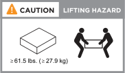

= 설치 준비 - EF50 및 EF80
:allow-uri-read: 
:icons: font
:imagesdir: ../media/

[role="lead"]
사이트를 준비하고, 스토리지 시스템의 리프팅 주의 사항을 이해하고, 상자를 개봉하여 내용물을 포장 명세서와 비교하고, 지원 혜택을 받기 위해 스토리지 시스템을 등록하여 EF50 또는 EF80 스토리지 시스템 설치를 준비하십시오.

== 1단계: 사이트 준비

설치 장소와 사용하려는 캐비닛 또는 랙이 스토리지 시스템의 사양을 충족하는지 확인하십시오.

.단계
.  https://hwu.netapp.com["NetApp Hardware Universe를 참조하십시오"^]을 사용하여 사이트가 스토리지 시스템의 환경 및 전기 요구 사항을 충족하는지 확인하십시오.
. 스토리지 시스템과 스위치를 설치할 충분한 캐비닛이나 랙 공간이 있는지 확인하십시오.
+
필요한 경우 스토리지 시스템의 정확한 치수는  https://hwu.netapp.com["NetApp Hardware Universe를 참조하십시오"^]를 참조하십시오.

+
** 스토리지 시스템용 2U
** 대부분의 스위치의 경우 1U

. 필요한 네트워크 스위치를 설치하십시오.
. 관리 소프트웨어에 지원되는 브라우저가 있는지 확인하십시오.
+
** Google Chrome(버전 89 이상)
** Microsoft Edge(버전 90 이상)
** Mozilla Firefox(버전 80 이상)
** Safari(버전 14 이상)

. 설치에 필요한 다음 장비와 도구를 준비하십시오.
+
** 정전기 방전(ESD) 스트랩
** Phillips #2 드라이버
** 플래시

== 2단계: 리프팅 주의사항 숙지

상자를 풀기 전과 나중에 스토리지 시스템을 설치할 때 스토리지 시스템의 무게를 이해하여 들어 올리고 이동할 때 필요한 예방 조치를 취할 수 있도록 해야 합니다.

EF50 또는 EF80 스토리지 시스템은 최대 61.5lbs(27.9kg)까지 나갈 수 있습니다. 스토리지 시스템을 들어 올리려면 두 사람이 함께 들거나 유압 리프트를 사용하십시오.

== 3단계: 상자 개봉

사이트와 사용하려는 캐비닛 또는 랙이 스토리지 시스템의 사양을 충족하는지 확인하고 운반 시 주의 사항을 숙지한 후, 모든 상자를 풀고 내용물을 포장 명세서의 품목과 비교하십시오.

.단계
. 모든 상자를 조심스럽게 열고 내용물을 정리된 상태로 꺼내 놓으세요.
. 개봉한 내용물과 포장 명세서를 비교해 보세요.
+
배송 상자 측면의 QR 코드를 스캔하여 포장 명세서를 받을 수 있습니다.

+

NOTE: 불일치 사항이 있으면 추후 조치를 위해 기록해 두십시오.

+
다음 항목은 상자에서 볼 수 있는 내용물의 일부입니다.

+
필요한 경우  https://hwu.netapp.com/["NetApp Hardware Universe를 참조하십시오"^]에서 지원되는 다른 케이블을 확인하고 해당 용도를 파악하십시오.

+
[cols="9,9,5"]
|===

| *하드웨어* | *케이블* |  

 a| 
** 드라이브가 포함된 스토리지 시스템
** 스위치
** 랙 마운트 하드웨어(지침 포함)
** 베젤

 a| 
** 컨트롤러 간 미러링 Ethernet 케이블
** 관리 이더넷 케이블(RJ-45 케이블)
** 네트워크 케이블
** 전원 케이블

|  
|===

== 4단계: 스토리지 시스템 등록

사이트가 스토리지 시스템의 사양을 충족하고 주문한 모든 부품을 받았는지 확인한 후에는 스토리지 시스템을 등록해야 합니다.

. 에서 계정을 만들고 하드웨어를 등록합니다 http://mysupport.netapp.com/["NetApp 지원"^].
+
등록 절차에는 각 컨트롤러의 일련 번호(SN)가 필요합니다. 일련 번호는 다음 위치에서 찾을 수 있습니다.

+
** 각 컨트롤러에서
** 포장 명세서에
** 확인 이메일에
+
image::../media/drw_ef50-ef80_sn_label_ieops-2689.svg[일련 번호 라벨의 예]

.다음 단계
스토리지 시스템 설치를 준비한 후 link:install-hardware.html["하드웨어를 설치합니다"].
