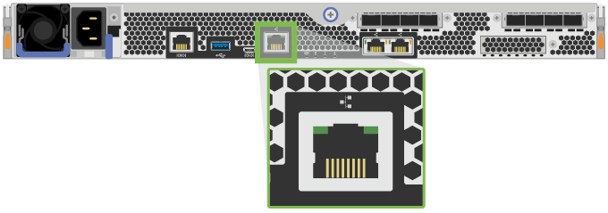
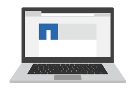

= 스토리지 시스템의 설치 및 구성을 완료합니다
:icons: font
:imagesdir: ../media/

[role="lead"]
컨트롤러 케이블을 네트워크에 연결하는 방법을 알아보고 설정과 구성을 완료합니다.

== 1단계: 데이터 호스트의 케이블을 연결합니다

네트워크 토폴로지에 따라 스토리지 시스템에 케이블을 연결합니다.

=== 옵션 1: 직접 연결 토폴로지

다음 예에서는 직접 연결 토폴로지를 사용하여 데이터 호스트에 케이블을 연결하는 방법을 보여 줍니다.

|===

 a| 
image:../media/direct_topo.png[""]
 a| 
. 각 호스트 어댑터를 컨트롤러의 호스트 포트에 직접 연결합니다.

|===

=== 옵션 2: Fabric 토폴로지

다음 예에서는 패브릭 토폴로지를 사용하여 데이터 호스트에 케이블을 연결하는 방법을 보여 줍니다.

|===

 a| 
image:../media/fabric_topo.png[""]
 a| 
. 각 호스트 어댑터를 스위치에 직접 연결합니다.
. 각 스위치를 컨트롤러의 호스트 포트에 직접 연결합니다.

|===

== 2단계: 관리 연결을 연결하고 구성합니다

DHCP 서버 또는 고정 IP 주소를 사용하여 컨트롤러 관리 포트를 구성할 수 있습니다.

=== 옵션 1: DHCP 서버

DHCP 서버를 사용하여 관리 포트를 구성하는 방법에 대해 알아봅니다.

.시작하기 전에
* IP 주소, 서브넷 마스크 및 게이트웨이 주소를 각 컨트롤러의 영구 임대로 연결하도록 DHCP 서버를 구성합니다.
* 네트워크 관리자로부터 스토리지 시스템에 연결하는 데 사용할 할당된 IP 주소를 얻습니다.

.단계
. 이더넷 케이블을 각 컨트롤러의 관리 포트에 연결하고 다른 쪽 끝을 네트워크에 연결합니다.
+
|===

 a| 
image:../media/cable_ethernet_inst-hw-ef600.png[""]
 a| 
RJ-45 이더넷 케이블(주문한 경우)

|===
+
|===

 a| 
다음 그림은 컨트롤러의 관리 포트 위치(EF600 표시)의 예입니다.

 a| 

|===
. 브라우저를 열고 네트워크 관리자가 제공한 컨트롤러 IP 주소 중 하나를 사용하여 스토리지 시스템에 연결합니다.

=== 옵션 2: 고정 IP 주소

IP 주소와 서브넷 마스크를 입력하여 관리 포트를 수동으로 구성하는 방법에 대해 알아봅니다.

.시작하기 전에
* 네트워크 관리자로부터 컨트롤러 IP 주소, 서브넷 마스크, 게이트웨이 주소, DNS 및 NTP 서버 정보를 얻습니다.
* 사용 중인 노트북이 DHCP 서버로부터 네트워크 구성을 수신하지 않는지 확인합니다.

.단계
. 이더넷 케이블을 사용하여 컨트롤러 A의 관리 포트를 랩톱의 이더넷 포트에 연결합니다.
+

NOTE: 컨트롤러 A는 상부 컨트롤러 캐니스터이고 컨트롤러 B는 하부 컨트롤러 캐니스터입니다.

+
|===

 a| 
image:../media/cable_ethernet_inst-hw-ef600.png[""]
 a| 
RJ-45 이더넷 케이블(주문한 경우)

|===
+
|===

 a| 
다음 그림은 컨트롤러의 관리 포트 위치(EF600 표시)의 예입니다.

 a| 

|===
. 브라우저를 열고 기본 IP 주소(169.254.128.101)를 사용하여 컨트롤러에 연결합니다. 컨트롤러가 자체 서명된 인증서를 다시 보냅니다. 브라우저가 연결이 안전하지 않음을 알려줍니다.
. 브라우저의 지침에 따라 SANtricity System Manager를 계속 진행합니다.
+

NOTE: 연결을 설정할 수 없는 경우 DHCP 서버로부터 네트워크 구성을 받지 않는지 확인합니다.

. 스토리지 시스템의 암호를 설정하여 로그인합니다.
. 네트워크 관리자가 네트워크 설정 구성 * 마법사에서 제공한 네트워크 설정을 사용하여 컨트롤러 A의 네트워크 설정을 구성한 다음 * 마침 * 을 선택합니다.
+

NOTE: IP 주소를 재설정하면 System Manager에서 컨트롤러에 대한 연결이 끊어집니다.

. 스토리지 시스템에서 랩톱을 분리하고 컨트롤러 A의 관리 포트를 네트워크에 연결합니다.
. 네트워크에 연결된 컴퓨터에서 브라우저를 열고 컨트롤러 A의 새로 구성된 IP 주소를 입력합니다.
+

NOTE: 컨트롤러 A와의 연결이 끊긴 경우 이더넷 케이블을 컨트롤러 B에 연결하여 컨트롤러 B(169.254.128.102)를 통해 컨트롤러 A에 다시 연결할 수 있습니다.

. 이전에 설정한 암호를 사용하여 로그인합니다.
+
네트워크 설정 구성 마법사가 나타납니다.

. 네트워크 관리자가 [네트워크 설정 구성] * 마법사에서 제공한 네트워크 설정을 사용하여 컨트롤러 B의 네트워크 설정을 구성한 다음 [마침]을 선택합니다.
. 컨트롤러 B를 네트워크에 연결합니다.
. 브라우저에 컨트롤러 B의 구성된 IP 주소를 입력하여 컨트롤러 B의 네트워크 설정을 확인합니다.
+

NOTE: 컨트롤러 B에 대한 연결이 끊긴 경우 이전에 검증된 컨트롤러 A 연결을 사용하여 컨트롤러 A를 통해 컨트롤러 B에 대한 연결을 다시 설정할 수 있습니다

== 3단계: 스토리지 시스템 구성

EF300 또는 EF600 하드웨어를 설치한 후에는 SANtricity 소프트웨어를 사용하여 스토리지 시스템을 구성 및 관리하십시오.

.시작하기 전에
* 관리 포트를 구성합니다.
* 암호 및 IP 주소를 확인하고 기록합니다.

.단계
. 웹 브라우저에 컨트롤러를 연결합니다.
. SANtricity System Manager를 사용하여 EF300 또는 EF600 시리즈 스토리지 시스템을 관리하십시오. System Manager에 포함된 온라인 도움말을 참조하십시오.
+
|===

 a| 

 a| 
System Manager에 액세스하려면 관리 포트를 구성하는 데 사용한 것과 동일한 IP 주소를 사용하십시오.

|===

SAS 확장을 위해 EF300을 케이블로 연결하는 경우 를 참조하십시오 link:../maintenance-ef600/index.html["EF600 하드웨어 유지 관리"] SAS 확장 카드 설치 및 의 경우  SAS 확장 케이블 연결용.
