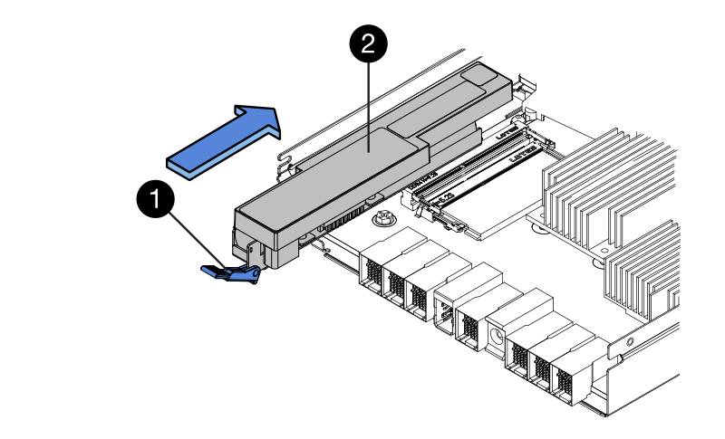

= E2800 이중 구성의 컨트롤러를 교체합니다
:allow-uri-read: 
:experimental: 
:icons: font
:imagesdir: ../media/

[role="lead"]
다음 컨트롤러 쉘프에 대해 이중 컨트롤러(이중 컨트롤러) 구성의 컨트롤러 캐니스터를 교체할 수 있습니다.

* E2812 컨트롤러 쉘프
* E2824 컨트롤러 쉘프
* E2860 컨트롤러 쉘프
* EF280 플래시 어레이

.이 작업에 대해
각 컨트롤러 캐니스터에는 컨트롤러 카드, 배터리 및 HIC(호스트 인터페이스 카드) 옵션이 포함되어 있습니다. 컨트롤러 캐니스터를 교체할 경우 배터리와 HIC가 설치된 경우 원래 컨트롤러 캐니스터에서 이를 제거하여 교체 컨트롤러 캐니스터에 설치해야 합니다.

.시작하기 전에
다음 사항을 확인하십시오.

* 교체 중인 컨트롤러 캐니스터와 부품 번호가 동일한 교체용 컨트롤러 캐니스터 (부품 번호를 확인하려면 1단계를 참조하십시오.)
* ESD 밴드이거나 다른 정전기 방지 예방 조치를 취했습니다.
* #1 십자 드라이버.
* 컨트롤러 캐니스터에 연결된 각 케이블을 식별하는 레이블입니다.
* 컨트롤러의 SANtricity 시스템 관리자에 액세스할 수 있는 브라우저가 있는 관리 스테이션. System Manager 인터페이스를 열려면 브라우저에서 컨트롤러의 도메인 이름 또는 IP 주소를 가리킵니다.

== 1단계: 컨트롤러 교체 준비(양면 인쇄)

교체 컨트롤러 캐니스터의 FRU 부품 번호가 올바른지, 구성을 백업하고, 지원 데이터를 수집하여 컨트롤러를 교체할 준비를 합니다. 컨트롤러가 여전히 온라인 상태인 경우 오프라인 상태로 전환해야 합니다.

.단계
. 새 컨트롤러 캐니스터의 포장을 풀고 정전기가 없는 평평한 표면에 놓습니다.
+
오류가 발생한 컨트롤러 캐니스터를 배송할 때 사용할 포장재를 보관합니다.

. 컨트롤러 캐니스터 뒷면에서 MAC 주소 및 FRU 부품 번호 레이블을 찾습니다.
+
image::../media/28_dwg_e2800_labels_maint-e2800.gif[E2800 컨트롤러의 MAC 주소 및 FRU 부품 번호]

+
* (1) * _MAC 주소: _ 관리 포트 1의 MAC 주소(""P1"). DHCP를 사용하여 원래 컨트롤러의 IP 주소를 얻은 경우 이 주소가 새 컨트롤러에 연결되어 있어야 합니다.

+
* (2) * _FRU 부품 번호: _ 이 번호는 현재 설치된 컨트롤러의 교체 부품 번호와 일치해야 합니다.

. SANtricity 시스템 관리자에서 교체할 컨트롤러 캐니스터의 교체 부품 번호를 찾습니다.
+
컨트롤러에 장애가 발생하여 교체해야 하는 경우 Recovery Guru의 세부 정보 영역에 교체 부품 번호가 표시됩니다. 이 번호를 수동으로 찾아야 하는 경우 다음 단계를 수행하십시오.

+
.. 하드웨어 * 를 선택합니다.
.. 컨트롤러 아이콘으로 표시된 컨트롤러 쉘프를 찾습니다.image:../media/sam1130_ss_hardware_controller_icon_maint-e2800.gif["컨트롤러 아이콘"]
.. 컨트롤러 아이콘을 클릭합니다.
.. 컨트롤러를 선택하고 * 다음 * 을 클릭합니다.
.. 기본 * 탭에서 컨트롤러의 * 교체 부품 번호 * 를 기록해 둡니다.

. 장애가 발생한 컨트롤러의 교체 부품 번호가 교체 컨트롤러의 FRU 부품 번호와 같은지 확인합니다.
+

CAUTION: * 데이터 액세스 손실 가능성 * -- 두 부품 번호가 동일하지 않은 경우 이 절차를 시도하지 마십시오. 또한, 장애가 발생한 컨트롤러 캐니스터에 HIC(호스트 인터페이스 카드)가 포함된 경우 해당 HIC를 새 컨트롤러 캐니스터에 설치해야 합니다. 일치하지 않는 컨트롤러 또는 HIC가 있으면 새 컨트롤러를 온라인으로 전환할 때 새 컨트롤러가 잠기게 됩니다.

. SANtricity System Manager를 사용하여 스토리지 시스템의 구성 데이터베이스를 백업합니다.
+
컨트롤러를 제거할 때 문제가 발생하면 저장된 파일을 사용하여 구성을 복원할 수 있습니다. 시스템에서 RAID 구성 데이터베이스의 현재 상태를 저장합니다. 이 데이터베이스는 볼륨 그룹 및 컨트롤러의 디스크 풀에 대한 모든 데이터를 포함합니다.

+
** System Manager에서:
+
... 지원 [지원 센터 > 진단] 메뉴를 선택합니다.
... 구성 데이터 수집 * 을 선택합니다.
... 수집 * 을 클릭합니다.
+
파일은 브라우저의 다운로드 폴더에 * configurationData - <arrayName> - <DateTime>.7z * 라는 이름으로 저장됩니다.

** 또는 다음 CLI 명령을 사용하여 구성 데이터베이스를 백업할 수도 있습니다.
+
Save storageArray dbmDatabase sourceLocation = 온보드 contentType = 모든 파일 = "파일 이름";"

. SANtricity 시스템 관리자를 사용하여 스토리지 어레이에 대한 지원 데이터를 수집합니다.
+
컨트롤러를 제거할 때 문제가 발생하면 저장된 파일을 사용하여 문제를 해결할 수 있습니다. 시스템은 스토리지 어레이에 대한 인벤토리, 상태 및 성능 데이터를 단일 파일로 저장합니다.

+
.. 지원 [지원 센터 > 진단] 메뉴를 선택합니다.
.. 지원 데이터 수집 * 을 선택합니다.
.. 수집 * 을 클릭합니다.
+
파일은 브라우저의 다운로드 폴더에 * support-data.7z * 라는 이름으로 저장됩니다.

. 컨트롤러가 아직 오프라인 상태가 아닌 경우 SANtricity 시스템 관리자를 사용하여 오프라인 상태로 전환합니다.
+
** SANtricity 시스템 관리자:
+
... 하드웨어 * 를 선택합니다.
... 그래픽에 드라이브가 표시되면 * 쉘프 뒷면 표시 * 를 선택하여 컨트롤러를 표시합니다.
... 오프라인 상태로 설정할 컨트롤러를 선택합니다.
... 상황에 맞는 메뉴에서 * 오프라인 상태로 전환 * 을 선택하고 작업을 수행할지 확인합니다.
+

NOTE: 오프라인으로 전환하려고 하는 컨트롤러를 사용하여 SANtricity 시스템 관리자에 액세스하는 경우 SANtricity 시스템 관리자를 사용할 수 없음 메시지가 표시됩니다. 다른 컨트롤러를 사용하여 SANtricity 시스템 관리자에 자동으로 액세스하려면 * 대체 네트워크 연결 * 을 선택합니다.

** 또는 다음 CLI 명령을 사용하여 컨트롤러를 오프라인으로 전환할 수 있습니다.
+
컨트롤러 A: *'et controller[a] availability=offline'의 경우

+
* 컨트롤러 B: *'et controller[b] availability=offline'의 경우

. SANtricity 시스템 관리자가 컨트롤러의 상태를 오프라인으로 업데이트할 때까지 기다립니다.
+

CAUTION: 상태가 업데이트되기 전에는 다른 작업을 시작하지 마십시오.

. Recovery Guru에서 * Recheck * 을 선택하고 세부 정보 영역에서 * OK to remove * 필드가 * Yes * 로 표시되어 이 구성 요소를 제거해도 안전하다는 것을 나타내는지 확인합니다.

== 2단계: 장애가 발생한 컨트롤러 제거(양면 인쇄)

결함이 있는 캐니스터를 새 캐니스터로 교체합니다.

=== 2a단계: 컨트롤러 캐니스터 제거(이중)

결함이 있는 컨트롤러 캐니스터를 제거하여 새 캐니스터로 교체합니다.

.단계
. ESD 밴드를 착용하거나 정전기 방지 조치를 취하십시오.
. 컨트롤러 캐니스터에 부착된 각 케이블에 레이블을 부착합니다.
. 컨트롤러 캐니스터에서 모든 케이블을 분리합니다.
+

CAUTION: 성능 저하를 방지하려면 케이블을 비틀거나 접거나 끼거나 밟지 마십시오.

. 컨트롤러 캐니스터에 SFP+ 트랜시버를 사용하는 HIC가 있는 경우 SFP를 제거합니다.
+
장애가 발생한 컨트롤러 캐니스터에서 HIC를 제거해야 하므로 HIC 포트에서 SFP를 모두 제거해야 합니다. 하지만 베이스보드 호스트 포트에 설치된 모든 SFP는 그대로 둘 수 있습니다. 케이블을 다시 연결할 때 해당 SFP를 새 컨트롤러 캐니스터로 이동할 수 있습니다.

. 컨트롤러 후면의 캐시 활성 LED가 꺼져 있는지 확인합니다.
. 캠 핸들의 래치를 꽉 잡고 분리될 때까지 캠 핸들을 오른쪽으로 열어 컨트롤러 캐니스터를 선반에서 분리합니다.
+
다음 그림은 E2812 컨트롤러 쉘프, E2824 컨트롤러 쉘프 또는 EF280 플래시 어레이의 예입니다.

+
image::../media/28_dwg_e2824_remove_controller_canister_maint-e2800.gif[컨트롤러 캐니스터를 제거합니다]

+
* (1) * _컨트롤러 캐니스터 _

+
* (2) * _ 캠 핸들 _

+
다음 그림은 E2860 컨트롤러 쉘프의 예입니다.

+
image::../media/28_dwg_e2860_add_controller_canister_maint-e2800.gif[컨트롤러 캐니스터를 제거합니다]

+
* (1) * _컨트롤러 캐니스터 _

+
* (2) * _ 캠 핸들 _

. 양손과 캠 핸들을 사용하여 컨트롤러 캐니스터를 선반에서 밀어 꺼냅니다.
+

CAUTION: 항상 두 손을 사용하여 컨트롤러 캐니스터의 무게를 지지하십시오.

+
E2812 컨트롤러 쉘프, E2824 컨트롤러 쉘프 또는 EF280 플래시 어레이에서 컨트롤러 캐니스터를 제거하면 플랩이 제자리에서 회전하여 빈 베이를 차단하여 공기 흐름과 냉각을 유지할 수 있습니다.

. 이동식 덮개가 위를 향하도록 컨트롤러 캐니스터를 뒤집습니다.
. 컨트롤러 캐니스터를 평평하고 정전기가 없는 표면에 놓습니다.

=== 2b단계: 배터리 분리(양면 인쇄)

새 컨트롤러를 설치할 수 있도록 배터리를 분리합니다.

.단계
. 단추를 누르고 덮개를 밀어서 컨트롤러 캐니스터의 덮개를 분리합니다.
. 컨트롤러 내부(배터리와 DIMM 사이)의 녹색 LED가 꺼져 있는지 확인합니다.
+
이 녹색 LED가 켜져 있으면 컨트롤러는 여전히 배터리 전원을 사용하고 있습니다. 구성 요소를 제거하기 전에 이 LED가 꺼질 때까지 기다려야 합니다.

+
image::../media/28_dwg_e2800_internal_cache_active_led_maint-e2800.gif[내부 캐시 활성 LED]

+
* (1) * _ 내부 캐시 활성 LED _

+
* (2) * _ 배터리 _

. 배터리의 파란색 분리 래치를 찾습니다.
. 분리 래치를 아래로 누르고 컨트롤러 캐니스터에서 멀리 밀어 배터리를 분리합니다.
+
image::../media/28_dwg_e2800_remove_battery_maint-e2800.gif[컨트롤러 캐니스터에서 배터리를 제거합니다]

+
* (1) * _ 배터리 분리 래치 _

+
* (2) * _ 배터리 _

. 배터리를 들어 올려 컨트롤러 캐니스터에서 꺼냅니다.

=== 단계 2c: 호스트 인터페이스 카드(양면 인쇄) 제거

컨트롤러 캐니스터에 HIC(호스트 인터페이스 카드)가 포함된 경우 원래 컨트롤러 캐니스터에서 HIC를 제거해야 새 컨트롤러 캐니스터에서 다시 사용할 수 있습니다.

.단계
. 1 십자 드라이버를 사용하여 HIC 페이스플레이트를 컨트롤러 캐니스터에 연결하는 나사를 제거합니다.
+
나사는 상단에 1개, 측면에 1개, 전면에 2개 등 4개가 있습니다.

+
image::../media/28_dwg_e2800_hic_faceplace_screws_maint-e2800.gif[전면판을 제거합니다]

. HIC 페이스플레이트를 탈거하십시오.
. 손가락이나 십자 드라이버를 사용하여 HIC를 컨트롤러 카드에 고정하는 세 개의 나비 나사를 풉니다.
. 카드를 들어 올리고 다시 밀어 컨트롤러 카드에서 HIC를 조심스럽게 분리합니다.
+

CAUTION: HIC 하단 또는 컨트롤러 카드 상단에 있는 구성 요소가 긁히거나 범프되지 않도록 주의하십시오.

+
image::../media/28_dwg_e2800_hic_thumbscrews_maint-e2800.gif[컨트롤러 카드에서 HIC를 제거합니다]

+
* (1) * _ HIC(호스트 인터페이스 카드) _

+
* (2) * _나비나사 _

. HIC를 정전기가 없는 표면에 놓습니다.

== 3단계: 새 컨트롤러 설치(양면 인쇄)

새 컨트롤러 캐니스터를 장착하여 결함이 있는 캐니스터를 교체합니다. 스토리지 배열에 두 개의 컨트롤러가 있는 경우에만 이 작업을 수행합니다(이중 구성).

=== 3a단계: 배터리 설치(양면 인쇄)

교체용 컨트롤러 캐니스터에 배터리를 설치해야 합니다. 원래 컨트롤러 캐니스터에서 분리한 배터리를 설치하거나 주문한 새 배터리를 설치할 수 있습니다.

.단계
. 교체용 컨트롤러 캐니스터를 뒤집어 이동식 덮개가 위를 향하도록 합니다.
. 덮개 단추를 누르고 덮개를 밀어 분리합니다.
. 배터리 슬롯이 사용자를 향하도록 컨트롤러 캐니스터의 방향을 맞춥니다.
. 배터리를 컨트롤러 캐니스터에 약간 아래쪽으로 삽입합니다.
+
배터리 전면의 금속 플랜지를 컨트롤러 캐니스터 하단의 슬롯에 삽입하고 배터리 상단을 캐니스터 왼쪽의 작은 정렬 핀 아래로 밀어 넣어야 합니다.

. 배터리 래치를 위로 이동하여 배터리를 고정합니다.
+
래치가 제자리에 고정되면 래치 하단이 섀시의 금속 슬롯에 후크됩니다.

+

+
* (1) * _ 배터리 분리 래치 _

+
* (2) * _ 배터리 _

. 컨트롤러 캐니스터를 뒤집어 배터리가 올바르게 설치되었는지 확인합니다.
+

CAUTION: * 하드웨어 손상 가능성 * -- 배터리 전면의 금속 플랜지가 컨트롤러 캐니스터의 슬롯에 완전히 삽입되어야 합니다(첫 번째 그림 참조). 배터리가 올바르게 설치되지 않은 경우(두 번째 그림 참조) 금속 플랜지가 컨트롤러 보드에 닿게 되어 전원을 공급할 때 컨트롤러가 손상될 수 있습니다.

+
** * 정답 * -- 배터리의 금속 플랜지가 컨트롤러의 슬롯에 완전히 삽입되어 있습니다.
+
image:../media/28_dwg_e2800_battery_flange_ok_maint-e2800.gif["올바른 금속 플랜지"]

** * 잘못됨 * -- 배터리의 금속 플랜지가 컨트롤러의 슬롯에 삽입되지 않음:
+
image:../media/28_dwg_e2800_battery_flange_not_ok_maint-e2800.gif["잘못된 금속 플랜지"]

=== 3b단계: 호스트 인터페이스 카드 설치(양면 인쇄)

원래 컨트롤러 캐니스터에서 HIC를 제거한 경우 새 컨트롤러 캐니스터에 HIC를 설치해야 합니다.

.단계
. 1 십자 드라이버를 사용하여 블랭크 페이스 플레이트를 교체용 컨트롤러 캐니스터에 연결하는 나사 4개를 분리하고 전면판을 제거합니다.
. HIC의 3개의 나비 나사를 컨트롤러의 해당 구멍에 맞추고 HIC 하단의 커넥터를 컨트롤러 카드의 HIC 인터페이스 커넥터와 맞춥니다.
+
HIC 하단 또는 컨트롤러 카드 상단에 있는 구성 요소가 긁히거나 범프되지 않도록 주의하십시오.

. HIC를 조심스럽게 제자리로 내리고 HIC 커넥터를 가볍게 눌러 HIC 커넥터를 장착합니다.
+

CAUTION: * 장비 손상 가능성 * -- HIC와 나비 나사 사이의 컨트롤러 LED에 골드 리본 커넥터가 끼이지 않도록 매우 조심하십시오.

+
image::../media/28_dwg_e2800_hic_thumbscrews_maint-e2800.gif[컨트롤러에 HIC를 다시 설치합니다]

+
* (1) * _ HIC(호스트 인터페이스 카드) _

+
* (2) * _나비나사 _

. HIC 나비 나사를 손으로 조입니다.
+
드라이버를 사용하지 마십시오. 또는 나사를 너무 세게 조일 수 있습니다.

. 1 십자 드라이버를 사용하여 원래 컨트롤러 캐니스터에서 분리한 HIC 페이스플레이트를 4개의 나사로 새 컨트롤러 캐니스터에 부착합니다.
+
image::../media/28_dwg_e2800_hic_faceplace_screws_maint-e2800.gif[전면판을 다시 설치합니다]

=== 단계 3c: 새 컨트롤러 캐니스터 설치(양면 인쇄)

배터리와 호스트 인터페이스 카드(HIC)를 설치한 후 처음 설치한 경우 새 컨트롤러 캐니스터를 컨트롤러 쉘프에 설치할 수 있습니다.

.단계
. 딸깍 소리가 날 때까지 덮개를 뒤로 밀어 컨트롤러 캐니스터에 덮개를 다시 설치합니다.
. 이동식 덮개가 아래를 향하도록 컨트롤러 캐니스터를 뒤집습니다.
. 캠 핸들을 열린 위치로 둔 상태에서 컨트롤러 캐니스터를 완전히 컨트롤러 쉘프에 밀어 넣습니다.
+
image::../media/28_dwg_e2824_remove_controller_canister_maint-e2800.gif[컨트롤러 캐니스터를 다시 장착합니다]

+
* (1) * _컨트롤러 캐니스터 _

+
* (2) * _ 캠 핸들 _

+
image::../media/28_dwg_e2860_add_controller_canister_maint-e2800.gif[컨트롤러 캐니스터를 다시 장착합니다]

+
* (1) * _컨트롤러 캐니스터 _

+
* (2) * _ 캠 핸들 _

. 캠 핸들을 왼쪽으로 이동하여 컨트롤러 캐니스터를 제자리에 고정합니다.
. 새 컨트롤러의 호스트 포트에 원래 컨트롤러의 SFP를 설치하고 모든 케이블을 다시 연결합니다.
+
둘 이상의 호스트 프로토콜을 사용하는 경우 올바른 호스트 포트에 SFP를 설치해야 합니다.

. 원래 컨트롤러가 IP 주소에 DHCP를 사용한 경우 교체 컨트롤러 후면의 레이블에 있는 MAC 주소를 찾습니다. 제거한 컨트롤러의 DNS/네트워크 및 IP 주소를 대체 컨트롤러의 MAC 주소와 연관시킬 것을 네트워크 관리자에게 요청합니다.
+

NOTE: 원래 컨트롤러가 IP 주소에 DHCP를 사용하지 않은 경우 새 컨트롤러는 제거한 컨트롤러의 IP 주소를 채택합니다.

== 4단계: 전체 컨트롤러 교체(양면 인쇄)

컨트롤러를 온라인 상태로 전환하고 지원 데이터를 수집하며 운영을 재개하십시오.

.단계
. 컨트롤러가 부팅되면 컨트롤러 LED와 7개 세그먼트 디스플레이를 확인합니다.
+
다른 컨트롤러와의 통신이 재설정된 경우:

+
** 7세그먼트 디스플레이에는 컨트롤러가 오프라인 상태임을 나타내는 반복 시퀀스 * OS *, * OL *, *_blank_ * 가 표시됩니다.
** 황색 주의 LED가 계속 켜져 있습니다.
** 호스트 링크 LED는 호스트 인터페이스에 따라 켜지거나 깜박이거나 꺼질 수 있습니다. image:../media/28_dwg_attn_led_7s_display_maint-e2800.gif["E2800 컨트롤러 LED"]
+
* (1) * _주의 LED(황색) _

+
* (2) * _7 세그먼트 표시 _

+
* (3) * _ 호스트 링크 LED _

. 컨트롤러의 7세그먼트 디스플레이에서 코드가 다시 온라인 상태가 되는지 확인합니다. 디스플레이에 다음 반복 시퀀스 중 하나가 표시되면 즉시 컨트롤러를 제거합니다.
+
** * OE *, * L0 *, *_blank_ * (일치하지 않는 컨트롤러)
** * OE *, * L6 *, *_blank_ * (지원되지 않는 HIC)
+

CAUTION: * 데이터 액세스 손실 가능성 * -- 방금 설치한 컨트롤러에 이러한 코드 중 하나가 표시되고 어떤 이유로든 다른 컨트롤러가 재설정된 경우 두 번째 컨트롤러도 잠길 수 있습니다.

. 컨트롤러가 다시 온라인 상태가 되면 Recovery Guru에서 NVSRAM 불일치가 보고되는지 확인합니다.
+
.. NVSRAM 불일치가 보고되면 다음 SMcli 명령을 사용하여 NVSRAM을 업그레이드합니다.
+
[listing]
----
SMcli <controller A IP> <controller B IP> -u admin -p <password> -k -c "download storageArray NVSRAM file=\"C:\Users\testuser\Downloads\NVSRAM .dlp file>\" forceDownload=TRUE;"
----
+
를 클릭합니다 `-k` 스토리지가 https 보안이 아닌 경우 매개 변수가 필요합니다.

+

NOTE: SMcli 명령을 완료할 수 없는 경우 에 문의하십시오 https://www.netapp.com/company/contact-us/support/["NetApp 기술 지원"^] 또는 에 로그인합니다 https://mysupport.netapp.com["NetApp Support 사이트"^] 를 눌러 케이스를 생성합니다.

. 시스템이 Optimal(최적) 상태인지 확인하고 컨트롤러 쉘프의 주의 LED를 확인합니다.
+
상태가 최적이 아니거나 주의 LED 중 하나라도 켜져 있으면 모든 케이블이 올바르게 장착되고 컨트롤러 캐니스터가 올바르게 설치되었는지 확인합니다. 필요한 경우 컨트롤러 캐니스터를 제거하고 다시 설치합니다.

+

NOTE: 문제를 해결할 수 없는 경우 기술 지원 부서에 문의하십시오.

. 필요한 경우 SANtricity System Manager를 사용하여 모든 볼륨을 원하는 소유자에게 다시 재배포합니다.
+
.. Storage [Volumes](저장소 [볼륨]) 메뉴를 선택합니다.
.. 메뉴 선택: More [Redistribute volumes](추가 [볼륨 재배포])

. 시스템의 펌웨어 및 NVSRAM 버전이 원하는 수준인지 확인하려면 하드웨어 [지원 > 업그레이드 센터] 메뉴를 클릭합니다.
+
필요한 경우 최신 버전을 설치합니다.

. SANtricity 시스템 관리자를 사용하여 스토리지 어레이에 대한 지원 데이터를 수집합니다.
+
.. 지원 [지원 센터 > 진단] 메뉴를 선택합니다.
.. 지원 데이터 수집 * 을 선택합니다.
.. 수집 * 을 클릭합니다.
+
파일은 브라우저의 다운로드 폴더에 * support-data.7z * 라는 이름으로 저장됩니다.

.다음 단계
컨트롤러 교체가 완료되었습니다. 일반 작업을 다시 시작할 수 있습니다.
