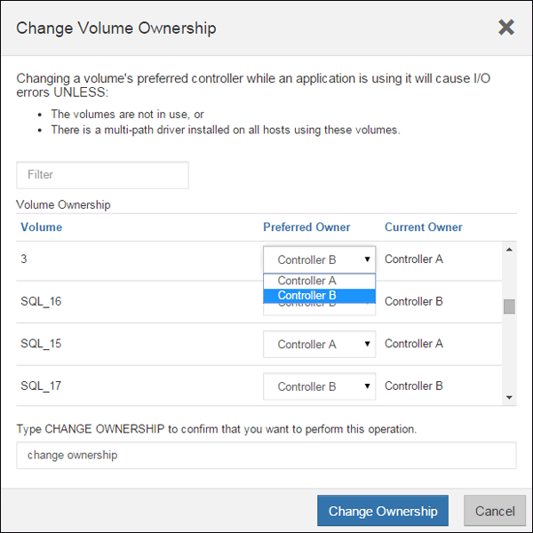

= E2800에 두 번째 컨트롤러 캐니스터를 추가합니다
:allow-uri-read: 
:experimental: 
:icons: font
:imagesdir: ../media/

[role="lead"]
E2800 어레이에 두 번째 컨트롤러 캐니스터를 추가할 수 있습니다.

.이 작업에 대해
이 작업에서는 E2812 컨트롤러 쉘프, E2824 컨트롤러 쉘프 또는 EF280 플래시 어레이의 단일 버전에 두 번째 컨트롤러 캐니스터를 추가하는 방법을 설명합니다. 이 절차를 단방향 - 양방향 변환이라고도 하며, 이는 온라인 절차입니다. 이 절차를 수행하는 동안 스토리지 배열의 데이터에 액세스할 수 있습니다.

.시작하기 전에
다음 사항을 확인하십시오.

* 현재 설치된 컨트롤러 캐니스터와 부품 번호가 동일한 새 컨트롤러 캐니스터 (부품 번호를 확인하려면 1단계를 참조하십시오.)
* 현재 설치된 컨트롤러 캐니스터의 HIC와 동일한 새 HIC(현재 설치된 컨트롤러 캐니스터에 호스트 인터페이스 카드가 포함된 경우에만 필요)
* ESD 밴드로 손목밴드를 착용하거나 기타 정전기 방지 조치를 취하십시오.
* 1 십자 드라이버.
* 새 케이블을 식별하기 위한 레이블 호환 하드웨어에 대한 자세한 내용은 를 참조하십시오 https://mysupport.netapp.com/NOW/products/interoperability["NetApp 상호 운용성 매트릭스"^] 또는 을 누릅니다 http://hwu.netapp.com/home.aspx["NetApp Hardware Universe를 참조하십시오"^].
* 새 컨트롤러 포트를 연결하는 데 필요한 모든 케이블, 트랜시버, 스위치 및 호스트 버스 어댑터(HBA)
* 컨트롤러의 SANtricity 시스템 관리자에 액세스할 수 있는 브라우저가 있는 관리 스테이션. System Manager 인터페이스를 열려면 브라우저에서 컨트롤러의 도메인 이름 또는 IP 주소를 가리킵니다.

== 1단계: 새 컨트롤러의 부품 번호를 확인합니다

새 컨트롤러의 부품 번호가 현재 설치된 컨트롤러와 동일한지 확인합니다.

.단계
. 새 컨트롤러 캐니스터의 포장을 풀고 정전기가 없는 평평한 표면에 놓습니다.
. 컨트롤러 캐니스터 뒷면에서 MAC 주소 및 FRU 부품 번호 레이블을 찾습니다.
+
image::../media/28_dwg_e2800_labels_maint-e2800.gif[E2800 컨트롤러의 MAC 주소 및 FRU 부품 번호]

+
* (1) * _MAC 주소: _ 관리 포트 1의 MAC 주소(""P1"). DHCP를 사용하여 원래 컨트롤러의 IP 주소를 얻은 경우 이 주소가 새 컨트롤러에 연결되어 있어야 합니다.

+
* (2) * _FRU 부품 번호: _ 이 번호는 현재 설치된 컨트롤러의 교체 부품 번호와 일치해야 합니다.

. SANtricity 시스템 관리자에서 설치된 컨트롤러 캐니스터의 교체 부품 번호를 찾습니다.
+
.. 하드웨어 * 를 선택합니다.
.. 컨트롤러 아이콘으로 표시된 컨트롤러 쉘프를 찾습니다.image:../media/sam1130_ss_hardware_controller_icon_maint-e2800.gif["컨트롤러 아이콘"]
.. 컨트롤러 아이콘을 클릭합니다.
.. 컨트롤러를 선택하고 * 다음 * 을 클릭합니다.
.. 기본 * 탭에서 컨트롤러의 * 교체 부품 번호 * 를 기록해 둡니다.

. 설치된 컨트롤러의 교체 부품 번호가 새 컨트롤러의 FRU 부품 번호와 같은지 확인합니다.
+

CAUTION: * 데이터 액세스 손실 가능성 * -- 두 부품 번호가 동일하지 않은 경우 이 절차를 시도하지 마십시오. 또한 원래 컨트롤러 캐니스터에 HIC(호스트 인터페이스 카드)가 포함된 경우 새 컨트롤러 캐니스터에 동일한 HIC를 설치해야 합니다. 일치하지 않는 컨트롤러 또는 HIC가 있으면 새 컨트롤러를 온라인으로 전환할 때 새 컨트롤러가 잠기게 됩니다.

== 2단계: 호스트 인터페이스 카드를 설치합니다

현재 설치된 컨트롤러에 HIC가 포함된 경우 두 번째 컨트롤러 캐니스터에 동일한 호스트 인터페이스 카드(HIC) 모델을 설치해야 합니다.

.단계
. 새 HIC의 포장을 풀고 기존 HIC와 동일한지 확인합니다.
+

CAUTION: * 데이터 액세스 손실 가능성 * -- 두 컨트롤러 캐니스터에 설치된 HIC는 동일해야 합니다. 교체 HIC가 교체 중인 HIC와 동일하지 않은 경우 이 절차를 시도하지 마십시오. 일치하지 않는 HIC가 있으면 새 컨트롤러가 온라인 상태가 되면 잠기게 됩니다.

. 커버가 위를 향하도록 새 컨트롤러 캐니스터를 뒤집습니다.
. 덮개의 버튼을 누르고 덮개를 밀어 분리합니다.
. 1 Phillips 드라이버를 사용하여 블랭크 페이스 플레이트를 컨트롤러 캐니스터에 연결하는 나사 4개를 분리하고 전면판을 제거합니다.
. HIC의 3개의 나비 나사를 컨트롤러의 해당 구멍에 맞추고 HIC 하단의 커넥터를 컨트롤러 카드의 HIC 인터페이스 커넥터와 맞춥니다.
+
HIC 하단 또는 컨트롤러 카드 상단에 있는 구성 요소가 긁히거나 범프되지 않도록 주의하십시오.

. HIC를 조심스럽게 제자리로 내리고 HIC 커넥터를 가볍게 눌러 HIC 커넥터를 장착합니다.
+

CAUTION: * 장비 손상 가능성 * -- HIC와 나비 나사 사이의 컨트롤러 LED에 골드 리본 커넥터가 끼이지 않도록 매우 조심하십시오.

+
image::../media/28_dwg_e2800_hic_thumbscrews_maint-e2800.gif[컨트롤러에 HIC를 설치합니다]

+
* (1) * _호스트 인터페이스 카드 _

+
* (2) * _나비나사 _

. HIC 나비 나사를 손으로 조입니다.
+
드라이버를 사용하지 마십시오. 또는 나사를 너무 세게 조일 수 있습니다.

. 1 Phillips 드라이버를 사용하여 앞서 분리한 나사 4개로 새 HIC 페이스플레이트를 컨트롤러 캐니스터에 부착합니다.
+
image::../media/28_dwg_e2800_hic_faceplace_screws_maint-e2800.gif[전면판을 설치합니다]

. 딸깍 소리가 날 때까지 덮개를 뒤로 밀어 컨트롤러 캐니스터에 덮개를 다시 설치합니다.
. 설치할 준비가 될 때까지 컨트롤러 캐니스터를 옆에 둡니다.

== 3단계: 지원 데이터 수집

구성 요소를 교체하기 전과 교체 후에 지원 데이터를 수집하면 교체로 문제가 해결되지 않을 경우 기술 지원 부서에 전체 로그 세트를 보낼 수 있습니다.

.단계
. SANtricity 시스템 관리자의 홈 페이지에서 스토리지 어레이가 최적의 상태인지 확인합니다.
+
상태가 최적이 아닌 경우 Recovery Guru를 사용하거나 기술 지원 부서에 문의하여 문제를 해결하십시오. 이 절차를 계속 진행하지 마십시오.

. SANtricity 시스템 관리자를 사용하여 스토리지 어레이에 대한 지원 데이터를 수집합니다.
+
.. 지원 [지원 센터 > 진단] 메뉴를 선택합니다.
.. 지원 데이터 수집 * 을 선택합니다.
.. 수집 * 을 클릭합니다.
+
파일은 브라우저의 다운로드 폴더에 * support-data.7z * 라는 이름으로 저장됩니다.

. 스토리지 시스템과 접속된 모든 호스트 간에 입출력 작업이 발생하지 않도록 합니다. 예를 들어, 다음 단계를 수행할 수 있습니다.
+
** 스토리지에서 호스트로 매핑된 LUN이 포함된 모든 프로세스를 중지합니다.
** 스토리지에서 호스트로 매핑된 LUN에 데이터를 쓰는 애플리케이션이 없는지 확인합니다.
** 스토리지의 볼륨과 연결된 모든 파일 시스템을 마운트 해제합니다.
+

NOTE: 호스트 I/O 작업을 중지하는 정확한 단계는 호스트 운영 체제 및 구성에 따라 달라지며, 이 지침은 다루지 않습니다. 사용자 환경에서 호스트 I/O 작업을 중지하는 방법을 모르는 경우 호스트를 종료하는 것이 좋습니다.

+

CAUTION: * 데이터 손실 가능성 * -- I/O 작업이 진행되는 동안 이 절차를 계속하면 데이터가 손실될 수 있습니다.

== 4단계: 구성을 양면으로 변경합니다

컨트롤러 쉘프에 두 번째 컨트롤러를 추가하기 전에 새 NVSRAM 파일을 설치하고 명령줄 인터페이스를 사용하여 스토리지 배열을 양면 인쇄 모드로 설정하여 구성을 이중 모드로 변경해야 합니다. NVSRAM 파일의 이중 버전은 SANtricity OS 소프트웨어(컨트롤러 펌웨어)용 다운로드 파일에 포함되어 있습니다.

.단계
. NetApp Support 사이트에서 관리 클라이언트로 최신 NVSRAM 파일을 다운로드합니다.
+
.. SANtricity 시스템 관리자에서 지원 [업그레이드 센터] 메뉴를 선택합니다. "SANtricity OS 소프트웨어 업그레이드" 영역에서 * NetApp SANtricity OS 다운로드 * 를 클릭합니다.
.. NetApp Support 사이트에서 * E-Series SANtricity OS 컨트롤러 소프트웨어 * 를 선택합니다.
.. 온라인 지침에 따라 설치할 NVSRAM 버전을 선택한 다음 파일 다운로드를 완료합니다. NVSRAM의 양면 버전을 선택해야 합니다(파일 이름 끝에 "D""가 있음).
+
파일 이름은 * N290X-830834-D01.DLP * 와 비슷합니다

. SANtricity 시스템 관리자를 사용하여 파일을 업그레이드합니다.
+

CAUTION: * 데이터 손실 또는 스토리지 배열 손상 위험 * -- 업그레이드 중에 스토리지 배열을 변경하지 마십시오. 스토리지 어레이에 대한 전원을 유지합니다.

+
업그레이드 전 상태 점검 중에는 작업을 취소할 수 있지만 전송 또는 활성화 중에는 취소할 수 없습니다.

+
** SANtricity 시스템 관리자:
+
... SANtricity OS 소프트웨어 업그레이드 * 에서 * 업그레이드 시작 * 을 클릭합니다.
... 컨트롤러 NVSRAM 파일 * 선택 옆에 있는 * 찾아보기 * 를 클릭한 다음 다운로드한 NVSRAM 파일을 선택합니다.
... 시작 * 을 클릭한 다음 작업을 수행할지 확인합니다.
+
업그레이드가 시작되고 다음이 발생합니다.

+
**** 업그레이드 전 상태 점검이 시작됩니다. 업그레이드 전 상태 점검에 실패하면 Recovery Guru를 사용하거나 기술 지원 부서에 문의하여 문제를 해결하십시오.
**** 컨트롤러 파일이 전송되고 활성화됩니다. 필요한 시간은 스토리지 배열 구성에 따라 다릅니다.
**** 컨트롤러가 자동으로 재부팅되어 새 설정이 적용됩니다.

** 또는 다음 CLI 명령을 사용하여 업그레이드를 수행할 수도 있습니다.
+
[listing]
----
download storageArray NVSRAM file="filename" healthCheckMelOverride=FALSE;
----
+
이 명령에서 파일 이름은 컨트롤러 NVSRAM 파일(이름에 "dl"이 있는 파일)의 이중 버전 파일 경로와 파일 이름입니다. 파일 경로와 파일 이름은 큰따옴표(" ")로 묶어야 합니다. 예를 들면 다음과 같습니다.

+
[listing]
----
file="C:\downloads\N290X-830834-D01.dlp"
----

. (선택 사항) 업그레이드된 항목 목록을 보려면 * 로그 저장 * 을 클릭합니다.
+
파일은 브라우저의 다운로드 폴더에 * latest-upgrade-log-timestamp.txt * 라는 이름으로 저장됩니다.

+
** 컨트롤러 NVSRAM을 업그레이드한 후 SANtricity 시스템 관리자에서 다음 사항을 확인하십시오.
+
*** 하드웨어 페이지로 이동하여 모든 구성 요소가 나타나는지 확인합니다.
*** 소프트웨어 및 펌웨어 인벤토리 대화 상자로 이동합니다(지원 [업그레이드 센터] 메뉴로 이동한 다음 * 소프트웨어 및 펌웨어 인벤토리 * 링크를 클릭합니다). 새 소프트웨어 및 펌웨어 버전을 확인합니다.

** 컨트롤러 NVSRAM을 업그레이드할 때 기존 NVSRAM에 적용한 모든 사용자 정의 설정은 활성화 과정 중에 유실됩니다. 활성화 프로세스가 완료된 후 NVSRAM에 사용자 정의 설정을 다시 적용해야 합니다.

. CLI 명령을 사용하여 스토리지 배열 설정을 이중화로 변경합니다. CLI를 사용하려면 CLI 패키지를 다운로드한 경우 명령 프롬프트를 열거나 Storage Manager가 설치된 경우 EMW(Enterprise Management Window)를 열 수 있습니다.
+
** 명령 프롬프트에서 다음을 수행합니다.
+
... 다음 명령을 사용하여 스토리지를 단면 인쇄에서 양면 인쇄로 전환합니다.
+
[listing]
----
set storageArray redundancyMode=duplex;
----
... 다음 명령을 사용하여 컨트롤러를 재설정합니다.
+
[listing]
----
reset controller [a];
----

** EMW 인터페이스에서:
+
... 스토리지 배열을 선택합니다.
... 메뉴 선택: 도구 [스크립트 실행].
... 텍스트 상자에 다음 명령을 입력합니다.
+
[listing]
----
set storageArray redundancyMode=duplex;
----
... 메뉴 선택: 도구 [Verify and Execute](확인 및 실행)를 선택합니다.
... 텍스트 상자에 다음 명령을 입력합니다.
+
[listing]
----
reset controller [a];
----
... 메뉴 선택: 도구 [Verify and Execute](확인 및 실행)를 선택합니다.

컨트롤러가 재부팅되면 ""대체 컨트롤러 없음"" 오류 메시지가 표시됩니다. 이 메시지는 컨트롤러 A가 이중 모드로 전환되었음을 나타냅니다. 이 메시지는 두 번째 컨트롤러를 설치하고 호스트 케이블을 연결할 때까지 지속됩니다.

== 5단계: 컨트롤러 블랭크를 분리하십시오

두 번째 컨트롤러를 설치하기 전에 컨트롤러 보호물을 분리합니다. 컨트롤러 빈칸은 컨트롤러가 하나만 있는 컨트롤러 쉘프에 설치됩니다.

.단계
. 컨트롤러 블랭크가 분리될 때까지 캠 핸들의 래치를 누른 다음 캠 핸들을 오른쪽으로 엽니다.
. 블랭크 컨트롤러 캐니스터를 잡아당겨 선반에서 꺼낸 후 한쪽에 둡니다.
+
컨트롤러 블랭크를 분리할 때 플랩이 제자리에서 회전하여 빈 베이를 차단합니다.

== 6단계: 두 번째 컨트롤러 캐니스터 설치

두 번째 컨트롤러 캐니스터를 설치하여 단일 구성을 이중 구성으로 변경합니다.

.단계
. 이동식 덮개가 아래를 향하도록 컨트롤러 캐니스터를 뒤집습니다.
. 캠 핸들을 열린 위치로 둔 상태에서 컨트롤러 캐니스터를 완전히 컨트롤러 쉘프에 밀어 넣습니다.
+
image::../media/28_dwg_e2824_add_controller_canister.gif[두 번째 컨트롤러 캐니스터를 장착합니다]

+
* (1) * _컨트롤러 캐니스터 _

+
* (2) * _ 캠 핸들 _

. 캠 핸들을 왼쪽으로 이동하여 컨트롤러 캐니스터를 제자리에 고정합니다.
. SFP+ 트랜시버를 삽입하고 케이블을 새 컨트롤러에 연결합니다.

== 7단계: 두 번째 컨트롤러 추가 완료

두 번째 컨트롤러가 올바르게 작동하는지 확인하고, 듀플렉스 NVSRAM 파일을 재설치하고, 컨트롤러 간에 볼륨을 분산하고, 지원 데이터를 수집하여 두 번째 컨트롤러를 추가하는 프로세스를 완료합니다.

.단계
. 컨트롤러가 부팅되면 컨트롤러 LED와 7개 세그먼트 디스플레이를 확인합니다.
+
다른 컨트롤러와의 통신이 재설정된 경우:

+
** 7세그먼트 디스플레이에는 컨트롤러가 오프라인 상태임을 나타내는 반복 시퀀스 * OS *, * OL *, *_blank_ * 가 표시됩니다.
** 황색 주의 LED가 계속 켜져 있습니다.
** 호스트 링크 LED는 호스트 인터페이스에 따라 켜지거나 깜박이거나 꺼질 수 있습니다. image:../media/28_dwg_attn_led_7s_display_maint-e2800.gif["E2800 컨트롤러 LED"]
+
* (1) * _주의 LED(황색) _

+
* (2) * _7 세그먼트 표시 _

+
* (3) * _ 호스트 링크 LED _

. 컨트롤러 7개 세그먼트 디스플레이에서 코드가 온라인 상태가 되는지 확인합니다. 디스플레이에 다음 반복 시퀀스 중 하나가 표시되면 즉시 컨트롤러를 제거합니다.
+
** * OE *, * L0 *, *_blank_ * (일치하지 않는 컨트롤러)
** * OE *, * L6 *, *_blank_ * (지원되지 않는 HIC)
+

CAUTION: * 데이터 액세스 손실 가능성 * -- 방금 설치한 컨트롤러에 이러한 코드 중 하나가 표시되고 어떤 이유로든 다른 컨트롤러가 재설정된 경우 두 번째 컨트롤러도 잠길 수 있습니다.

. 다음 CLI 명령을 사용하여 스토리지 설정을 단면 인쇄에서 양면으로 업데이트합니다.
+
'세트 스토리지 배열 중복 모드 = 이중;'

. SANtricity 시스템 관리자에서 컨트롤러 상태가 최적인지 확인합니다.
+
상태가 최적이 아니거나 주의 LED 중 하나라도 켜져 있으면 모든 케이블이 올바르게 장착되어 있는지 확인하고 컨트롤러 캐니스터가 올바르게 설치되어 있는지 확인합니다. 필요한 경우 컨트롤러 캐니스터를 제거하고 다시 설치합니다.

+

NOTE: 문제를 해결할 수 없는 경우 기술 지원 부서에 문의하십시오.

. SANtricity 시스템 관리자를 사용하여 NVSRAM 파일의 양면 버전을 다시 설치합니다.
+
이 단계를 수행하면 두 컨트롤러가 이 파일의 동일한 버전을 갖게 됩니다.

+

CAUTION: * 데이터 손실 또는 스토리지 배열 손상 위험 * -- 업그레이드 중에 스토리지 배열을 변경하지 마십시오. 스토리지 어레이에 대한 전원을 유지합니다.

+

NOTE: SANtricity 시스템 관리자를 사용하여 새 NVSRAM 파일을 설치할 때 SANtricity OS 소프트웨어를 설치해야 합니다. SANtricity OS 소프트웨어의 최신 버전이 이미 있는 경우 해당 버전을 다시 설치해야 합니다.

+
.. 필요한 경우 NetApp Support 사이트에서 SANtricity OS 소프트웨어의 최신 버전을 다운로드하십시오.
.. System Manager에서 Upgrade Center로 이동합니다.
.. SANtricity OS 소프트웨어 업그레이드 * 에서 * 업그레이드 시작 * 을 클릭합니다.
.. 찾아보기 * 를 클릭하고 SANtricity OS 소프트웨어 파일을 선택합니다.
.. 찾아보기 * 를 클릭하고 컨트롤러 NVSRAM 파일을 선택합니다.
.. 시작 * 을 클릭하고 작업을 수행할지 확인합니다.
+
제어 작업의 전송이 시작됩니다.

. 컨트롤러가 재부팅된 후 필요에 따라 컨트롤러 A와 새 컨트롤러 B 간에 볼륨을 배포합니다
+
.. Storage [Volumes](저장소 [볼륨]) 메뉴를 선택합니다.
.. All Volumes(모든 볼륨) 탭에서 More [Change Ownership](자세히 [소유권 변경]) 메뉴를 선택합니다.
.. 텍스트 상자에 '소유권 변경' 명령을 입력합니다
+
소유권 변경 버튼이 활성화됩니다.

.. 재배포할 각 볼륨에 대해 * Preferred Owner * 목록에서 * Controller B * 를 선택합니다.
+

.. 소유권 변경 * 을 클릭합니다.
+
프로세스가 완료되면 볼륨 소유권 변경 대화 상자에 * Preferred Owner * 및 * Current Owner * 의 새 값이 표시됩니다.

. SANtricity 시스템 관리자를 사용하여 스토리지 어레이에 대한 지원 데이터를 수집합니다.
+
.. 지원 [지원 센터 > 진단] 메뉴를 선택합니다.
.. 수집 * 을 클릭합니다.
+
파일은 브라우저의 다운로드 폴더에 * support-data.7z * 라는 이름으로 저장됩니다.

.다음 단계
두 번째 컨트롤러를 추가하는 프로세스가 완료되었습니다. 일반 작업을 다시 시작할 수 있습니다.
