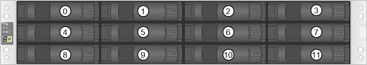
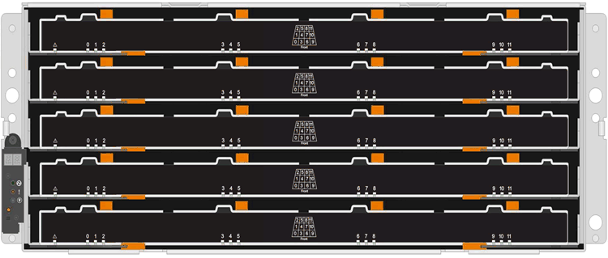

= 드라이브 E2800 교체 요구사항
:allow-uri-read: 
:icons: font
:imagesdir: ../media/

[role="lead"]
E2800 드라이브를 교체하기 전에 요구 사항과 고려 사항을 검토하십시오.

== 쉘프 유형

12 드라이브, 24 드라이브, 60 드라이브 컨트롤러 쉘프 또는 드라이브 쉘프의 드라이브를 교체할 수 있습니다.

=== 12-드라이브 또는 24-드라이브 쉘프

그림에서는 각 쉘프 유형에서 드라이브 번호가 지정되는 방식을 보여줍니다(쉘프의 전면 베젤 또는 엔드 캡이 탈거됨).

* E2812 컨트롤러 쉘프 또는 DE212C 드라이브 쉘프의 드라이브 번호 지정: *

* E2824 컨트롤러 쉘프, EF280 플래시 어레이 또는 DE224C 드라이브 쉘프의 드라이브 번호 지정: *

image::../media/28_dwg_e2824_de224c_drive_numbering_maint-e2800.gif[24-드라이브 쉘프에 대한 드라이브 번호 지정]

NOTE: E2812, E2824, EF280 스토리지 어레이에는 DE1600 12 드라이브 트레이, DE5600 24 드라이브 트레이 또는 DE6600 60 드라이브 트레이를 포함하여 하나 이상의 SAS-2 기존 확장 드라이브 트레이가 포함될 수 있습니다 이러한 드라이브 트레이 중 하나에서 드라이브를 교체하는 방법은 를 참조하십시오 link:https://library.netapp.com/ecm/ecm_download_file/ECMLP2577975["E2660, E2760, E5460, E5560 또는 E5660 트레이의 드라이브 교체"^] 및 link:https://library.netapp.com/ecm/ecm_download_file/ECMLP2577971["E2600, E2700, E5400, E5500, E5600 12-드라이브 또는 24-드라이브 트레이의 드라이브 교체"^].

=== 60-드라이브 쉘프

E2860 컨트롤러 쉘프와 DE460C 드라이브 쉘프는 모두 12개의 드라이브 슬롯이 포함된 5개의 드라이브 드로서로 구성됩니다. 드라이브 드로어 1은 상단에 있고 드라이브 드로어 5는 하단에 있습니다.

E2860 컨트롤러 쉘프 드로어 및 DE460C 드라이브 쉘프 드로어의 경우 쉘프 내의 각 드라이브 드로어에서 드라이브의 번호가 0에서 11로 지정됩니다.

image::../media/dwg_trafford_drawer_with_hdds_callouts_maint-e2800.gif[드라이브 슬롯 번호입니다]

NOTE: E2860 스토리지 어레이에는 DE1600 12 드라이브 트레이, DE5600 24 드라이브 트레이 또는 DE6600 60 드라이브 트레이를 포함하여 하나 이상의 SAS-2 기존 확장 드라이브 트레이를 포함할 수 있습니다 이러한 드라이브 트레이 중 하나에서 드라이브를 교체하는 방법은 를 참조하십시오 link:https://library.netapp.com/ecm/ecm_download_file/ECMLP2577975["E2660, E2760, E5460, E5560 또는 E5660 트레이의 드라이브 교체"^] 및 link:https://library.netapp.com/ecm/ecm_download_file/ECMLP2577971["E2600, E2700, E5400, E5500, E5600 12-드라이브 또는 24-드라이브 트레이의 드라이브 교체"^].

=== 드라이브 드로어

E2860 컨트롤러 쉘프 및 DE460C 드라이브 쉘프에서 드라이브 드로어를 교체할 수 있습니다. 이러한 60-드라이브 쉘프에는 각각 5개의 드라이브 서랍이 있습니다.

5개의 드로어 각각은 최대 12개의 드라이브를 수용할 수 있습니다.

image:../media/92_dwg_de6600_drawer_with_hdds_no_callouts_maint-e2800.gif["드라이브가 설치된 드로어"]

== 드라이브 취급

스토리지 배열의 드라이브는 충격에 약합니다. 부적절한 드라이브 취급은 드라이브 고장의 주요 원인입니다.

스토리지 배열의 드라이브가 손상되지 않도록 하려면 다음 규칙을 따르십시오.

* 정전기 방전(ESD) 방지:
+
** 설치할 준비가 될 때까지 드라이브를 ESD 백에 보관하십시오.
** ESD 백에 금속 공구나 칼날을 넣지 마십시오.
+
ESD 가방을 손으로 열거나 가위로 잘라냅니다.

** 나중에 드라이브를 반품해야 할 경우를 대비하여 ESD 가방과 포장재를 보관하십시오.
** 보관 인클로저 섀시의 도색되지 않은 표면에 접지된 ESD 손목 접지대를 항상 착용하십시오.
+
손목 스트랩을 사용할 수 없는 경우 드라이브를 다루기 전에 저장 장치 인클로저 섀시의 색칠되지 않은 표면을 만지십시오.

* 드라이브를 주의하여 다루십시오.
+
** 드라이브를 분리, 설치 또는 운반할 때는 항상 두 손을 사용하십시오.
** 드라이브를 선반에 강제로 밀어 넣은 후 부드럽고 단단한 압력을 사용하여 드라이브 래치를 완전히 결합하지 마십시오.
** 쿠션이 있는 표면에 드라이브를 놓고 드라이브를 서로 쌓지 마십시오.
** 다른 표면에 드라이브를 부딪히지 마십시오.
** 드라이브를 쉘프에서 제거하기 전에 핸들을 풀고 드라이브가 회전할 때까지 60초 동안 기다립니다.
** 드라이브를 배송할 때는 항상 승인된 포장재를 사용하십시오.

* 자기장 회피:
+
** 드라이브를 자기 장치에서 멀리 떨어진 곳에 두십시오.
+
자기장은 드라이브의 모든 데이터를 파괴하고 드라이브 회로에 돌이킬 수 없는 손상을 일으킬 수 있습니다.

