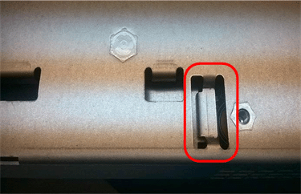

= E5700 배터리 교체
:allow-uri-read: 
:experimental: 
:icons: font
:imagesdir: ../media/

[role="lead"]
E5700 스토리지 시스템에서 장애가 발생한 배터리를 교체할 수 있습니다.

각 E5700 컨트롤러 캐니스터에는 AC 전원에 장애가 발생할 경우 캐싱된 데이터를 보관하는 배터리가 포함되어 있습니다. SANtricity 시스템 관리자의 Recovery Guru에서 배터리 실패 상태 또는 배터리 교체 필요 상태를 보고하는 경우 영향을 받는 배터리를 교체해야 합니다.

.시작하기 전에
* 사용 중인 볼륨이 없거나 이러한 볼륨을 사용하는 모든 호스트에 다중 경로 드라이버가 설치되어 있는지 확인합니다.
* 검토 link:batteries-intro-concept.html["E5700 배터리 교체 요구사항"].

.무엇을 &#8217;필요로 할거야
* 교체용 배터리
* ESD 밴드이거나 다른 정전기 방지 예방 조치를 취했습니다.
* 컨트롤러 캐니스터에 연결된 각 케이블을 식별하는 레이블입니다.
* 컨트롤러의 SANtricity 시스템 관리자에 액세스할 수 있는 브라우저가 있는 관리 스테이션. System Manager 인터페이스를 열려면 브라우저에서 컨트롤러의 도메인 이름 또는 IP 주소를 가리킵니다.

== 1단계: 컨트롤러를 오프라인으로 설정(양면 인쇄)

이중 구성이 있는 경우 장애가 발생한 배터리를 안전하게 제거할 수 있도록 영향을 받는 컨트롤러를 오프라인으로 설정합니다. 오프라인 상태로 전환하지 않는 컨트롤러는 온라인 상태여야 합니다(최적 상태).

NOTE: 스토리지 배열에 두 개의 컨트롤러가 있는 경우에만 이 작업을 수행합니다(이중 구성).

.단계
. SANtricity 시스템 관리자에서 Recovery Guru의 세부 정보를 검토하여 배터리에 문제가 있는지 확인하고 다른 항목을 먼저 해결하지 않도록 합니다.
. Recovery Guru의 세부 정보 영역에서 교체할 배터리를 확인합니다.
. SANtricity System Manager를 사용하여 스토리지 시스템의 구성 데이터베이스를 백업합니다.
+
컨트롤러를 제거할 때 문제가 발생하면 저장된 파일을 사용하여 구성을 복원할 수 있습니다. 시스템에서 RAID 구성 데이터베이스의 현재 상태를 저장합니다. 이 데이터베이스는 볼륨 그룹 및 컨트롤러의 디스크 풀에 대한 모든 데이터를 포함합니다.

+
** SANtricity 시스템 관리자:
+
... 지원 [지원 센터 > 진단] 메뉴를 선택합니다.
... 구성 데이터 수집 * 을 선택합니다.
... 수집 * 을 클릭합니다.
+
파일은 브라우저의 다운로드 폴더에 * configurationData - <arrayName> - <DateTime>.7z * 라는 이름으로 저장됩니다.

** 또는 다음 CLI 명령을 사용하여 구성 데이터베이스를 백업할 수도 있습니다.
+
Save storageArray dbmDatabase sourceLocation = 온보드 contentType = 모든 파일 = "파일 이름";"

. SANtricity 시스템 관리자를 사용하여 스토리지 어레이에 대한 지원 데이터를 수집합니다.
+
컨트롤러를 제거할 때 문제가 발생하면 저장된 파일을 사용하여 문제를 해결할 수 있습니다. 시스템은 스토리지 어레이에 대한 인벤토리, 상태 및 성능 데이터를 단일 파일로 저장합니다.

+
.. 지원 [지원 센터 > 진단] 메뉴를 선택합니다.
.. 지원 데이터 수집 * 을 선택합니다.
.. 수집 * 을 클릭합니다.
+
파일은 브라우저의 다운로드 폴더에 * support-data.7z * 라는 이름으로 저장됩니다.

. 컨트롤러가 아직 오프라인 상태가 아닌 경우 SANtricity 시스템 관리자를 사용하여 오프라인 상태로 전환합니다.
+
** SANtricity 시스템 관리자:
+
... 하드웨어 * 를 선택합니다.
... 그래픽에 드라이브가 표시되면 * 쉘프 뒷면 표시 * 를 선택하여 컨트롤러를 표시합니다.
... 오프라인 상태로 설정할 컨트롤러를 선택합니다.
... 상황에 맞는 메뉴에서 * 오프라인 상태로 전환 * 을 선택하고 작업을 수행할지 확인합니다.
+

NOTE: 오프라인으로 전환하려고 하는 컨트롤러를 사용하여 SANtricity 시스템 관리자에 액세스하는 경우 SANtricity 시스템 관리자를 사용할 수 없음 메시지가 표시됩니다. 다른 컨트롤러를 사용하여 SANtricity 시스템 관리자에 자동으로 액세스하려면 * 대체 네트워크 연결 * 을 선택합니다.

** 또는 다음 CLI 명령을 사용하여 컨트롤러를 오프라인으로 전환할 수 있습니다.
+
컨트롤러 A: *'et controller[a] availability=offline'의 경우

+
* 컨트롤러 B: *'et controller[b] availability=offline'의 경우

. SANtricity 시스템 관리자가 컨트롤러의 상태를 오프라인으로 업데이트할 때까지 기다립니다.
+

CAUTION: 상태가 업데이트되기 전에는 다른 작업을 시작하지 마십시오.

== 2단계: 컨트롤러 캐니스터 제거

결함이 있는 배터리를 제거하려면 먼저 컨트롤러 캐니스터를 제거해야 합니다.

.단계
. ESD 밴드를 착용하거나 정전기 방지 조치를 취하십시오.
. 컨트롤러 캐니스터에 부착된 각 케이블에 레이블을 부착합니다.
. 컨트롤러 캐니스터에서 모든 케이블을 분리합니다.
+

CAUTION: 성능 저하를 방지하려면 케이블을 비틀거나 접거나 끼거나 밟지 마십시오.

. 컨트롤러 캐니스터의 호스트 포트가 SFP+ 트랜시버를 사용하는 경우 포트를 설치된 상태로 둡니다.
. 컨트롤러 후면의 캐시 활성 LED가 꺼져 있는지 확인합니다.
. 캠 핸들의 래치를 꽉 잡고 분리될 때까지 캠 핸들을 오른쪽으로 열어 컨트롤러 캐니스터를 선반에서 분리합니다.
+
다음 그림은 E5724 컨트롤러 쉘프의 예입니다.

+
image::../media/28_dwg_e2824_remove_controller_canister_maint-e5700.gif[28 DWG e2824 컨트롤러 캐니스터 유지보수 ed5700을 제거합니다]

+
* (1) * _컨트롤러 캐니스터 _

+
* (2) * _ 캠 핸들 _

+
다음 그림은 E5560 컨트롤러 쉘프의 예입니다.

+
image::../media/28_dwg_e2860_add_controller_canister_maint-e5700.gif[28 DWG e2860 컨트롤러 캐니스터 유지보수 e5700을 추가합니다]

+
* (1) * _컨트롤러 캐니스터 _

+
* (2) * _ 캠 핸들 _

. 양손과 캠 핸들을 사용하여 컨트롤러 캐니스터를 선반에서 밀어 꺼냅니다.
+

CAUTION: 항상 두 손을 사용하여 컨트롤러 캐니스터의 무게를 지지하십시오.

+
E5724 컨트롤러 쉘프에서 컨트롤러 캐니스터를 제거하는 경우 플랩이 제자리에 장착되어 빈 베이를 차단하여 공기 흐름과 냉각을 유지합니다.

. 이동식 덮개가 위를 향하도록 컨트롤러 캐니스터를 뒤집습니다.
. 컨트롤러 캐니스터를 평평하고 정전기가 없는 표면에 놓습니다.

== 3단계: 결함이 있는 배터리를 제거합니다

컨트롤러 쉘프에서 컨트롤러 캐니스터를 제거한 후 배터리를 분리합니다.

.단계
. 단추를 누르고 덮개를 밀어서 컨트롤러 캐니스터의 덮개를 분리합니다.
. 컨트롤러 내부(배터리와 DIMM 사이)의 녹색 LED가 꺼져 있는지 확인합니다.
+
이 녹색 LED가 켜져 있으면 컨트롤러는 여전히 배터리 전원을 사용하고 있습니다. 구성 요소를 제거하기 전에 이 LED가 꺼질 때까지 기다려야 합니다.

+
image::../media/28_dwg_e2800_internal_cache_active_led_maint-e5700.gif[28 DWG e2800 내부 캐시가 활성 상태로 유지 관리 e5700이 되었습니다]

+
* (1) * _ 내부 캐시 활성 LED _

+
* (2) * _ 배터리 _

. 배터리의 파란색 분리 래치를 찾습니다.
. 분리 래치를 아래로 누르고 컨트롤러 캐니스터에서 멀리 밀어 배터리를 분리합니다.
+
image::../media/28_dwg_e2800_remove_battery_maint-e5700.gif[28 DWG e2800 배터리 유지 관리 e5700을 제거합니다]

+
* (1) * _ 배터리 분리 래치 _

+
* (2) * _ 배터리 _

. 배터리를 들어 올려 컨트롤러 캐니스터에서 꺼냅니다.
. 결함이 있는 배터리를 재활용하거나 폐기하려면 해당 지역의 적절한 절차를 따르십시오.
+

CAUTION: IATA(International Air Transport Association) 규정을 준수하기 위해 리튬 배터리는 컨트롤러 선반 안에 설치하지 않는 한 항공편으로 배송하지 마십시오.

== 4단계: 새 배터리를 장착하십시오

결함이 있는 배터리를 제거한 후 새 배터리를 설치합니다.

.단계
. 새 배터리의 포장을 풀고 정전기가 없는 평평한 표면에 놓습니다.
+

NOTE: IATA 안전 규정을 준수하기 위해 교체 배터리는 30% 이하의 충전 상태(SoC)로 배송됩니다. 전원을 다시 켜면 교체 배터리가 완전히 충전되고 최초 학습 사이클이 완료될 때까지 쓰기 캐싱이 재개되지 않습니다.

. 배터리 슬롯이 사용자를 향하도록 컨트롤러 캐니스터의 방향을 맞춥니다.
. 배터리를 컨트롤러 캐니스터에 약간 아래쪽으로 삽입합니다.
+
배터리 전면의 금속 플랜지를 컨트롤러 캐니스터 하단의 슬롯에 삽입한 다음 배터리 상단을 캐니스터 왼쪽의 작은 정렬 핀 아래로 밀어 넣어야 합니다.

. 배터리 래치를 위로 이동하여 배터리를 고정합니다.
+
래치가 제자리에 고정되면 래치 하단이 섀시의 금속 슬롯에 후크됩니다.

+
image::../media/28_dwg_e2800_insert_battery_maint-e5700.gif[28 DWG e2800 인서트 배터리 유지보수 e5700]

+
* (1) * _ 배터리 분리 래치 _

+
* (2) * _ 배터리 _

. 컨트롤러 캐니스터를 뒤집어 배터리가 올바르게 설치되었는지 확인합니다.
+

CAUTION: * 하드웨어 손상 가능성 * -- 배터리 전면의 금속 플랜지가 컨트롤러 캐니스터의 슬롯에 완전히 삽입되어야 합니다(첫 번째 그림 참조). 배터리가 올바르게 설치되지 않은 경우(두 번째 그림 참조) 금속 플랜지가 컨트롤러 보드에 닿게 되어 전원을 공급할 때 컨트롤러가 손상될 수 있습니다.

+
** * 정답 * -- 배터리의 금속 플랜지가 컨트롤러의 슬롯에 완전히 삽입되어 있습니다.
+
image:../media/28_dwg_e2800_battery_flange_ok_maint-e5700.gif[""]

** * 잘못됨 * -- 배터리의 금속 플랜지가 컨트롤러의 슬롯에 삽입되지 않음:
+

== 5단계: 컨트롤러 캐니스터 재설치

새 배터리를 장착한 후 컨트롤러 캐니스터를 컨트롤러 쉘프에 다시 설치합니다.

.단계
. 딸깍 소리가 날 때까지 덮개를 뒤로 밀어 컨트롤러 캐니스터에 덮개를 다시 설치합니다.
. 이동식 덮개가 아래를 향하도록 컨트롤러 캐니스터를 뒤집습니다.
. 캠 핸들을 열린 위치로 둔 상태에서 컨트롤러 캐니스터를 완전히 컨트롤러 쉘프에 밀어 넣습니다.
+
image::../media/28_dwg_e2824_remove_controller_canister_maint-e5700.gif[28 DWG e2824 컨트롤러 캐니스터 유지보수 ed5700을 제거합니다]

+
* (1) * _컨트롤러 캐니스터 _

+
* (2) * _ 캠 핸들 _

+
image::../media/28_dwg_e2860_add_controller_canister_maint-e5700.gif[28 DWG e2860 컨트롤러 캐니스터 유지보수 e5700을 추가합니다]

+
* (1) * _컨트롤러 캐니스터 _

+
* (2) * _ 캠 핸들 _

. 캠 핸들을 왼쪽으로 이동하여 컨트롤러 캐니스터를 제자리에 고정합니다.
. 모든 케이블을 다시 연결합니다.

== 6단계: 컨트롤러를 온라인으로 전환(양면 인쇄)

이중 구성의 경우 컨트롤러를 온라인 상태로 전환하고 지원 데이터를 수집하며 작업을 다시 시작합니다.

NOTE: 스토리지 어레이에 컨트롤러가 두 개인 경우에만 이 작업을 수행합니다.

.단계
. 컨트롤러가 부팅되면 컨트롤러 LED와 7개 세그먼트 디스플레이를 확인합니다.
+

NOTE: 그림은 컨트롤러 캐니스터의 예를 보여줍니다. 컨트롤러의 호스트 포트 수와 유형은 다를 수 있습니다.

+
다른 컨트롤러와의 통신이 재설정된 경우:

+
** 7세그먼트 디스플레이에는 컨트롤러가 오프라인 상태임을 나타내는 반복 시퀀스 * OS *, * OL *, *_blank_ * 가 표시됩니다.
** 황색 주의 LED가 계속 켜져 있습니다.
** 호스트 인터페이스에 따라 호스트 링크 LED가 켜지거나 깜박이거나 꺼질 수 있습니다.image:../media/e5700_hic_3_callouts_maint-e5700.gif[""]
+
* (1) * _ 호스트 링크 LED _

+
* (2) * _주의 LED(황색) _

+
* (3) * _7 세그먼트 표시 _

. SANtricity 시스템 관리자를 사용하여 컨트롤러를 온라인 상태로 전환합니다.
+
** SANtricity 시스템 관리자:
+
... 하드웨어 * 를 선택합니다.
... 그래픽에 드라이브가 표시되면 * Show back of shelf * 를 선택합니다.
... 온라인으로 설정하려는 컨트롤러를 선택합니다.
... 상황에 맞는 메뉴에서 * 온라인 위치 * 를 선택하고 작업을 수행할지 확인합니다.
+
컨트롤러가 온라인 상태가 됩니다.

** 또는 다음 CLI 명령을 사용하여 컨트롤러를 온라인으로 전환할 수 있습니다.
+
컨트롤러 A: * et controller [a] availability = online;"

+
* 컨트롤러 B: * 의 경우 [b] 가용성온라인;"

. 컨트롤러가 다시 온라인 상태가 최적인지 확인하고 컨트롤러 쉘프의 주의 LED를 확인합니다.
+
상태가 최적이 아니거나 주의 LED 중 하나라도 켜져 있는 경우 모든 케이블이 올바르게 장착되어 있는지 확인하고 배터리 및 컨트롤러 캐니스터가 올바르게 설치되어 있는지 확인합니다. 필요한 경우 컨트롤러 캐니스터와 배터리를 분리했다가 다시 설치합니다.

+

NOTE: 문제를 해결할 수 없는 경우 기술 지원 부서에 문의하십시오.

. 필요한 경우 SANtricity 시스템 관리자를 사용하여 스토리지 어레이에 대한 지원 데이터를 수집합니다.
+
.. 지원 * > * 지원 센터 * > * 진단 * 을 선택합니다.
.. 지원 데이터 수집 * 을 선택합니다.
.. 수집 * 을 클릭합니다.
+
파일은 브라우저의 다운로드 폴더에 * support-data.7z * 라는 이름으로 저장됩니다.

배터리 교체가 완료되었습니다. 일반 작업을 다시 시작할 수 있습니다.
