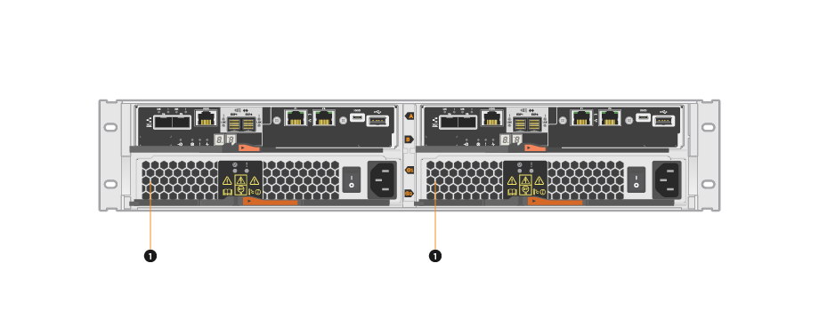

= E5700 캐니스터 교체 요구사항
:allow-uri-read: 
:icons: font
:imagesdir: ../media/

[role="lead"]
E5700 캐니스터를 교체하기 전에 요구사항 및 고려 사항을 검토하십시오.

캐니스터는 3가지 유형, 즉 12-드라이브 또는 24-드라이브 컨트롤러 쉘프 또는 드라이브 쉘프에서 이중 전원을 공급하고 적절한 냉각 기능을 제공하는 전원 팬 캐니스터, 60-드라이브 컨트롤러 쉘프 또는 드라이브 쉘프의 전원 중복에 사용되는 전원 캐니스터, 60-드라이브 컨트롤러 쉘프 또는 드라이브 쉘프를 냉각하는 데 사용되는 팬 캐니스터를 지원합니다.

== 전원 공급 장치

NOTE: 전원 공급 장치 교체 절차는 IOM 교체에 적용할 수 있습니다. IOM을 교체하려면 전원 공급 장치 교체 절차를 수행하십시오.

각 24-드라이브 컨트롤러 쉘프 또는 드라이브 쉘프에는 통합 팬을 포함하는 2개의 전원 공급 장치가 있습니다. 이러한 SANtricity System Manager를 _power-fan canisters_라고 합니다. 전원 팬 캐니스터가 고장일 경우 가능한 한 빨리 교체하여 선반이 예비 전원과 적절한 냉각 기능을 갖도록 해야 합니다.

=== 전원 공급 장치의 쉘프 유형

다음 쉘프에서 전원 공급 장치를 교체할 수 있습니다.

* E5724 컨트롤러 쉘프
* DE224C 드라이브 쉘프

다음 그림은 전원 공급 장치 2개(전원 팬 캐니스터)가 있는 E5724 컨트롤러 쉘프의 예를 보여줍니다. DE224C 드라이브 쉘프는 동일하지만 컨트롤러 캐니스터 대신 I/O 모듈(IOM)을 포함합니다.

컨트롤러 캐니스터 아래에 전원 공급 장치(전원 팬 캐니스터) 2개가 있는 * (1) * _ 컨트롤러 쉘프

_Replace power supply__ 항목은 E5700 또는 E2800 컨트롤러 쉘프에 연결될 수 있는 DE1600 또는 DE5600 드라이브 트레이에서 장애가 발생한 전원 팬 캐니스터를 교체하는 방법에 대해 설명하지 않습니다. 이러한 드라이브 트레이 모델에 대한 지침은 을 참조하십시오 link:https://library.netapp.com/ecm/ecm_download_file/ECMP1140874["DE1600 드라이브 트레이 또는 DE5600 드라이브 트레이의 전원 팬 캐니스터 교체"].

=== 전원 공급 장치 교체 요구 사항

전원 공급 장치를 교체하려는 경우 다음 요구 사항을 염두에 두십시오.

* 컨트롤러 쉘프 또는 드라이브 쉘프 모델에서 지원되는 대체 전원 공급 장치(전원 팬 캐니스터)가 있어야 합니다.
* ESD 밴드를 가지고 있거나 다른 정전기 방지 예방 조치를 취했습니다.
* 다음 조건이 충족될 경우, 스토리지 배열의 전원이 켜져 있고 호스트 I/O 작업을 수행하는 동안 전원 공급 장치(전원 팬 캐니스터)를 교체할 수 있습니다.
+
** 선반의 두 번째 전원 공급 장치(전원 팬 캐니스터)가 최적 상태입니다.
** SANtricity 시스템 관리자의 Recovery Guru 세부 정보 영역에 있는 *제거할 수 있음* 필드가* 예*로 표시되면 이 구성 요소를 제거해도 안전하다는 의미입니다.
+

NOTE: 쉘프의 두 번째 전원 공급 장치(전원 팬 캐니스터)가 최적의 상태가 아니거나 Recovery Guru에서 전원 팬 캐니스터를 제거할 수 없는 경우 기술 지원 부서에 문의하십시오.

== 전원 캐니스터

각 60-드라이브 컨트롤러 쉘프 또는 드라이브 쉘프에는 전원 이중화를 위한 2개의 전원 캐니스터가 포함됩니다.

=== 전원 캐니스터용 쉘프 유형

다음 선반의 전원 캐니스터를 교체할 수 있습니다.

* E57760 컨트롤러 쉘프
* DE460C 드라이브 쉘프

_Replace power 캐니스터_항목은 컨트롤러 쉘프에 연결될 수 있는 DE6600 드라이브 트레이에서 장애가 발생한 전원 캐니스터를 교체하는 방법을 설명하지 않습니다.

다음 그림은 두 개의 전원 캐니스터가 있는 DE460C 드라이브 쉘프의 후면을 보여줍니다.

image::../media/28_dwg_de460c_rear_no_callouts_maint-e5700.gif[두 개의 파워 캐니스터가 있는 DE460C]

다음 그림은 전원 캐니스터를 보여줍니다.

image::../media/28_dwg_e2860_de460c_psu_maint-e5700.gif[전원 캐니스터]

=== 전원 캐니스터 교체 요구 사항

전원 캐니스터를 교체하려는 경우 다음 요구 사항을 염두에 두십시오.

* 교체 전원 캐니스터는 컨트롤러 쉘프 또는 드라이브 쉘프 모델에서 지원됩니다.
* 하나의 전원 캐니스터가 설치되고 실행 중입니다.
* ESD 밴드를 가지고 있거나 다른 정전기 방지 예방 조치를 취했습니다.
* 다음 조건이 충족될 경우, 스토리지 배열의 전원이 켜져 있고 호스트 I/O 작업을 수행하는 동안 전원 캐니스터를 교체할 수 있습니다.
* 선반의 다른 전원 캐니스터는 최적 상태입니다.
+

NOTE: 이 절차를 수행하는 동안 다른 전원 캐니스터는 두 팬에 전원을 공급하여 장비가 과열되지 않도록 합니다.

* SANtricity 시스템 관리자의 Recovery Guru 세부 정보 영역에 있는 *제거할 수 있음* 필드가* 예*로 표시되면 이 구성 요소를 제거해도 안전하다는 의미입니다.
+

NOTE: 쉘프의 두 번째 전원 캐니스터가 최적의 상태가 아니거나 Recovery Guru에서 전원 캐니스터를 제거할 수 없는 경우 기술 지원 부서에 문의하십시오.

== 팬 캐니스터

각 60-드라이브 컨트롤러 쉘프 또는 드라이브 쉘프에는 2개의 팬 캐니스터가 포함됩니다.

=== 팬 캐니스터용 선반 유형

다음 선반의 팬 캐니스터를 교체할 수 있습니다.

* E57760 컨트롤러 쉘프
* DE460C 드라이브 쉘프

_Fan 캐니스터 교체_항목에서는 컨트롤러 쉘프에 연결될 수 있는 DE6600 드라이브 트레이에서 장애가 발생한 팬 캐니스터를 교체하는 방법에 대해 설명하지 않습니다.

다음 그림에서는 팬 캐니스터를 보여 줍니다.

image::../media/28_dwg_e2860_de460c_single_fan_canister_no_callouts_maint-e5700.gif[팬 캐니스터]

다음 그림은 두 개의 팬 캐니스터가 있는 DE460C 쉘프의 후면을 보여줍니다.

image::../media/28_dwg_de460c_rear_no_callouts_maint-e5700.gif[팬 캐니스터 2개가 장착된 DE460C]

CAUTION: * 발생 가능한 장비 손상 * -- 전원을 켠 상태로 팬 캐니스터를 교체할 경우, 장비 과열 가능성을 방지하기 위해 30분 이내에 교체 절차를 완료해야 합니다.

=== 팬 캐니스터 교체 요구 사항

팬 캐니스터를 교체하려는 경우 다음 요구 사항을 염두에 두십시오.

* 컨트롤러 쉘프 또는 드라이브 쉘프 모델에서 지원되는 교체용 팬 캐니스터(팬)가 있습니다.
* 하나의 팬 캐니스터가 설치되고 실행 중입니다.
* ESD 밴드를 가지고 있거나 다른 정전기 방지 예방 조치를 취했습니다.
* 전원을 켠 상태에서 이 절차를 수행할 경우 장비 과열 가능성을 방지하기 위해 30분 이내에 완료해야 합니다.
* 다음 조건이 충족될 경우 스토리지 배열의 전원이 켜져 있고 호스트 I/O 작업을 수행하는 동안 팬 캐니스터를 교체할 수 있습니다.
+
** 선반의 두 번째 팬 캐니스터는 최적 상태입니다.
** SANtricity 시스템 관리자의 Recovery Guru 세부 정보 영역에 있는 *제거할 수 있음* 필드가* 예*로 표시되면 이 구성 요소를 제거해도 안전하다는 의미입니다.
+

NOTE: 선반의 두 번째 팬 캐니스터가 최적의 상태가 아니거나 Recovery Guru에서 팬 캐니스터를 제거할 수 없는 경우 기술 지원 부서에 문의하십시오.

