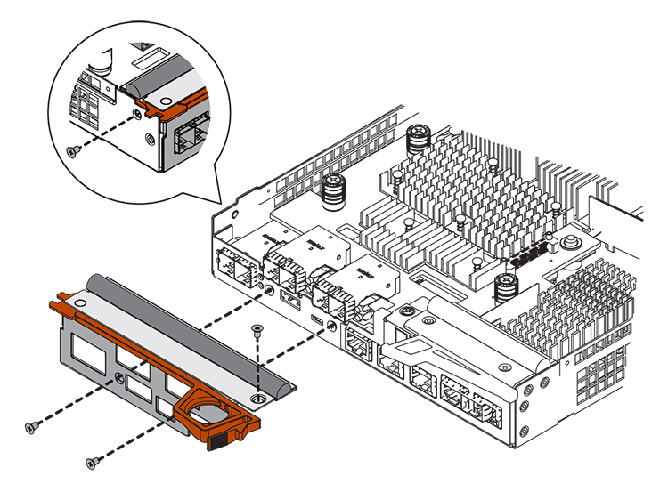

= E5700 호스트 인터페이스 카드(HIC) 추가
:experimental: 
:icons: font
:imagesdir: ../media/

[role="lead"]
HIC(호스트 인터페이스 카드)를 베이스보드 호스트 포트가 있는 E5700 컨트롤러 캐니스터에 추가할 수 있습니다. 이렇게 하면 스토리지 배열에서 호스트 포트 수가 늘어나고 추가 호스트 프로토콜이 제공됩니다.

HIC를 추가할 때는 스토리지 어레이의 전원을 끄고 전원을 다시 전원을 설치해야 합니다.

.시작하기 전에
* 검토 link:hics-overview-supertask-concept.html["E5700 HIC 교체 요구사항"].
* 이 절차에 대한 다운타임 유지 보수 기간을 예약합니다. HIC를 설치할 때는 전원을 꺼야 하므로 이 절차를 성공적으로 완료할 때까지 스토리지 배열의 데이터에 액세스할 수 없습니다. (이중 구성에서는 두 컨트롤러가 전원을 켤 때 동일한 HIC 구성을 가져야 합니다.)

.무엇을 &#8217;필요로 할거야
* 스토리지 어레이에 하나 또는 두 개의 컨트롤러가 있는지 여부에 따라 하나 또는 두 개의 HIC를 제공합니다. HIC는 컨트롤러와 호환되어야 합니다.
* 스위치 또는 호스트 버스 어댑터(HBA)와 같은 새 호스트 포트에 새 호스트 하드웨어가 설치됩니다.
* 새 호스트 포트를 연결하는 데 필요한 모든 케이블, 트랜시버, 스위치 및 호스트 버스 어댑터(HBA)
+
호환 하드웨어에 대한 자세한 내용은 를 참조하십시오 https://mysupport.netapp.com/NOW/products/interoperability["NetApp 상호 운용성 매트릭스"^] 및.

* 컨트롤러 캐니스터에 연결된 각 케이블을 식별하는 레이블입니다.
* ESD 밴드이거나 다른 정전기 방지 예방 조치를 취했습니다.
* 1 십자 드라이버.
* 컨트롤러의 SANtricity 시스템 관리자에 액세스할 수 있는 브라우저가 있는 관리 스테이션. System Manager 인터페이스를 열려면 브라우저에서 컨트롤러의 도메인 이름 또는 IP 주소를 가리킵니다.

== 1단계: HIC를 추가할 준비를 합니다

스토리지 시스템의 구성 데이터베이스를 백업하고 지원 데이터를 수집하며 호스트 I/O 작업을 중지하여 HIC를 추가할 준비를 합니다. 그런 다음 컨트롤러 쉘프의 전원을 끕니다.

.단계
. SANtricity 시스템 관리자의 홈 페이지에서 스토리지 어레이가 최적의 상태인지 확인합니다.
+
상태가 최적이 아닌 경우 Recovery Guru를 사용하거나 기술 지원 부서에 문의하여 문제를 해결하십시오. 이 절차를 계속 진행하지 마십시오.

. SANtricity System Manager를 사용하여 스토리지 시스템의 구성 데이터베이스를 백업합니다.
+
이 절차 중에 문제가 발생하면 저장된 파일을 사용하여 구성을 복원할 수 있습니다. 시스템에서 RAID 구성 데이터베이스의 현재 상태를 저장합니다. 이 데이터베이스는 볼륨 그룹 및 컨트롤러의 디스크 풀에 대한 모든 데이터를 포함합니다.

+
** System Manager에서:
+
... 지원 [지원 센터 > 진단] 메뉴를 선택합니다.
... 구성 데이터 수집 * 을 선택합니다.
... 수집 * 을 클릭합니다.
+
파일은 브라우저의 다운로드 폴더에 * configurationData - <arrayName> - <DateTime>.7z * 라는 이름으로 저장됩니다.

** 또는 다음 CLI 명령을 사용하여 구성 데이터베이스를 백업할 수도 있습니다.
+
Save storageArray dbmDatabase sourceLocation = 온보드 contentType = 모든 파일 = "파일 이름";"

. SANtricity 시스템 관리자를 사용하여 스토리지 어레이에 대한 지원 데이터를 수집합니다.
+
이 절차 중에 문제가 발생하면 저장된 파일을 사용하여 문제를 해결할 수 있습니다. 시스템은 스토리지 어레이에 대한 인벤토리, 상태 및 성능 데이터를 단일 파일로 저장합니다.

+
.. 지원 [지원 센터 > 진단] 메뉴를 선택합니다.
.. 지원 데이터 수집 * 을 선택합니다.
.. 수집 * 을 클릭합니다.
+
파일은 브라우저의 다운로드 폴더에 * support-data.7z * 라는 이름으로 저장됩니다.

. 스토리지 시스템과 접속된 모든 호스트 간에 입출력 작업이 발생하지 않도록 합니다. 예를 들어, 다음 단계를 수행할 수 있습니다.
+
** 스토리지에서 호스트로 매핑된 LUN이 포함된 모든 프로세스를 중지합니다.
** 스토리지에서 호스트로 매핑된 LUN에 데이터를 쓰는 애플리케이션이 없는지 확인합니다.
** 스토리지의 볼륨과 연결된 모든 파일 시스템을 마운트 해제합니다.
+

NOTE: 호스트 I/O 작업을 중지하는 정확한 단계는 호스트 운영 체제 및 구성에 따라 달라지며, 이 지침은 다루지 않습니다. 사용자 환경에서 호스트 I/O 작업을 중지하는 방법을 모르는 경우 호스트를 종료하는 것이 좋습니다.

+

CAUTION: * 데이터 손실 가능성 * -- I/O 작업이 진행되는 동안 이 절차를 계속하면 스토리지를 액세스할 수 없기 때문에 호스트 애플리케이션에서 데이터에 액세스할 수 없게 됩니다.

. 스토리지 배열이 미러링 관계에 참여하는 경우 보조 스토리지 배열에 대한 모든 호스트 I/O 작업을 중지합니다.
. 캐시 메모리의 데이터가 드라이브에 기록될 때까지 기다립니다.
+
드라이브에 캐시된 데이터를 기록해야 하는 경우 각 컨트롤러 후면의 녹색 캐시 활성 LED가 켜집니다. 이 LED가 꺼질 때까지 기다려야 합니다.

+
image::../media/e5700_ib_hic_w_cache_led_callouts_maint-e5700.gif[e5700 IB hic w cache led Callouts maint e5700]

+
* (1) * _ 캐시 활성 LED _

. SANtricity 시스템 관리자의 홈 페이지에서 * 진행 중인 작업 보기 * 를 선택합니다. 다음 단계를 계속하기 전에 모든 작업이 완료될 때까지 기다리십시오.
. 컨트롤러 쉘프의 전원을 끕니다.
+
.. 컨트롤러 쉘프의 두 전원 스위치를 끕니다.
.. 컨트롤러 쉘프의 모든 LED가 꺼질 때까지 기다립니다.

== 2단계: 컨트롤러 캐니스터 제거

새 HIC를 추가할 수 있도록 컨트롤러 캐니스터를 제거합니다.

.단계
. 컨트롤러 캐니스터에 부착된 각 케이블에 레이블을 부착합니다.
. 컨트롤러 캐니스터에서 모든 케이블을 분리합니다.
+

CAUTION: 성능 저하를 방지하려면 케이블을 비틀거나 접거나 끼거나 밟지 마십시오.

. 컨트롤러 후면의 캐시 활성 LED가 꺼져 있는지 확인합니다.
+
캐시 데이터를 드라이브에 기록해야 하는 경우 컨트롤러 후면의 녹색 캐시 활성 LED가 켜집니다. 컨트롤러 캐니스터를 제거하기 전에 이 LED가 꺼질 때까지 기다려야 합니다.

+
image::../media/e5700_ib_hic_w_cache_led_callouts_maint-e5700.gif[e5700 IB hic w cache led Callouts maint e5700]

+
* (1) * _ 캐시 활성 LED _

. 캠 핸들의 래치를 꽉 잡고 분리될 때까지 캠 핸들을 오른쪽으로 열어 컨트롤러 캐니스터를 선반에서 분리합니다.
+
다음 그림은 E5724 컨트롤러 쉘프의 예입니다.

+
image::../media/28_dwg_e2824_remove_controller_canister_maint-e5700.gif[28 DWG e2824 컨트롤러 캐니스터 유지보수 ed5700을 제거합니다]

+
* (1) * _컨트롤러 캐니스터 _

+
* (2) * _ 캠 핸들 _

+
다음 그림은 E5560 컨트롤러 쉘프의 예입니다.

+
image::../media/28_dwg_e2860_add_controller_canister_maint-e5700.gif[28 DWG e2860 컨트롤러 캐니스터 유지보수 e5700을 추가합니다]

+
* (1) * _컨트롤러 캐니스터 _

+
* (2) * _ 캠 핸들 _

. 양손과 캠 핸들을 사용하여 컨트롤러 캐니스터를 선반에서 밀어 꺼냅니다.
+

CAUTION: 항상 두 손을 사용하여 컨트롤러 캐니스터의 무게를 지지하십시오.

+
E5724 컨트롤러 쉘프에서 컨트롤러 캐니스터를 제거하는 경우 플랩이 제자리에 장착되어 빈 베이를 차단하여 공기 흐름과 냉각을 유지합니다.

. 이동식 덮개가 위를 향하도록 컨트롤러 캐니스터를 뒤집습니다.
. 컨트롤러 캐니스터를 평평하고 정전기가 없는 표면에 놓습니다.

== 3단계: HIC 설치

HIC(호스트 인터페이스 카드)를 설치하여 스토리지 어레이의 호스트 포트 수를 늘립니다.

CAUTION: * 데이터 액세스 손실 가능성 * -- HIC가 다른 E-Series 컨트롤러용으로 설계된 경우 E5700 컨트롤러 캐니스터에 HIC를 설치하지 마십시오. 또한 이중 구성이 있는 경우 컨트롤러와 HIC는 모두 동일해야 합니다. 호환되지 않거나 일치하지 않는 HIC가 있으면 전원을 공급하면 컨트롤러가 잠깁니다.

.단계
. 새 HIC 및 새 HIC 페이스플레이트의 포장을 풉니다.
. 컨트롤러 캐니스터 커버의 버튼을 누르고 커버를 밀어 분리합니다.
. DIMM에 의해 컨트롤러 내부의 녹색 LED가 꺼져 있는지 확인합니다.
+
이 녹색 LED가 켜져 있으면 컨트롤러는 여전히 배터리 전원을 사용하고 있습니다. 구성 요소를 제거하기 전에 이 LED가 꺼질 때까지 기다려야 합니다.

+
image::../media/28_dwg_e2800_internal_cache_active_led_maint-e5700.gif[28 DWG e2800 내부 캐시가 활성 상태로 유지 관리 e5700이 되었습니다]

+
* (1) * _ 내부 캐시 활성 _

+
* (2) * _ 배터리 _

. 1 Phillips 드라이버를 사용하여 블랭크 페이스 플레이트를 컨트롤러 캐니스터에 연결하는 나사 4개를 분리하고 전면판을 제거합니다.
. HIC의 3개의 나비 나사를 컨트롤러의 해당 구멍에 맞추고 HIC 하단의 커넥터를 컨트롤러 카드의 HIC 인터페이스 커넥터와 맞춥니다.
+
HIC 하단 또는 컨트롤러 카드 상단에 있는 구성 요소가 긁히거나 범프되지 않도록 주의하십시오.

. HIC를 조심스럽게 제자리로 내리고 HIC 커넥터를 가볍게 눌러 HIC 커넥터를 장착합니다.
+

CAUTION: * 장비 손상 가능성 * -- HIC와 나비 나사 사이의 컨트롤러 LED에 골드 리본 커넥터가 끼이지 않도록 매우 조심하십시오.

+
image::../media/28_dwg_e2800_hic_thumbscrews_maint-e5700.gif[28 DWG e2800 hic 손잡이 나사 maint e5700]

+
* (1) * _ HIC(호스트 인터페이스 카드) _

+
* (2) * _나비나사 _

. HIC 나비 나사를 손으로 조입니다.
+
드라이버를 사용하지 마십시오. 또는 나사를 너무 세게 조일 수 있습니다.

. 1 Phillips 드라이버를 사용하여 앞서 분리한 나사 4개로 새 HIC 페이스플레이트를 컨트롤러 캐니스터에 부착합니다.
+

== 4단계: 컨트롤러 캐니스터 재설치

새 HIC를 설치한 후 컨트롤러 캐니스터를 컨트롤러 쉘프에 다시 설치합니다.

.단계
. 이동식 덮개가 아래를 향하도록 컨트롤러 캐니스터를 뒤집습니다.
. 캠 핸들을 열린 위치로 둔 상태에서 컨트롤러 캐니스터를 완전히 컨트롤러 쉘프에 밀어 넣습니다.
+
다음 그림은 E5724 컨트롤러 쉘프의 예입니다.

+
image::../media/28_dwg_e2824_remove_controller_canister_maint-e5700.gif[28 DWG e2824 컨트롤러 캐니스터 유지보수 ed5700을 제거합니다]

+
* (1) * _컨트롤러 캐니스터 _

+
* (2) * _ 캠 핸들 _

+
다음 그림은 E5560 컨트롤러 쉘프의 예입니다.

+
image::../media/28_dwg_e2860_add_controller_canister_maint-e5700.gif[28 DWG e2860 컨트롤러 캐니스터 유지보수 e5700을 추가합니다]

+
* (1) * _컨트롤러 캐니스터 _

+
* (2) * _ 캠 핸들 _

. 캠 핸들을 왼쪽으로 이동하여 컨트롤러 캐니스터를 제자리에 고정합니다.
. 분리한 모든 케이블을 다시 연결합니다.
+

CAUTION: 이때 데이터 케이블을 새 HIC 포트에 연결하지 마십시오.

. (선택 사항) 이중 구성에 HIC를 추가하는 경우 모든 단계를 반복하여 두 번째 컨트롤러 캐니스터를 제거하고 두 번째 HIC를 설치한 다음 두 번째 컨트롤러 캐니스터를 재설치합니다.

== 5단계: HIC 추가 완료

컨트롤러 LED 및 7개 세그먼트 디스플레이를 확인한 다음 컨트롤러의 상태가 최적인지 확인합니다.

.단계
. 컨트롤러 쉘프 후면에서 전원 스위치 2개를 켭니다.
+
** 전원 켜기 프로세스 중에는 일반적으로 완료하는 데 90초 이하의 시간이 소요되는 전원 스위치를 끄지 마십시오.
** 각 선반의 팬은 처음 시작할 때 매우 시끄럽습니다. 시동 중 큰 소음이 정상입니다.

. 컨트롤러가 부팅되면 컨트롤러 LED와 7개 세그먼트 디스플레이를 확인합니다.
+
** 7세그먼트 디스플레이에는 반복 시퀀스 * OS *, * SD *, *_blank_ * 가 표시되어 컨트롤러가 일일 시작(SOD) 처리를 수행하고 있음을 나타냅니다. 컨트롤러가 성공적으로 부팅되면 7개 세그먼트 디스플레이에 트레이 ID가 표시됩니다.
** 오류가 발생하지 않는 한 컨트롤러의 주황색 주의 LED가 켜졌다가 꺼집니다.
** 호스트 케이블을 연결할 때까지 녹색 호스트 링크 LED가 꺼져 있습니다.
+

NOTE: 그림은 컨트롤러 캐니스터의 예를 보여줍니다. 컨트롤러의 호스트 포트 수와 유형은 다를 수 있습니다.

+
image::../media/e5700_hic_3_callouts_maint-e5700.gif[e5700 hic 3 콜아웃이 e5700에 적용됩니다]

+
* (1) * _ 호스트 링크 LED _

+
* (2) * _주의 LED(황색) _

+
* (3) * _7 세그먼트 표시 _

. SANtricity 시스템 관리자에서 컨트롤러 상태가 최적인지 확인합니다.
+
상태가 최적이 아니거나 주의 LED 중 하나라도 켜져 있는 경우 모든 케이블이 올바르게 장착되어 있는지 확인하고 HIC 및 컨트롤러 캐니스터가 올바르게 설치되었는지 확인합니다. 필요한 경우 컨트롤러 캐니스터와 HIC를 분리했다가 다시 설치합니다.

+

NOTE: 문제를 해결할 수 없는 경우 기술 지원 부서에 문의하십시오.

. 새 HIC 포트에 SFP+ 트랜시버가 필요한 경우 SFP를 설치합니다.
. SFP+(광) 포트를 통해 HIC를 설치한 경우 새 포트에 예상 호스트 프로토콜이 있는지 확인합니다.
+
.. SANtricity 시스템 관리자에서 * 하드웨어 * 를 선택합니다.
.. 그래픽에 드라이브가 표시되면 * 쉘프 뒷면 표시 * 를 클릭합니다.
.. 컨트롤러 A 또는 컨트롤러 B의 그래픽을 선택합니다
.. 컨텍스트 메뉴에서 * 설정 보기 * 를 선택합니다.
.. Host Interfaces * 탭을 선택합니다.
.. 추가 설정 표시 * 를 클릭합니다.
.. HIC 포트에 대해 표시된 세부 정보(HIC에서 * e0__x_ * 또는 * 0__x_ * 로 표시된 포트 * 슬롯 1 *)를 검토하여 호스트 포트를 데이터 호스트에 연결할 준비가 되었는지 확인합니다.
+
*** _새로운 HIC 포트에 기대하는 프로토콜이 있는 경우 _:
+
새 HIC 포트를 데이터 호스트에 연결할 준비가 되면 다음 단계로 이동합니다.

*** _ 새로운 HIC 포트가 예상 프로토콜을 * 가지고 있지 * 않을 경우 _:
+
새 HIC 포트를 데이터 호스트에 연결하려면 먼저 소프트웨어 기능 팩을 적용해야 합니다. 을 참조하십시오 link:hpp-change-host-protocol-task.html["E5700 호스트 프로토콜을 변경합니다"]. 그런 다음 호스트 포트를 데이터 호스트에 연결하고 작업을 재개합니다.

. 컨트롤러의 호스트 포트에서 데이터 호스트로 케이블을 연결합니다.
+
새 호스트 프로토콜을 구성 및 사용하기 위한 지침이 필요한 경우 을 참조하십시오 link:../config-linux/index.html["Linux Express 구성"], , 또는 .

스토리지 배열에 호스트 인터페이스 카드를 추가하는 프로세스가 완료되었습니다. 일반 작업을 다시 시작할 수 있습니다.
