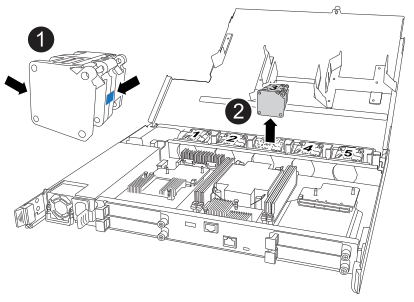

= 팬 모듈 교체 - EF50 및 EF80
:allow-uri-read: 
:icons: font
:imagesdir: ../media/

[role="lead"]
팬에 장애가 발생하거나 효율적으로 작동하지 않을 경우 EF50 또는 EF80 스토리지 시스템의 팬 모듈을 교체하십시오. 이는 시스템 냉각 및 전체 시스템 성능에 영향을 줄 수 있습니다.

.이 작업에 대해
* 팬을 교체하려면 준비 작업을 하고, 고장난 컨트롤러를 오프라인으로 전환하고, 컨트롤러를 제거하고, 팬을 교체하고, 컨트롤러를 다시 설치하고, 온라인 상태로 전환하고, 교체를 완료한 다음 고장난 부품을 NetApp에 반환합니다.
* 손상된 컨트롤러의 케이블을 분리하기 전에 먼저 컨트롤러를 오프라인 상태로 전환해야 합니다.
* 각 컨트롤러에는 5개의 팬이 포함되어 있습니다. 팬이 고장 나면 컨트롤러의 적절한 냉각을 위해 가능한 한 빨리 교체해야 합니다.
* 스토리지 시스템 위치(파란색) LED(스토리지 시스템 전면과 두 컨트롤러에 있음)를 켜서 영향을 받는 스토리지 시스템을 물리적으로 찾을 수 있습니다. SANtricity System Manager를 사용하여 *하드웨어* > *컨트롤러 및 구성 요소*를 선택하고 *컨트롤러 셸프* 탭을 선택한 다음 상황 메뉴에서 *위치 표시등 켜기*를 선택하십시오.

== 1단계: 팬 교체 준비

팬을 교체하려면 교체가 가능한지 확인하고, 필요한 도구와 장비를 준비하고, 스토리지 시스템의 구성 데이터베이스를 백업해야 합니다.

.단계
. Recovery Guru에서 고장난 팬을 제거해도 안 된다고 표시되는지 확인하십시오. 만약 그렇다면, 이 절차를 계속 진행하기 전에 https://mysupport.netapp.com/site/global/dashboard["NetApp 지원"] 문의해 주십시오.
. 다음 사항을 확인하십시오.
+
** 교체용 팬
** ESD 손목 밴드를 착용했거나 다른 정전기 방지 조치를 취했습니다.
** 정전기가 없는 평평한 작업 표면
** 장애가 발생한 컨트롤러에 연결된 각 케이블을 식별하기 위한 라벨.
** 장애가 발생한 컨트롤러의 SANtricity System Manager에 액세스할 수 있는 브라우저가 있는 관리 스테이션.
+
System Manager 인터페이스를 열려면 브라우저에서 장애가 발생한 컨트롤러의 도메인 이름 또는 IP 주소를 가리킵니다.

. SANtricity System Manager를 사용하여 스토리지 시스템의 구성 데이터베이스를 백업하십시오.
+
컨트롤러를 제거할 때 문제가 발생하면 저장된 파일을 사용하여 구성을 복원할 수 있습니다. 시스템은 장애가 발생한 컨트롤러의 볼륨 그룹 및 디스크 풀에 대한 모든 데이터를 포함하는 RAID 구성 데이터베이스의 현재 상태를 저장합니다.

+
.. 지원 * > * 지원 센터 * > * 진단 * 을 선택합니다.
.. 구성 데이터 수집 * 을 선택합니다.
.. *Collect*를 선택합니다.
+
파일은 브라우저의 다운로드 폴더에 * configurationData - <arrayName> - <DateTime>.7z * 라는 이름으로 저장됩니다.

== 2단계: 컨트롤러를 오프라인 상태로 전환합니다

이 절차의 나머지 부분을 안전하게 수행할 수 있도록 손상된 컨트롤러를 오프라인 상태로 전환하십시오.

.이 작업에 대해
컨트롤러를 오프라인으로 전환할 때는 최소 1분 이상 기다린 후 다시 온라인 상태로 전환해야 합니다. 이 대기 시간 동안 스토리지 시스템이 컨트롤러의 상태를 업데이트하고 캐시된 모든 데이터가 드라이브에 기록되도록 합니다.

.단계
. 손상된 컨트롤러가 이미 오프라인 상태가 아닌 경우 SANtricity System Manager를 사용하여 오프라인으로 설정하십시오.
+
.. 컨트롤러를 표시하려면 *Hardware* > *Controllers and components*를 선택하십시오.
.. 콘텐츠 메뉴를 표시하기 위해 오프라인으로 전환할 컨트롤러를 선택하십시오.
.. * 오프라인으로 전환 * 을 선택한 다음 작업을 수행할 것인지 확인합니다.
+

NOTE: 오프라인으로 전환하려는 컨트롤러를 사용하여 SANtricity System Manager에 액세스하는 경우 SANtricity System Manager를 사용할 수 없습니다 메시지가 표시됩니다. 다른 컨트롤러를 사용하여 SANtricity System Manager에 자동으로 액세스하려면 *대체 네트워크 연결에 연결*을 선택하십시오.

. SANtricity 시스템 관리자가 컨트롤러의 상태를 오프라인으로 업데이트할 때까지 기다립니다.
+

CAUTION: 상태가 업데이트되기 전에는 다른 작업을 시작하지 마십시오.

. Recovery Guru를 사용하여 결함이 있는 구성 요소를 제거하는 것이 안전한지 확인하십시오.
+
.. *다시 확인*을 선택합니다.
.. 세부 정보 영역의 *제거 가능* 필드에 *예*가 표시되는지 확인하십시오.
+

CAUTION: *제거 가능* 필드에 *예*가 표시되지 않으면 결함이 있는 구성 요소를 제거하지 마십시오. 대신 Recovery Guru를 사용하여 문제를 해결하십시오.

== 3단계: 컨트롤러 제거

캐시 메모리의 데이터가 드라이브에 기록되었는지 확인하고, 고장난 컨트롤러에서 모든 케이블을 분리한 다음, 고장난 컨트롤러를 섀시에서 제거합니다.

.단계
. 손상된 컨트롤러에서 NV 캐싱 활성(녹색) LED가 꺼져 있는지 확인하십시오.
+
NV Caching Active(녹색) LED가 꺼지면 캐시 메모리의 모든 데이터가 드라이브에 기록되었으므로 손상된 컨트롤러를 안전하게 제거할 수 있습니다.

+

NOTE: NV 캐싱 활성(녹색) LED가 켜져 있으면 캐시된 데이터가 드라이브에 기록되고 있는 것입니다. 기록 과정이 완료되고 NV 캐싱 활성 LED가 꺼질 때까지 기다려야 합니다. 그러나 LED가 5분 이상 켜져 있는 경우 https://mysupport.netapp.com/site/global/dashboard["NetApp 지원"] 이 절차를 계속 진행하기 전에 문의하십시오.

+
NV 캐싱 활성(녹색) LED는 컨트롤러의 NV 아이콘 옆에 있습니다.

+
image::../media/drw_g_nvmem_led_ieops-1839.svg[NV 상태 LED 위치]

+
[cols="1,4"]
|===

 a| 
image::../media/icon_round_1.png[설명선 번호 1]
 a| 
컨트롤러의 NV 아이콘 및 NV Caching Active LED

|===

. ESD 밴드를 착용하거나 정전기 방지 조치를 취하십시오.
. 장애가 발생한 컨트롤러에 연결된 각 케이블에 라벨을 지정합니다.
. 손상된 컨트롤러의 전원 공급 장치에서 전원 코드를 분리하십시오.
+

NOTE: 전원 공급 장치(PSU)에는 전원 스위치가 없습니다.

. 손상된 컨트롤러에서 모든 케이블을 분리합니다.
. 손상된 컨트롤러를 제거합니다.
+
다음 그림은 컨트롤러를 분리할 때 컨트롤러 핸들(컨트롤러 왼쪽)의 작동을 보여줍니다.

+
image::../media/drw_g_and_t_handles_remove_ieops-1837.svg[컨트롤러 핸들 작동으로 컨트롤러를 제거합니다]

+
[cols="1,4"]
|===

 a| 
image::../media/icon_round_1.png[설명선 번호 1]
 a| 
컨트롤러 양쪽 끝에 있는 수직 잠금 탭을 바깥쪽으로 밀어 핸들을 수평 위치로 해제하십시오.

 a| 
image::../media/icon_round_2.png[설명선 번호 2]
 a| 
** 컨트롤러를 미드플레인에서 분리하려면 손잡이를 당기십시오.
+
당기면 손잡이가 컨트롤러에서 튀어나오고 약간의 저항이 느껴지면 계속 당기세요.

** 컨트롤러 하단을 받쳐주면서 섀시에서 컨트롤러를 빼낸 다음, 정전기가 없는 평평한 작업 표면에 놓으십시오.

 a| 
image::../media/icon_round_3.png[설명선 번호 3]
 a| 
필요한 경우 손잡이를 수직으로 회전시켜(탭 옆) 방해가 되지 않도록 이동하십시오.

|===
. 엄지나사를 시계 반대 방향으로 돌려 푼 다음 덮개를 열어 컨트롤러 덮개를 여세요.

== 4단계: 팬 교체

손상된 컨트롤러 내부의 결함이 있는 팬을 찾아 교체하십시오.

.단계
. 콘솔 오류 메시지를 확인하여 교체해야 할 팬을 찾으십시오.
. 장애가 발생한 팬을 제거합니다.
+

+
[cols="1,4"]
|===

 a| 
image::../media/icon_round_1.png[설명선 번호 1]
| 파란색 접점에서 팬의 양쪽을 잡으십시오. 

 a| 
image::../media/icon_round_2.png[설명선 번호 2]
| 팬을 위쪽으로 똑바로 당겨서 소켓에서 빼냅니다. 
|===
. 교체용 팬을 포장에서 꺼내어 스토리지 시스템 근처의 평평하고 정전기가 없는 표면에 놓습니다.
+
결함이 있는 팬을 반환할 때 사용할 포장 재료를 보관하십시오.

. 교체용 팬을 가이드에 맞춰 끼운 다음 팬 커넥터가 소켓에 완전히 고정될 때까지 아래로 누르십시오.

== 5단계: 컨트롤러 재설치

컨트롤러를 섀시에 다시 설치하고 전원 코드와 모든 케이블을 다시 연결하십시오.

.이 작업에 대해
다음 그림은 컨트롤러를 재설치할 때 컨트롤러 핸들(컨트롤러 왼쪽 측면 기준)의 작동 방식을 보여주며, 컨트롤러 재설치 단계를 참고하는 데 사용할 수 있습니다.

image::../media/drw_g_and_t_handles_reinstall_ieops-1838.svg[컨트롤러를 설치하기 위한 컨트롤러 핸들 작업]

[cols="1,4"]
|===

 a| 
image::../media/icon_round_1.png[설명선 번호 1]
 a| 
컨트롤러를 정비하는 동안 컨트롤러 손잡이를 수직으로 회전시켜(탭 옆) 치웠다면 수평 위치로 다시 회전시키십시오.

 a| 
image::../media/icon_round_2.png[설명선 번호 2]
 a| 
손잡이를 눌러 컨트롤러를 섀시에 다시 삽입합니다.

 a| 
image::../media/icon_round_3.png[설명선 번호 3]
 a| 
손잡이를 수직 위치로 회전하고 잠금 탭으로 제자리에 고정하십시오.

|===
.단계
. 컨트롤러 덮개를 닫고 엄지나사를 시계 방향으로 돌려 단단히 조입니다.
. 컨트롤러를 섀시에 삽입합니다.
+
.. 컨트롤러 뒷면을 섀시의 개구부에 맞추고 컨트롤러가 중앙면에 닿아 완전히 고정될 때까지 손잡이를 부드럽지만 단단하게 누르십시오.
+

NOTE: 컨트롤러를 섀시에 밀어 넣을 때 과도한 힘을 사용하지 마십시오. 커넥터가 손상될 수 있습니다.

.. 컨트롤러 손잡이를 위로 돌려 탭으로 제자리에 고정합니다.

. 전원 코드를 전원 공급 장치에 다시 연결하고 전원 코드 고정 장치를 사용하여 전원 코드를 고정하십시오.
+
전원 공급 장치에 전원이 복구되면 상태 LED가 녹색으로 표시되어야 합니다.

. 컨트롤러에 모든 케이블을 다시 연결합니다.
+

NOTE: 컨트롤러를 온라인 상태로 전환하기 전에 케이블을 다시 연결해야 합니다. 특히 미러링 케이블 연결은 시스템의 완전한 이중화를 보장하고 캐시 미러링 및 I/O 전송에 사용되므로 더욱 중요합니다.

== 6단계: 컨트롤러를 온라인 상태로 전환합니다

손상된 컨트롤러를 다시 온라인 상태로 전환하십시오.

.단계
. SANtricity System Manager를 사용하여 컨트롤러를 온라인 상태로 전환하십시오.
+
.. 컨트롤러를 표시하려면 *Hardware* > *Controllers and components*를 선택하십시오.
.. 온라인으로 전환할 컨트롤러를 선택하여 컨텍스트 메뉴를 표시합니다.
.. *온라인 배치*를 선택한 다음 작업을 수행할 것인지 확인합니다.
+
컨트롤러가 온라인 상태가 됩니다.

. 컨트롤러가 부팅되면 컨트롤러 LED를 확인합니다.
+
다른 컨트롤러와의 통신이 재설정된 경우:

+
** 황색 주의 LED가 계속 켜져 있습니다.
** 호스트 인터페이스에 따라 호스트 링크 LED가 켜지거나 깜박이거나 꺼질 수 있습니다.

. 컨트롤러가 다시 온라인 상태가 되면:
+
.. 상태가 최적인지 확인하십시오.
.. 컨트롤러의 주의 LED가 꺼져 있는지 확인하십시오.
+
상태가 최적이 아니거나 주의 LED가 켜져 있는 경우 모든 케이블이 올바르게 연결되었는지, 컨트롤러가 제대로 설치되었는지 확인하십시오. 필요한 경우 컨트롤러를 제거한 후 다시 설치하십시오.

+

NOTE: 문제를 해결할 수 없는 경우 이 절차를 계속 진행하기 전에 https://mysupport.netapp.com/site/global/dashboard["NetApp 지원"^]에 문의하십시오. 필요한 경우 SANtricity System Manager를 사용하여 스토리지 시스템에 대한 지원 데이터를 수집하십시오.

== 7단계: 팬 교체 완료

SANtricity System Manager를 사용하여 최신 버전의 SANtricity OS가 설치되어 있는지 확인하고, 모든 볼륨이 소유 컨트롤러로 반환되었는지 확인하고, 작업을 재개할 수 있도록 지원 데이터를 수집하십시오.

.단계
. 스토리지 시스템에 최신 버전의 SANtricity OS가 설치되어 있는지 확인하십시오.
+
.. *Support* > *Upgrade Center*를 선택합니다
.. 필요한 경우 최신 버전을 설치합니다.

. 모든 볼륨이 소유 컨트롤러로 반환되었는지 확인합니다.
+
[cols="1,2"]
|===
| 만약... | 그런 다음... 

 a| 
Recovery Guru가 있으며 볼륨이 기본 경로에 있지 않음(소유 컨트롤러로 반환되지 않음)을 나타냅니다
 a| 
.. * Storage * > * Volumes * > * More * 를 선택하고 드롭다운 메뉴에서 * Redistribute volumes * 를 선택하여 소유 컨트롤러에 볼륨을 재분배합니다.
.. Recovery Guru가 있는지 확인하고 볼륨이 기본 경로에 없다고 여전히 표시되는지 확인하여 모든 볼륨이 소유 컨트롤러로 재배포되었는지 확인하십시오.

NOTE: 볼륨이 여전히 소유 컨트롤러로 반환되지 않으면 https://mysupport.netapp.com/site/global/dashboard["NetApp 지원"]에 문의하십시오.

 a| 
Recovery Guru가 없습니다(모든 볼륨이 소유 컨트롤러로 반환된 것으로 보입니다)
 a| 
모든 볼륨이 소유 컨트롤러로 반환되었는지 확인하려면 * Storage * > * Volumes * > * More * 를 선택하고 드롭다운 메뉴에서 * Change volume ownership * 을 선택하여 볼륨 소유자를 확인하십시오.

|===
. 스토리지 시스템에 대한 지원 데이터 수집:
+
.. 지원 * > * 지원 센터 * > * 진단 * 을 선택합니다.
.. 지원 데이터 수집 * 을 선택합니다.
.. *Collect*를 선택합니다.
+
파일은 브라우저의 다운로드 폴더에 * support-data.7z * 라는 이름으로 저장됩니다.

== 8단계: 불량 부품을 NetApp에 반환합니다

키트에 동봉된 RMA 지침에 따라 고장난 부품을 NetApp으로 반송하십시오. 자세한 내용은  https://mysupport.netapp.com/site/info/rma["부품 반품 및 교체"] 페이지를 참조하십시오.
