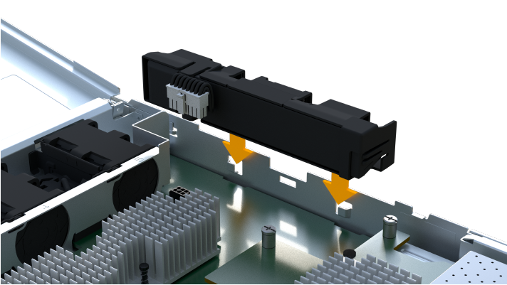

= EF300 또는 EF600 컨트롤러 교체
:allow-uri-read: 
:experimental: 
:icons: font
:imagesdir: ../media/

[role="lead"]
EF300 또는 EF600 컨트롤러 쉘프에 있는 단일 컨트롤러를 교체할 수 있습니다.

.이 작업에 대해
장애가 발생한 컨트롤러 캐니스터를 교체할 경우 원래 컨트롤러 캐니스터에서 배터리, 전원 공급 장치, DIMM, 팬 및 호스트 인터페이스 카드(HIC)를 분리한 다음 교체용 컨트롤러 캐니스터에 설치해야 합니다.

.시작하기 전에
* 검토 link:controllers-overview-supertask-concept.html["EF300 또는 EF600 컨트롤러 교체 요구사항"].
* 다음 두 가지 방법 중 하나로 오류가 발생한 컨트롤러 캐니스터가 있는지 확인합니다.
+
** SANtricity 시스템 관리자의 Recovery Guru에서 컨트롤러 캐니스터를 교체하도록 안내합니다.
** 컨트롤러 캐니스터의 황색 주의 LED가 켜져 컨트롤러에 장애가 있음을 나타냅니다.
+
[]
====

NOTE: 다음과 같은 교체 조건이 발생할 때마다 컨트롤러의 황색 주의 LED가 꺼집니다.

*** 대체 전원 공급 장치에 실패했습니다
*** Alt 드라이브 경로가 실패했습니다
*** 서랍이 열려 있거나 없습니다
*** 팬이 고장/누락되었습니다
*** 전원 공급 장치가 없습니다

====

* 다음 사항을 확인하십시오.
+
** 교체 중인 컨트롤러 캐니스터와 부품 번호가 동일한 교체용 컨트롤러 캐니스터
** ESD 밴드이거나 다른 정전기 방지 예방 조치를 취했습니다.
** 평평하고 정전기가 없는 작업 공간.
** 1 십자 드라이버
** 컨트롤러 캐니스터에 연결된 각 케이블을 식별하는 레이블입니다.
** 컨트롤러의 SANtricity 시스템 관리자에 액세스할 수 있는 브라우저가 있는 관리 스테이션. System Manager 인터페이스를 열려면 브라우저에서 컨트롤러의 도메인 이름 또는 IP 주소를 가리킵니다.

== 1단계: 컨트롤러 교체 준비

교체 컨트롤러 캐니스터의 FRU 부품 번호가 올바른지, 구성을 백업하고, 지원 데이터를 수집하여 장애가 발생한 컨트롤러 캐니스터 교체를 준비하십시오.

.단계
. 새 컨트롤러 캐니스터의 포장을 풀고 정전기가 없는 평평한 표면에 놓습니다.
+
오류가 발생한 컨트롤러 캐니스터를 배송할 때 사용할 포장재를 보관합니다.

. 컨트롤러 캐니스터 뒷면에서 MAC 주소 및 FRU 부품 번호 레이블을 찾습니다.
. SANtricity 시스템 관리자에서 교체할 컨트롤러 캐니스터의 교체 부품 번호를 찾습니다.
+
컨트롤러에 장애가 발생하여 교체해야 하는 경우 Recovery Guru의 세부 정보 영역에 교체 부품 번호가 표시됩니다. 이 번호를 수동으로 찾아야 하는 경우 다음 단계를 수행하십시오.

+
.. 하드웨어 * 를 선택합니다.
.. 컨트롤러 아이콘으로 표시된 컨트롤러 쉘프를 찾습니다 image:../media/sam1130_ss_hardware_controller_icon_maint-ef600.gif[""].
.. 컨트롤러 아이콘을 클릭합니다.
.. 컨트롤러를 선택하고 * 다음 * 을 클릭합니다.
.. 기본 * 탭에서 컨트롤러의 * 교체 부품 번호 * 를 기록해 둡니다.

. 장애가 발생한 컨트롤러의 교체 부품 번호가 교체 컨트롤러의 FRU 부품 번호와 같은지 확인합니다.
+

CAUTION: * 데이터 액세스 손실 가능성 * -- 두 부품 번호가 동일하지 않은 경우 이 절차를 시도하지 마십시오. 또한, 장애가 발생한 컨트롤러 캐니스터에 HIC(호스트 인터페이스 카드)가 포함된 경우 해당 HIC를 새 컨트롤러 캐니스터에 설치해야 합니다. 일치하지 않는 컨트롤러 또는 HIC가 있으면 새 컨트롤러를 온라인으로 전환할 때 새 컨트롤러가 잠기게 됩니다.

. SANtricity System Manager를 사용하여 스토리지 시스템의 구성 데이터베이스를 백업합니다.
+
컨트롤러를 제거할 때 문제가 발생하면 저장된 파일을 사용하여 구성을 복원할 수 있습니다. 시스템에서 RAID 구성 데이터베이스의 현재 상태를 저장합니다. 이 데이터베이스는 볼륨 그룹 및 컨트롤러의 디스크 풀에 대한 모든 데이터를 포함합니다.

+
** System Manager에서:
+
... 지원 [지원 센터 > 진단] 메뉴를 선택합니다.
... 구성 데이터 수집 * 을 선택합니다.
... 수집 * 을 클릭합니다.
+
파일은 브라우저의 다운로드 폴더에 * configurationData - <arrayName> - <DateTime>.7z * 라는 이름으로 저장됩니다.

. 컨트롤러가 아직 오프라인 상태가 아닌 경우 SANtricity 시스템 관리자를 사용하여 오프라인 상태로 전환합니다.
+
.. 하드웨어 * 를 선택합니다.
.. 그래픽에 드라이브가 표시되면 * 쉘프 뒷면 표시 * 를 선택하여 컨트롤러를 표시합니다.
.. 오프라인 상태로 설정할 컨트롤러를 선택합니다.
.. 상황에 맞는 메뉴에서 * 오프라인 상태로 전환 * 을 선택하고 작업을 수행할지 확인합니다.

+

NOTE: 오프라인으로 전환하려고 하는 컨트롤러를 사용하여 SANtricity 시스템 관리자에 액세스하는 경우 SANtricity 시스템 관리자를 사용할 수 없음 메시지가 표시됩니다. 다른 컨트롤러를 사용하여 SANtricity 시스템 관리자에 자동으로 액세스하려면 * 대체 네트워크 연결 * 을 선택합니다.

. SANtricity 시스템 관리자가 컨트롤러의 상태를 오프라인으로 업데이트할 때까지 기다립니다.
+

CAUTION: 상태가 업데이트되기 전에는 다른 작업을 시작하지 마십시오.

. Recovery Guru에서 * Recheck * 을 선택하고 세부 정보 영역에서 * OK to remove * 필드가 * Yes * 로 표시되어 이 구성 요소를 제거해도 안전하다는 것을 나타내는지 확인합니다.

== 2단계: 장애가 발생한 컨트롤러를 제거합니다

컨트롤러 캐니스터를 제거하여 결함이 있는 캐니스터를 새 캐니스터로 교체합니다.

이 절차는 배터리, 호스트 인터페이스 카드, 전원 공급 장치, DIMM 및 팬과 같은 구성 요소를 제거해야 하는 다단계 절차입니다.

=== 2a단계: 컨트롤러 캐니스터를 제거합니다

결함이 있는 컨트롤러 캐니스터를 제거하여 새 캐니스터로 교체합니다.

.단계
. ESD 밴드를 착용하거나 정전기 방지 조치를 취하십시오.
. 컨트롤러 캐니스터에 부착된 각 케이블에 레이블을 부착합니다.
. 컨트롤러 캐니스터에서 모든 케이블을 분리합니다.
+

CAUTION: 성능 저하를 방지하려면 케이블을 비틀거나 접거나 끼거나 밟지 마십시오.

. 컨트롤러 캐니스터에 SFP+ 트랜시버를 사용하는 HIC가 있는 경우 SFP를 제거합니다.
+
장애가 발생한 컨트롤러 캐니스터에서 HIC를 제거해야 하므로 HIC 포트에서 SFP를 모두 제거해야 합니다. 케이블을 다시 연결할 때 해당 SFP를 새 컨트롤러 캐니스터로 이동할 수 있습니다.

. 컨트롤러의 양쪽에 있는 손잡이를 잡고 다시 당겨서 쉘프에서 빼냅니다.
+
image::../media/remove_controller_5.png[핸들을 쥐어 컨트롤러를 제거합니다]

. 두 손과 핸들을 사용하여 컨트롤러 캐니스터를 선반에서 밀어 꺼냅니다. 컨트롤러 전면에 엔클로저가 없을 경우 두 손을 사용하여 완전히 빼냅니다.
+

CAUTION: 항상 두 손을 사용하여 컨트롤러 캐니스터의 무게를 지지하십시오.

+
image::../media/remove_controller_6.png[분리할 때 두 손으로 컨트롤러의 무게를 지탱합니다]

. 컨트롤러 캐니스터를 평평하고 정전기가 없는 표면에 놓습니다.

=== 2b단계: 배터리를 분리합니다

고장난 컨트롤러 캐니스터에서 배터리를 분리하여 새 컨트롤러 캐니스터에 설치합니다.

.단계
. 단일 나비 나사를 풀고 덮개를 들어올려 컨트롤러 캐니스터의 덮개를 제거합니다.
. 컨트롤러 측면에서 'Press' 탭을 찾습니다.
. 탭을 누르고 배터리 케이스를 눌러 배터리를 분리합니다.
+
image::../media/batt_3.png["탭을 눌러 배터리를 분리합니다]

. 배터리 와이어링 커넥터 하우징을 조심스럽게 쥐어줍니다. 배터리를 당겨 보드에서 분리합니다.image:../media/batt_2.png["배터리 배선에서 커넥터 하우징을 탈거하십시오"]
. 배터리를 컨트롤러에서 들어올려 정전기가 없는 평평한 표면에 놓습니다.image:../media/batt_4.png["배터리를 컨트롤러에서 들어올립니다"]

=== 단계 2c: HIC를 제거합니다

컨트롤러 캐니스터에 HIC가 포함된 경우 원래 컨트롤러 캐니스터에서 HIC를 제거해야 합니다. 그렇지 않으면 이 단계를 건너뛸 수 있습니다.

.단계
. 십자 드라이버를 사용하여 HIC 페이스플레이트를 컨트롤러 캐니스터에 연결하는 나사 2개를 제거합니다.
+
image::../media/hic_2.png[HIC 전면판을 제거합니다]

+

NOTE: 위의 이미지는 HIC의 모양이 다를 수 있는 예입니다.

. HIC 페이스플레이트를 탈거하십시오.
. 손가락이나 십자 드라이버를 사용하여 HIC를 컨트롤러 카드에 고정하는 단일 나비 나사를 풉니다.
+
image::../media/hic_3.png[HIC 손잡이 나사를 풉니다]

+

NOTE: HIC는 상단에 3개의 나사 위치가 있지만 1개만 고정됩니다.

. 컨트롤러 카드를 들어올리고 컨트롤러 밖으로 빼서 HIC를 컨트롤러 카드에서 조심스럽게 분리합니다.
+

CAUTION: HIC 하단 또는 컨트롤러 카드 상단에 있는 구성 요소가 긁히거나 범프되지 않도록 주의하십시오.

+
image::../media/hic_4.png[컨트롤러 카드에서 HIC를 제거합니다]

. HIC를 평평하고 정전기가 없는 표면에 놓습니다.

=== 2D 단계: 전원 공급 장치를 제거합니다

새 컨트롤러에 설치할 수 있도록 전원 공급 장치를 분리합니다.

.단계
. 전원 케이블을 분리합니다.
+
.. 전원 코드 고정 장치를 연 다음 전원 공급 장치에서 전원 코드를 뽑습니다.
.. 전원에서 전원 코드를 뽑습니다.

. 전원 공급 장치 오른쪽에 있는 탭을 찾아 전원 공급 장치 쪽으로 누르십시오.
+
image::../media/psup_2.png[전원 공급 장치 옆의 탭을 누릅니다]

. 전원 공급 장치의 전면에서 핸들을 찾습니다.
. 핸들을 사용하여 전원 공급 장치를 시스템에서 똑바로 밀어 꺼냅니다.
+
image::../media/psup_3.png[전원 공급 장치를 밀어 꺼냅니다]

+

CAUTION: 전원 공급 장치를 분리할 때는 항상 두 손을 사용하여 무게를 지탱하십시오.

=== 2단계: DIMM을 분리합니다

새 컨트롤러에 설치할 수 있도록 DIMM을 분리합니다.

.단계
. 컨트롤러에서 DIMM을 찾습니다.
. 교체 DIMM을 올바른 방향으로 삽입할 수 있도록 소켓에서 DIMM의 방향을 기록해 두십시오.
+

NOTE: DIMM 밑면의 노치는 설치 중에 DIMM을 정렬하는 데 도움이 됩니다.

. DIMM의 양쪽에 있는 두 개의 DIMM 이젝터 탭을 천천히 밀어서 슬롯에서 DIMM을 꺼낸 다음 슬롯에서 밀어 꺼냅니다.
+

NOTE: DIMM 회로 보드의 구성 요소에 압력이 가해질 수 있으므로 DIMM의 가장자리를 조심스럽게 잡으십시오.

+
image::../media/dimm_2.png[DIMM 슬롯에서 이젝터 탭을 아래로 누릅니다]

+
image::../media/dimim_3.png[DIMM를 분리합니다]

=== 단계 2f: 팬을 제거합니다

새 컨트롤러에 설치할 수 있도록 팬을 분리합니다.

.단계
. 컨트롤러에서 팬을 조심스럽게 들어올립니다.
+
image::../media/fan_2.png[팬을 분리합니다]

. 모든 팬이 분리될 때까지 반복합니다.

== 3단계: 새 컨트롤러를 설치합니다

새 컨트롤러 캐니스터를 장착하여 결함이 있는 캐니스터를 교체합니다.

이 절차는 전지, 호스트 인터페이스 카드, 전원 공급 장치, DIMM 및 팬과 같은 구성 요소를 원래 컨트롤러에서 설치해야 하는 다단계 절차입니다.

=== 3a단계: 배터리를 설치합니다

교체용 컨트롤러 캐니스터에 배터리를 설치합니다.

.단계
. 다음 사항을 확인하십시오.
+
** 원래 컨트롤러 캐니스터에서 나온 배터리 또는 주문한 새 배터리입니다.
** 교체용 컨트롤러 캐니스터

. 컨트롤러 측면에 있는 금속 래치와 배터리 케이스를 맞추고 배터리를 컨트롤러에 삽입합니다.
+

+
배터리가 딸깍 소리를 내며 제자리에 고정됩니다.

. 배터리 커넥터를 보드에 다시 연결합니다.

=== 3b단계: HIC를 설치합니다

원래 컨트롤러 캐니스터에서 HIC를 제거한 경우 새 컨트롤러 캐니스터에 HIC를 설치해야 합니다. 그렇지 않으면 이 단계를 건너뛸 수 있습니다.

.단계
. 1 십자 드라이버를 사용하여 블랭크 페이스 플레이트를 교체용 컨트롤러 캐니스터에 연결하는 나사 2개를 분리하고 전면판을 제거합니다.
. HIC의 단일 나비나사를 컨트롤러의 해당 구멍에 맞추고 HIC 아래쪽에 있는 커넥터를 컨트롤러 카드의 HIC 인터페이스 커넥터와 맞춥니다.
+
HIC 하단 또는 컨트롤러 카드 상단에 있는 구성 요소가 긁히거나 범프되지 않도록 주의하십시오.

+
image::../media/hic_7.png[HIC를 설치합니다]

+

NOTE: 위의 이미지는 예시이며 HIC의 모양은 다를 수 있습니다.

. HIC를 조심스럽게 제자리로 내리고 HIC 커넥터를 가볍게 눌러 HIC 커넥터를 장착합니다.
+

CAUTION: * 발생 가능한 장비 손상 * -- HIC와 나비나사 사이에 있는 컨트롤러 LED의 골드 리본 커넥터가 끼이지 않도록 매우 조심하십시오.

. HIC 나비나사를 손으로 조입니다.
+
드라이버를 사용하지 마십시오. 또는 나사를 너무 세게 조일 수 있습니다.

+
image::../media/hic_3.png[컨트롤러에 HIC 나비나사를 손으로 조입니다]

+

NOTE: 위의 이미지는 예시이며 HIC의 모양은 다를 수 있습니다.

. 1 십자 드라이버를 사용하여 원래 컨트롤러 캐니스터에서 분리한 HIC 페이스플레이트를 2개의 나사로 새 컨트롤러 캐니스터에 부착합니다.

=== 단계 3c: 전원 공급 장치를 설치합니다

교체용 컨트롤러 캐니스터에 전원 공급 장치를 설치합니다.

.단계
. 양손으로 전원 공급 장치의 가장자리를 시스템 섀시의 입구에 맞춘 다음 캠 핸들을 사용하여 전원 공급 장치를 섀시에 부드럽게 밀어 넣습니다.
+
전원 공급 장치는 키 입력 방식이며 한 방향으로만 설치할 수 있습니다.

+

CAUTION: 전원 공급 장치를 시스템에 밀어 넣을 때 과도한 힘을 가하지 마십시오. 커넥터가 손상될 수 있습니다.

+
image::../media/psup_4.png[전원 공급 장치를 컨트롤러에 설치합니다]

=== 3D 단계: DIMM을 설치합니다

DIMM을 새 컨트롤러 캐니스터에 설치합니다.

.단계
. DIMM의 모서리를 잡고 슬롯에 맞춥니다.
+
DIMM의 핀 사이의 노치가 소켓의 탭과 일직선이 되어야 합니다.

. DIMM을 슬롯에 똑바로 삽입합니다.
+
image::../media/dimm_4.png[DIMM을 컨트롤러의 슬롯에 설치합니다]

+
DIMM은 슬롯에 단단히 장착되지만 쉽게 장착할 수 있습니다. 그렇지 않은 경우 DIMM을 슬롯에 재정렬하고 다시 삽입합니다.

+

NOTE: DIMM이 균일하게 정렬되어 슬롯에 완전히 삽입되었는지 육안으로 검사합니다.

. 래치가 DIMM 끝 부분의 노치 위에 걸릴 때까지 DIMM의 상단 가장자리를 조심스럽게 단단히 누릅니다.
+

NOTE: DIMM이 꼭 맞습니다. 한 번에 한 쪽을 부드럽게 누르고 각 탭을 개별적으로 고정해야 할 수 있습니다.

+
image::../media/dimm_5.png[DIMM 슬롯의 걸쇠를 위로 눌러 고정합니다]

=== 단계 3E: 팬을 설치합니다

교체용 컨트롤러 캐니스터에 팬을 설치합니다.

.단계
. 팬을 교체 컨트롤러로 완전히 밀어 넣습니다.
+
image::../media/fan_3.png[팬을 컨트롤러에 설치합니다]

+
image::../media/fan_3_a.png[팬을 컨트롤러에 설치합니다]

. 모든 팬이 설치될 때까지 반복합니다.

=== 단계 3F: 새 컨트롤러 캐니스터를 설치합니다

마지막으로, 새 컨트롤러 캐니스터를 컨트롤러 쉘프에 설치합니다.

.단계
. 컨트롤러 캐니스터의 덮개를 내리고 나비나사를 고정합니다.
. 컨트롤러 손잡이를 잡은 상태에서 컨트롤러 캐니스터를 천천히 컨트롤러 쉘프에 밀어 넣습니다.
+

NOTE: 컨트롤러가 올바르게 설치되면 딸깍하는 소리가 납니다.

+
image::../media/remove_controller_7.png[컨트롤러를 쉘프에 설치합니다]

. 원래 컨트롤러에서 원래 컨트롤러의 SFP를 새 컨트롤러의 호스트 포트에 설치하고, 원래 컨트롤러에 설치된 경우에는 모든 케이블을 다시 연결합니다.
+
둘 이상의 호스트 프로토콜을 사용하는 경우 올바른 호스트 포트에 SFP를 설치해야 합니다.

. 원래 컨트롤러가 IP 주소에 DHCP를 사용한 경우 교체 컨트롤러 후면의 레이블에 있는 MAC 주소를 찾습니다. 제거한 컨트롤러의 DNS/네트워크 및 IP 주소를 대체 컨트롤러의 MAC 주소와 연관시킬 것을 네트워크 관리자에게 요청합니다.
+

NOTE: 원래 컨트롤러가 IP 주소에 DHCP를 사용하지 않은 경우 새 컨트롤러는 제거한 컨트롤러의 IP 주소를 채택합니다.

== 4단계: 전체 컨트롤러 교체

컨트롤러를 온라인 상태로 전환하고 지원 데이터를 수집하며 운영을 재개하십시오.

.단계
. 컨트롤러를 온라인으로 설정합니다.
+
.. System Manager에서 Hardware 페이지로 이동합니다.
.. 컨트롤러 후면 표시 * 를 선택합니다.
.. 교체된 컨트롤러를 선택합니다.
.. 드롭다운 목록에서 * 온라인 상태로 * 를 선택합니다.

. 컨트롤러가 부팅되면 컨트롤러 LED를 확인합니다.
+
다른 컨트롤러와의 통신이 재설정된 경우:

+
** 황색 주의 LED가 계속 켜져 있습니다.
** 호스트 인터페이스에 따라 호스트 링크 LED가 켜지거나 깜박이거나 꺼질 수 있습니다.

. 컨트롤러가 다시 온라인 상태가 되면 Recovery Guru에서 NVSRAM 불일치가 보고되는지 확인합니다.
+
.. NVSRAM 불일치가 보고되면 다음 SMcli 명령을 사용하여 NVSRAM을 업그레이드합니다.
+
[listing]
----
SMcli <controller A IP> <controller B IP> -u admin -p <password> -k -c "download storageArray NVSRAM file=\"C:\Users\testuser\Downloads\NVSRAM .dlp file>\" forceDownload=TRUE;"
----
+
를 클릭합니다 `-k` 스토리지가 https 보안이 아닌 경우 매개 변수가 필요합니다.

+

NOTE: SMcli 명령을 완료할 수 없는 경우 에 문의하십시오 https://www.netapp.com/company/contact-us/support/["NetApp 기술 지원"^] 또는 에 로그인합니다 https://mysupport.netapp.com["NetApp Support 사이트"^] 를 눌러 케이스를 생성합니다.

. 시스템이 Optimal(최적) 상태인지 확인하고 컨트롤러 쉘프의 주의 LED를 확인합니다.
+
상태가 최적이 아니거나 주의 LED 중 하나라도 켜져 있으면 모든 케이블이 올바르게 장착되고 컨트롤러 캐니스터가 올바르게 설치되었는지 확인합니다. 필요한 경우 컨트롤러 캐니스터를 제거하고 다시 설치합니다.

+

NOTE: 문제를 해결할 수 없는 경우 기술 지원 부서에 문의하십시오.

. 시스템의 펌웨어 및 NVSRAM 버전이 원하는 수준인지 확인하려면 하드웨어 [지원 > 업그레이드 센터] 메뉴를 클릭합니다.
+
필요한 경우 최신 버전을 설치합니다.

. 모든 볼륨이 기본 소유자에게 반환되었는지 확인합니다.
+
.. Storage [Volumes](저장소 [볼륨]) 메뉴를 선택합니다. 모든 볼륨 * 페이지에서 볼륨이 기본 소유자에게 배포되었는지 확인합니다. 메뉴 선택: More [Change Ownership](자세히[소유권 변경])를 선택하면 볼륨 소유자가 표시됩니다.
.. 기본 소유자가 볼륨을 모두 소유한 경우 6단계를 계속 진행하십시오.
.. 반환된 볼륨이 없는 경우 볼륨을 수동으로 반환해야 합니다. More [Redistribute volumes](추가 [볼륨 재배포]) 메뉴로 이동합니다.
.. 자동 배포 또는 수동 배포 후 일부 볼륨만 기본 소유자에게 반환되는 경우 Recovery Guru에서 호스트 연결 문제를 확인해야 합니다.
.. Recovery Guru가 없거나 복구 전문가 단계를 수행한 후에도 볼륨은 여전히 선호하는 소유자에게 반환되지 않는 경우 지원 부서에 문의하십시오.

. SANtricity 시스템 관리자를 사용하여 스토리지 어레이에 대한 지원 데이터를 수집합니다.
+
.. 지원 [지원 센터 > 진단] 메뉴를 선택합니다.
.. 지원 데이터 수집 * 을 선택합니다.
.. 수집 * 을 클릭합니다.
+
파일은 브라우저의 다운로드 폴더에 * support-data.7z * 라는 이름으로 저장됩니다.

.다음 단계
컨트롤러 교체가 완료되었습니다. 일반 작업을 다시 시작할 수 있습니다.
