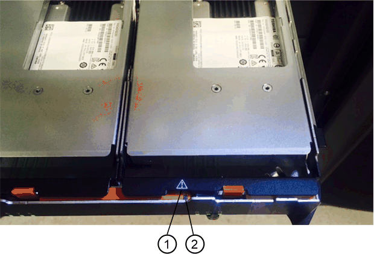

= EF300 스토리지의 드라이브를 교체합니다
:allow-uri-read: 
:icons: font
:imagesdir: ../media/

[role="lead"]
EF300 스토리지의 드라이브를 교체할 수 있습니다.

EF300은 24개 드라이브 및 60개 드라이브 쉘프를 통해 SAS 확장을 지원합니다. 다음 절차는 24-드라이브 쉘프인지 60-드라이브 쉘프인지에 따라 다릅니다.

* <<EF300(24-드라이브 쉘프)에서 드라이브 교체>>
* <<EF300(60-드라이브 쉘프)에서 드라이브 교체>>

== EF300(24-드라이브 쉘프)에서 드라이브 교체

다음 절차에 따라 24-드라이브 쉘프의 드라이브를 교체하십시오.

.이 작업에 대해
SANtricity 시스템 관리자의 Recovery Guru는 스토리지 어레이의 드라이브를 모니터링하여 드라이브 오류가 임박한 경우 또는 실제 드라이브 장애를 알려줍니다. 드라이브에 오류가 발생하면 황색 주의 LED가 켜집니다. 스토리지 배열이 I/O를 수신하는 동안 오류가 발생한 드라이브를 핫 스왑할 수 있습니다

.시작하기 전에
* 에서 드라이브 취급 요구 사항을 검토합니다 link:drives-overview-supertask-concept.html["EF300 또는 EF600 드라이브 교체에 대한 요구사항"].

.필요한 것
* NetApp에서 지원하는 컨트롤러 쉘프 또는 드라이브 쉘프 대체 드라이브
* ESD 밴드이거나 다른 정전기 방지 예방 조치를 취했습니다.
* 평평하고 정전기가 없는 작업 표면입니다.
* 컨트롤러의 SANtricity 시스템 관리자에 액세스할 수 있는 브라우저가 있는 관리 스테이션. System Manager 인터페이스를 열려면 브라우저에서 컨트롤러의 도메인 이름 또는 IP 주소를 가리킵니다.

=== 1단계: 드라이브 교체 준비(24 드라이브)

SANtricity 시스템 관리자의 Recovery Guru를 확인하고 필수 단계를 완료하여 드라이브를 교체할 준비를 합니다. 그런 다음 장애가 발생한 구성 요소를 찾을 수 있습니다.

.단계
. SANtricity System Manager의 Recovery Guru에서 드라이브 오류가 발생했다는 메시지가 표시되지만 아직 드라이브에 오류가 발생하지 않은 경우 Recovery Guru의 지침에 따라 드라이브에 장애가 발생한 것입니다.
. 필요한 경우 SANtricity 시스템 관리자를 사용하여 적합한 교체 드라이브가 있는지 확인하십시오.
+
.. 하드웨어 * 를 선택합니다.
.. 쉘프 그래픽에서 장애가 발생한 드라이브를 선택합니다.
.. 드라이브를 클릭하여 상황에 맞는 메뉴를 표시한 다음 * 설정 보기 * 를 선택합니다.
.. 교체 드라이브의 용량이 교체 중인 드라이브와 같거나 큰지, 예상 기능이 있는지 확인합니다.
+
예를 들어, 하드 디스크 드라이브(HDD)를 SSD(Solid State Drive)로 교체하려고 시도하지 마십시오. 마찬가지로, 보안 가능 드라이브를 교체하는 경우 교체 드라이브도 안전하게 사용할 수 있는지 확인하십시오.

. 필요한 경우 SANtricity 시스템 관리자를 사용하여 스토리지 배열 내의 드라이브를 찾습니다. 드라이브 컨텍스트 메뉴에서 * 로케이터 표시등 켜기 * 를 선택합니다.
+
드라이브 주의 LED(주황색)가 깜박여 교체할 드라이브를 확인할 수 있습니다.

+

NOTE: 베젤이 있는 쉘프에 드라이브를 장착하는 경우 드라이브 LED를 보려면 베젤을 분리해야 합니다.

=== 2단계: 장애가 발생한 드라이브 제거(24 드라이브)

장애가 발생한 드라이브를 제거하여 새 드라이브로 교체합니다.

.단계
. 교체용 드라이브의 포장을 풀고 선반 근처의 평평한 정전기 방지 표면에 놓습니다.
+
포장재를 모두 보관하십시오.

. 오류가 발생한 드라이브의 분리 단추를 누릅니다.
+
image::../media/drw_drive_latch_maint-e5700.gif[drw 드라이브 래치 maint e5700]

+
** E5524 컨트롤러 쉘프 또는 DE224C 드라이브 쉘프의 경우, 분리 단추는 드라이브 위쪽에 있습니다. 드라이브 스프링의 캠 핸들이 부분적으로 열리고 드라이브가 미드플레인에서 해제됩니다.

. 캠 핸들을 열고 드라이브를 살짝 밀어 꺼냅니다.
. 30초 동안 기다립니다.
. 양손을 사용하여 선반에서 드라이브를 분리합니다.
. 드라이브를 자기 들판 반대쪽으로 정전기 방지 쿠션 처리된 표면에 놓습니다.
. 소프트웨어가 드라이브가 제거되었음을 인식할 때까지 30초 동안 기다립니다.
+

NOTE: 활성 드라이브를 실수로 분리한 경우 30초 이상 기다린 다음 다시 설치합니다. 복구 절차는 스토리지 관리 소프트웨어를 참조하십시오.

=== 3단계: 새 드라이브 설치(24 드라이브)

장애가 발생한 드라이브를 교체하기 위해 새 드라이브를 설치합니다. 장애가 발생한 드라이브를 제거한 후 가능한 한 빨리 교체용 드라이브를 설치합니다. 그렇지 않으면 장비가 과열될 위험이 있습니다.

.단계
. 캠 핸들을 엽니다.
. 두 손으로 교체용 드라이브를 열린 베이에 삽입하고 드라이브가 멈출 때까지 힘껏 밉니다.
. 드라이브가 미드플레인에 완전히 장착되고 손잡이가 딸깍 소리를 내며 제자리에 고정될 때까지 캠 핸들을 천천히 닫습니다.
+
드라이브가 올바르게 삽입되면 드라이브의 녹색 LED가 켜집니다.

+

NOTE: 구성에 따라 컨트롤러가 자동으로 새 드라이브에 데이터를 재구성합니다. 쉘프에서 핫 스페어 드라이브를 사용하는 경우, 컨트롤러는 핫 스페어에서 전체 재구성을 수행해야 데이터를 교체한 드라이브에 복사할 수 있습니다. 이 재구성 프로세스는 이 절차를 완료하는 데 필요한 시간을 증가시킵니다.

=== 4단계: 전체 드라이브 교체(24 드라이브)

새 드라이브가 올바르게 작동하는지 확인합니다.

.단계
. 교체한 드라이브의 전원 LED 및 주의 LED를 확인합니다.
+
드라이브를 처음 삽입할 때 주의 LED가 켜져 있을 수 있습니다. 하지만 1분 이내에 LED가 꺼집니다.

+
** 전원 LED가 켜져 있거나 깜박이고 주의 LED가 꺼져 있습니다. 새 드라이브가 올바르게 작동하고 있음을 나타냅니다.
** 전원 LED가 꺼져 있음: 드라이브가 올바르게 설치되지 않았을 수 있음을 나타냅니다. 드라이브를 분리하고 30초 정도 기다린 다음 다시 설치합니다.
** 주의 LED가 켜짐: 새 드라이브에 결함이 있을 수 있음을 나타냅니다. 다른 새 드라이브로 교체합니다.

. SANtricity 시스템 관리자의 Recovery Guru에서 여전히 문제가 나타나면 * Recheck * 를 선택하여 문제가 해결되었는지 확인합니다.
. Recovery Guru에서 드라이브 재구성이 자동으로 시작되지 않았다고 표시되면 다음과 같이 수동으로 재구성을 시작합니다.
+

NOTE: 기술 지원 부서 또는 Recovery Guru에서 지시한 경우에만 이 작업을 수행하십시오.

+
.. 하드웨어 * 를 선택합니다.
.. 교체한 드라이브를 클릭합니다.
.. 드라이브의 컨텍스트 메뉴에서 * reconstruct * 를 선택합니다.
.. 이 작업을 수행할지 확인합니다.
+
드라이브 재구성이 완료되면 볼륨 그룹이 Optimal(최적) 상태에 있습니다.

. 필요한 경우 베젤을 다시 설치합니다.
. 키트와 함께 제공된 RMA 지침에 설명된 대로 오류가 발생한 부품을 NetApp에 반환합니다.

.다음 단계
드라이브 교체가 완료되었습니다. 일반 작업을 다시 시작할 수 있습니다.

== EF300(60-드라이브 쉘프)에서 드라이브 교체

다음 절차에 따라 60-드라이브 쉘프의 드라이브를 교체합니다.

.이 작업에 대해
SANtricity 시스템 관리자의 Recovery Guru는 스토리지 어레이의 드라이브를 모니터링하여 드라이브 오류가 임박한 경우 또는 실제 드라이브 장애를 알려줍니다. 드라이브에 오류가 발생하면 황색 주의 LED가 켜집니다. 스토리지 배열이 I/O 작업을 수신하는 동안 오류가 발생한 드라이브를 핫 스왑할 수 있습니다.

.시작하기 전에
* 에서 드라이브 취급 요구 사항을 검토합니다 link:drives-overview-supertask-concept.html["EF300 또는 EF600 드라이브 교체에 대한 요구사항"].

.필요한 것
* NetApp에서 지원하는 컨트롤러 쉘프 또는 드라이브 쉘프 대체 드라이브
* ESD 밴드이거나 다른 정전기 방지 예방 조치를 취했습니다.
* 컨트롤러의 SANtricity 시스템 관리자에 액세스할 수 있는 브라우저가 있는 관리 스테이션. System Manager 인터페이스를 열려면 브라우저에서 컨트롤러의 도메인 이름 또는 IP 주소를 가리킵니다.

=== 1단계: 드라이브 교체 준비(60 드라이브)

SANtricity 시스템 관리자의 Recovery Guru를 확인하고 필수 단계를 완료하여 드라이브를 교체할 준비를 합니다. 그런 다음 장애가 발생한 구성 요소를 찾을 수 있습니다.

.단계
. SANtricity System Manager의 Recovery Guru에서 드라이브 오류가 발생했다는 메시지가 표시되지만 아직 드라이브에 오류가 발생하지 않은 경우 Recovery Guru의 지침에 따라 드라이브에 장애가 발생한 것입니다.
. 필요한 경우 SANtricity 시스템 관리자를 사용하여 적합한 교체 드라이브가 있는지 확인하십시오.
+
.. 하드웨어 * 를 선택합니다.
.. 쉘프 그래픽에서 장애가 발생한 드라이브를 선택합니다.
.. 드라이브를 클릭하여 상황에 맞는 메뉴를 표시한 다음 * 설정 보기 * 를 선택합니다.
.. 교체 드라이브의 용량이 교체 중인 드라이브와 같거나 큰지, 예상 기능이 있는지 확인합니다.
+
예를 들어, 하드 디스크 드라이브(HDD)를 SSD(Solid State Disk)로 교체하려고 시도하지 마십시오. 마찬가지로, 보안 가능 드라이브를 교체하는 경우 교체 드라이브도 안전하게 사용할 수 있는지 확인하십시오.

. 필요한 경우 SANtricity 시스템 관리자를 사용하여 스토리지 배열 내의 드라이브를 찾습니다.
+
.. 쉘프에 베젤이 있는 경우 LED가 보일 수 있도록 베젤을 분리합니다.
.. 드라이브의 컨텍스트 메뉴에서 * 로케이터 조명 켜기 * 를 선택합니다.
+
드라이브 드로어의 주의 LED(주황색)가 깜박여 올바른 드라이브 드로어를 열고 교체할 드라이브를 식별할 수 있습니다.

+
image::../media/2860_dwg_attn_led_on_drawer_maint-e5700.gif[2860 DWG Attn이 문서함 유지 e5700에서 이끌었습니다]

+
* (1) * _주의 LED _

.. 양쪽 레버를 당겨 드라이브 드로어의 래치를 풉니다.
.. 확장 레버를 사용하여 드라이브 서랍이 멈출 때까지 조심스럽게 빼냅니다.
.. 드라이브 드로어의 상단을 보고 각 드라이브 전면에 있는 주의 LED를 찾습니다.
+
image::../media/2860_dwg_amber_on_drive_maint-e5700.gif[드라이브 유지보수 e5700의 2860 DWG 호박색]

+
오른쪽 상단의 드라이브에 대한 * (1) * _주의 LED 표시등이 켜집니다 _

+
드라이브 드로어 주의 LED는 각 드라이브 전면의 왼쪽에 있으며 드라이브 핸들의 LED 바로 뒤에 주의 아이콘이 있습니다.

+

+
* (1) * _주의 아이콘 _

+
* (2) * _주의 LED _

=== 2단계: 장애가 발생한 드라이브 제거(60 드라이브)

장애가 발생한 드라이브를 제거하여 새 드라이브로 교체합니다.

.단계
. 교체용 드라이브의 포장을 풀고 선반 근처의 평평한 정전기 방지 표면에 놓습니다.
+
다음 번에 드라이브를 다시 보내야 할 경우 포장재를 모두 보관하십시오.

. 드라이브 드로어의 양쪽을 향해 당겨 해당 드라이브 드로어의 중앙에서 드라이브 드로어 레버를 분리합니다.
. 확장 드라이브 드로어 레버를 조심스럽게 당겨 드라이브 드로어를 엔클로저에서 분리하지 않고 완전히 꺼냅니다.
. 분리할 드라이브 앞에 있는 주황색 분리 래치를 부드럽게 뒤로 당깁니다.
+
구동 스프링의 캠 핸들이 부분적으로 열리고 드로어에서 드라이브가 해제됩니다.

+
image::../media/trafford_drive_rel_button_maint-e5700.gif[Trafford 드라이브 렐 버튼 maint e5700을 클릭합니다]

+
* (1) * _주황색 분리 래치 _

. 캠 핸들을 열고 드라이브를 약간 들어 올립니다.
. 30초 동안 기다립니다.
. 캠 핸들을 사용하여 드라이브를 선반에서 들어 올립니다.
+
image::../media/92_dwg_de6600_install_or_remove_drive_maint-e5700.gif[92 DWG de6600 드라이브 유지보수 e5700을 설치하거나 제거합니다]

. 드라이브를 자기 들판 반대쪽으로 정전기 방지 쿠션 처리된 표면에 놓습니다.
. 소프트웨어가 드라이브가 제거되었음을 인식할 때까지 30초 동안 기다립니다.
+

NOTE: 활성 드라이브를 실수로 분리한 경우 30초 이상 기다린 다음 다시 설치합니다. 복구 절차는 스토리지 관리 소프트웨어를 참조하십시오.

=== 3단계: 새 드라이브 설치(60 드라이브)

새 드라이브를 설치하여 장애가 발생한 드라이브를 교체합니다.

CAUTION: * 데이터 액세스 손실 가능성 * -- 드라이브 드로어를 인클로저에 다시 밀어넣을 때 드로어를 닫지 마십시오. 드로어가 흔들리거나 스토리지 어레이가 손상되지 않도록 드로어를 천천히 밀어 넣습니다.

.단계
. 새 드라이브의 캠 핸들을 수직으로 올립니다.
. 드라이브 캐리어의 양쪽에 있는 두 개의 돌출된 단추를 드라이브 드로어의 드라이브 채널에서 일치하는 틈에 맞춥니다.
+
image::../media/28_dwg_e2860_de460c_drive_cru_maint-e5700.gif[28 DWG e2860 de460c 드라이브 CRU maint e5700]

+
드라이브 캐리어 오른쪽의 * (1) * _Raised 버튼

. 드라이브를 수직으로 내린 다음 드라이브가 주황색 분리 래치 아래에 고정될 때까지 캠 핸들을 아래로 돌립니다.
. 드라이브 드로어를 조심스럽게 케이스에 다시 밀어 넣습니다. 드로어가 흔들리거나 스토리지 어레이가 손상되지 않도록 드로어를 천천히 밀어 넣습니다.
. 양쪽 레버를 중앙으로 밀어 드라이브 드로어를 닫습니다.
+
드라이브가 올바르게 삽입되면 드라이브 드로어 전면의 교체된 드라이브에 대한 녹색 작동 LED가 켜집니다.

+
구성에 따라 컨트롤러가 자동으로 새 드라이브에 데이터를 재구성합니다. 쉘프에서 핫 스페어 드라이브를 사용하는 경우, 컨트롤러는 핫 스페어에서 전체 재구성을 수행해야 데이터를 교체한 드라이브에 복사할 수 있습니다. 이 재구성 프로세스는 이 절차를 완료하는 데 필요한 시간을 증가시킵니다.

=== 4단계: 전체 드라이브 교체(60 드라이브)

새 드라이브가 올바르게 작동하는지 확인합니다.

.단계
. 교체한 드라이브의 전원 LED 및 주의 LED를 확인합니다. (드라이브를 처음 삽입할 때 주의 LED가 켜져 있을 수 있습니다. 하지만 1분 이내에 LED가 꺼집니다.)
+
** 전원 LED가 켜져 있거나 깜박이고 주의 LED가 꺼져 있습니다. 새 드라이브가 올바르게 작동하고 있음을 나타냅니다.
** 전원 LED가 꺼져 있음: 드라이브가 올바르게 설치되지 않았을 수 있음을 나타냅니다. 드라이브를 분리하고 30초 정도 기다린 다음 다시 설치합니다.
** 주의 LED가 켜짐: 새 드라이브에 결함이 있을 수 있음을 나타냅니다. 다른 새 드라이브로 교체합니다.

. SANtricity 시스템 관리자의 Recovery Guru에서 여전히 문제가 나타나면 * Recheck * 를 선택하여 문제가 해결되었는지 확인합니다.
. Recovery Guru에서 드라이브 재구성이 자동으로 시작되지 않았다고 표시되면 다음과 같이 수동으로 재구성을 시작합니다.
+

NOTE: 기술 지원 부서 또는 Recovery Guru에서 지시한 경우에만 이 작업을 수행하십시오.

+
.. 하드웨어 * 를 선택합니다.
.. 교체한 드라이브를 클릭합니다.
.. 드라이브의 컨텍스트 메뉴에서 * reconstruct * 를 선택합니다.
.. 이 작업을 수행할지 확인합니다.
+
드라이브 재구성이 완료되면 볼륨 그룹이 Optimal(최적) 상태에 있습니다.

. 필요한 경우 베젤을 다시 설치합니다.
. 키트와 함께 제공된 RMA 지침에 설명된 대로 오류가 발생한 부품을 NetApp에 반환합니다.

.다음 단계
드라이브 교체가 완료되었습니다. 일반 작업을 다시 시작할 수 있습니다.
