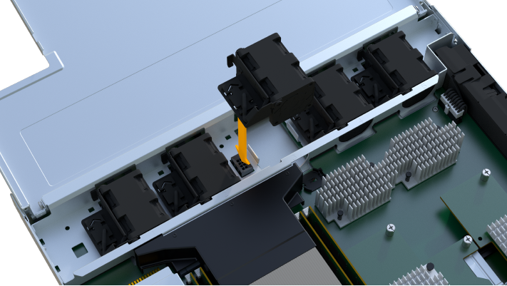

= EF300 또는 EF600 팬을 교체합니다
:allow-uri-read: 
:experimental: 
:icons: font
:imagesdir: ../media/

[role="lead"]
EF300 또는 EF600 어레이에서 팬을 교체할 수 있습니다.

.이 작업에 대해
각 EF300 및 EF600 컨트롤러 쉘프 또는 드라이브 쉘프에는 5개의 팬이 포함됩니다. 팬에 장애가 발생할 경우 가능한 한 빨리 팬을 교체하여 선반이 충분히 냉각되도록 해야 합니다.

.시작하기 전에
다음 사항을 확인하십시오.

* 교체용 팬
* ESD 밴드이거나 다른 정전기 방지 예방 조치를 취했습니다.
* 평평하고 정전기가 없는 작업 공간.
* 컨트롤러 캐니스터에 연결된 각 케이블을 식별하는 레이블입니다.
* 컨트롤러의 SANtricity 시스템 관리자에 액세스할 수 있는 브라우저가 있는 관리 스테이션. System Manager 인터페이스를 열려면 브라우저에서 컨트롤러의 도메인 이름 또는 IP 주소를 가리킵니다.

== 1단계: 컨트롤러를 오프라인으로 전환합니다

장애가 발생한 팬을 안전하게 교체할 수 있도록 컨트롤러 캐니스터를 오프라인으로 설정합니다.

.단계
. SANtricity 시스템 관리자로부터 Recovery Guru의 세부 정보를 검토하여 팬에 문제가 있는지 확인하고 다른 항목을 먼저 해결하지 않도록 합니다.
. Recovery Guru의 세부 정보 영역에서 교체할 팬을 결정합니다.
. SANtricity System Manager를 사용하여 스토리지 시스템의 구성 데이터베이스를 백업합니다.
+
컨트롤러를 제거할 때 문제가 발생하면 저장된 파일을 사용하여 구성을 복원할 수 있습니다. 시스템에서 RAID 구성 데이터베이스의 현재 상태를 저장합니다. 이 데이터베이스는 볼륨 그룹 및 컨트롤러의 디스크 풀에 대한 모든 데이터를 포함합니다.

+
** System Manager에서:
+
... 지원 [지원 센터 > 진단] 메뉴를 선택합니다.
... 구성 데이터 수집 * 을 선택합니다.
... 수집 * 을 클릭합니다.
+
파일은 브라우저의 다운로드 폴더에 * configurationData - <arrayName> - <DateTime>.7z * 라는 이름으로 저장됩니다.

. 컨트롤러가 아직 오프라인 상태가 아닌 경우 SANtricity 시스템 관리자를 사용하여 오프라인 상태로 전환합니다.
+
.. 하드웨어 * 를 선택합니다.
.. 그래픽에 드라이브가 표시되면 * 쉘프 뒷면 표시 * 를 선택하여 컨트롤러를 표시합니다.
.. 오프라인 상태로 설정할 컨트롤러를 선택합니다.
.. 상황에 맞는 메뉴에서 * 오프라인 상태로 전환 * 을 선택하고 작업을 수행할지 확인합니다.

+

NOTE: 오프라인으로 전환하려고 하는 컨트롤러를 사용하여 SANtricity 시스템 관리자에 액세스하는 경우 SANtricity 시스템 관리자를 사용할 수 없음 메시지가 표시됩니다. 다른 컨트롤러를 사용하여 SANtricity 시스템 관리자에 자동으로 액세스하려면 * 대체 네트워크 연결 * 을 선택합니다.

. SANtricity 시스템 관리자가 컨트롤러의 상태를 오프라인으로 업데이트할 때까지 기다립니다.
+

NOTE: 상태가 업데이트되기 전에는 다른 작업을 시작하지 마십시오.

. Recovery Guru에서 * Recheck * 를 선택하고 세부 정보 영역에서 * OK to remove * 필드가 Yes 로 표시되어 이 구성 요소를 제거해도 안전함을 나타내는지 확인합니다.

== 2단계: 컨트롤러 캐니스터 제거

고장난 팬을 새 팬으로 교체할 수 있도록 컨트롤러 캐니스터를 제거합니다.

.단계
. ESD 밴드를 착용하거나 정전기 방지 조치를 취하십시오.
. 컨트롤러 캐니스터에 부착된 각 케이블에 레이블을 부착합니다.
. 컨트롤러 캐니스터에서 모든 케이블을 분리합니다.
+

CAUTION: 성능 저하를 방지하려면 케이블을 비틀거나 접거나 끼거나 밟지 마십시오.

. 컨트롤러 후면의 캐시 활성 LED가 꺼져 있는지 확인합니다.
. 컨트롤러의 양쪽에 있는 손잡이를 잡고 다시 당겨서 쉘프에서 빼냅니다.
+
image::../media/remove_controller_5.png[핸들을 쥐어 컨트롤러를 제거합니다]

. 두 손과 핸들을 사용하여 컨트롤러 캐니스터를 선반에서 밀어 꺼냅니다. 컨트롤러 전면에 엔클로저가 없을 경우 두 손을 사용하여 완전히 빼냅니다.
+

CAUTION: 항상 두 손을 사용하여 컨트롤러 캐니스터의 무게를 지지하십시오.

+
image::../media/remove_controller_6.png[분리할 때 두 손으로 컨트롤러의 무게를 지탱합니다]

. 컨트롤러 캐니스터를 평평하고 정전기가 없는 표면에 놓습니다.

== 3단계: 장애가 발생한 팬을 제거합니다

고장난 팬을 분리하여 새 팬으로 교체할 수 있습니다.

.단계
. 단일 나비 나사를 풀고 덮개를 들어올려 컨트롤러 캐니스터의 덮개를 제거합니다.
. 컨트롤러 내부의 녹색 LED가 꺼져 있는지 확인합니다.
+
이 녹색 LED가 켜져 있으면 컨트롤러는 여전히 배터리 전원을 사용하고 있습니다. 구성 요소를 제거하기 전에 이 LED가 꺼질 때까지 기다려야 합니다.

. 컨트롤러에서 장애가 발생한 팬을 조심스럽게 들어 올립니다.
+
image::../media/fan_2.png[팬을 분리합니다]

== 4단계: 새 팬을 설치합니다

새 팬을 설치하여 장애가 발생한 팬을 교체합니다.

.단계
. 교체 팬을 선반 안으로 완전히 밀어 넣습니다.
+
image::../media/fan_3.png[팬을 컨트롤러에 설치합니다]

+

== 5단계: 컨트롤러 캐니스터 재설치

새 팬을 설치한 후 컨트롤러 캐니스터를 컨트롤러 쉘프에 다시 설치합니다.

.단계
. 컨트롤러 캐니스터의 덮개를 내리고 나비나사를 고정합니다.
. 컨트롤러 손잡이를 잡은 상태에서 컨트롤러 캐니스터를 천천히 컨트롤러 쉘프에 밀어 넣습니다.
+

NOTE: 컨트롤러가 올바르게 설치되면 딸깍하는 소리가 납니다.

+
image::../media/remove_controller_7.png[컨트롤러를 쉘프에 설치합니다]

== 6단계: 팬 교체 완료

컨트롤러를 온라인 상태로 전환하고 지원 데이터를 수집하며 운영을 재개하십시오.

. 컨트롤러를 온라인으로 설정합니다.
+
.. System Manager에서 하드웨어 페이지로 이동합니다.
.. 컨트롤러 후면 표시 * 를 선택합니다.
.. 교체한 팬이 있는 컨트롤러를 선택합니다.
.. 드롭다운 목록에서 * 온라인 상태로 * 를 선택합니다.

. 컨트롤러가 부팅되면 컨트롤러 LED를 확인합니다.
+
다른 컨트롤러와의 통신이 재설정된 경우:

+
** 황색 주의 LED가 계속 켜져 있습니다.
** 호스트 인터페이스에 따라 호스트 링크 LED가 켜지거나 깜박이거나 꺼질 수 있습니다.

. 컨트롤러가 다시 온라인 상태가 최적인지 확인하고 컨트롤러 쉘프의 주의 LED를 확인합니다.
+
상태가 최적이 아니거나 주의 LED 중 하나라도 켜져 있으면 모든 케이블이 올바르게 장착되고 컨트롤러 캐니스터가 올바르게 설치되었는지 확인합니다. 필요한 경우 컨트롤러 캐니스터를 제거하고 다시 설치합니다.

+

NOTE: 문제를 해결할 수 없는 경우 기술 지원 부서에 문의하십시오.

. 최신 버전의 SANtricity OS가 설치되어 있는지 확인하려면 메뉴: 하드웨어 [지원 > 업그레이드 센터]를 클릭합니다.
+
필요한 경우 최신 버전을 설치합니다.

. 모든 볼륨이 기본 소유자에게 반환되었는지 확인합니다.
+
.. Storage [Volumes](저장소 [볼륨]) 메뉴를 선택합니다. 모든 볼륨 * 페이지에서 볼륨이 기본 소유자에게 배포되었는지 확인합니다. 메뉴 선택: More [Change Ownership](자세히[소유권 변경])를 선택하면 볼륨 소유자가 표시됩니다.
.. 기본 소유자가 볼륨을 모두 소유한 경우 6단계를 계속 진행하십시오.
.. 반환된 볼륨이 없는 경우 볼륨을 수동으로 반환해야 합니다. More [Redistribute volumes](추가 [볼륨 재배포]) 메뉴로 이동합니다.
.. 자동 배포 또는 수동 배포 후 일부 볼륨만 기본 소유자에게 반환되는 경우 Recovery Guru에서 호스트 연결 문제를 확인해야 합니다.
.. Recovery Guru가 없거나 복구 전문가 단계를 수행한 후에도 볼륨은 여전히 선호하는 소유자에게 반환되지 않는 경우 지원 부서에 문의하십시오.

. SANtricity 시스템 관리자를 사용하여 스토리지 어레이에 대한 지원 데이터를 수집합니다.
+
.. 지원 [지원 센터 > 진단] 메뉴를 선택합니다.
.. 지원 데이터 수집 * 을 선택합니다.
.. 수집 * 을 클릭합니다.
+
파일은 브라우저의 다운로드 폴더에 * support-data.7z * 라는 이름으로 저장됩니다.

.다음 단계
팬 교체가 완료되었습니다. 일반 작업을 다시 시작할 수 있습니다.
