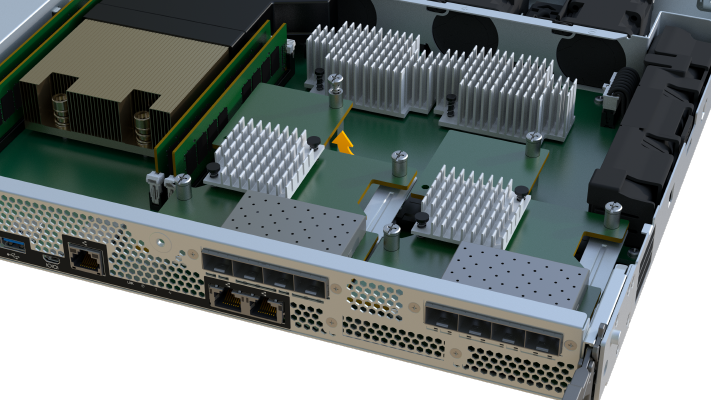

= EF300 또는 EF600 호스트 인터페이스 카드(HIC) 업그레이드
:allow-uri-read: 
:experimental: 
:icons: font
:imagesdir: ../media/

[role="lead"]
HIC(호스트 인터페이스 카드)를 업그레이드하여 호스트 포트 수를 늘리거나 호스트 프로토콜을 변경할 수 있습니다.

.이 작업에 대해
* HIC를 업그레이드할 때는 스토리지 어레이의 전원을 끄고 HIC를 업그레이드한 다음 전원을 다시 적용해야 합니다.
* EF300 또는 EF600 컨트롤러에서 HIC를 업그레이드할 때 모든 단계를 반복하여 두 번째 컨트롤러를 제거하고, 두 번째 컨트롤러의 HIC를 업그레이드한 다음, 컨트롤러 쉘프에 전원을 다시 설치하기 전에 두 번째 컨트롤러를 다시 설치합니다.

.시작하기 전에
* 검토 link:hics-overview-supertask-concept.html["EF300 또는 EF600 HIC 업그레이드 요구사항"].
* 이 절차에 대한 다운타임 유지 보수 기간을 예약합니다. 이 절차를 성공적으로 완료할 때까지 스토리지 배열의 데이터에 액세스할 수 없습니다. 두 컨트롤러의 전원이 켜져 있을 때 동일한 HIC 구성을 가져야 하므로 HIC를 설치할 때는 전원을 꺼야 합니다.

.무엇을 &#8217;필요로 할거야
* 컨트롤러와 호환되는 2개의 HIC.
* ESD 밴드이거나 다른 정전기 방지 예방 조치를 취했습니다.
* 평평하고 정전기가 없는 작업 공간.
* 컨트롤러 캐니스터에 연결된 각 케이블을 식별하는 레이블입니다.
* 1 십자 드라이버.
* 컨트롤러의 SANtricity 시스템 관리자에 액세스할 수 있는 브라우저가 있는 관리 스테이션. System Manager 인터페이스를 열려면 브라우저에서 컨트롤러의 도메인 이름 또는 IP 주소를 가리킵니다.

CAUTION: * 데이터 액세스 손실 가능성 * -- HIC가 다른 E-Series 컨트롤러를 위해 설계된 경우 EF300 또는 EF600 컨트롤러 캐니스터에 HIC를 설치하지 않습니다. 또한 컨트롤러와 HIC는 모두 동일해야 합니다. 호환되지 않거나 일치하지 않는 HIC가 있으면 전원을 공급하면 컨트롤러가 잠깁니다.

== 1단계: 컨트롤러 쉘프를 오프라인 상태로 전환합니다

HIC를 안전하게 업그레이드할 수 있도록 컨트롤러 쉘프를 오프라인 상태로 전환합니다.

.단계
. SANtricity 시스템 관리자의 홈 페이지에서 스토리지 어레이가 최적의 상태인지 확인합니다.
+
상태가 최적이 아닌 경우 Recovery Guru를 사용하거나 기술 지원 부서에 문의하여 문제를 해결하십시오. 이 절차를 계속 진행하지 마십시오.

. SANtricity System Manager를 사용하여 스토리지 시스템의 구성 데이터베이스를 백업합니다.
+
컨트롤러를 제거할 때 문제가 발생하면 저장된 파일을 사용하여 구성을 복원할 수 있습니다. 시스템에서 RAID 구성 데이터베이스의 현재 상태를 저장합니다. 이 데이터베이스는 볼륨 그룹 및 컨트롤러의 디스크 풀에 대한 모든 데이터를 포함합니다.

+
** System Manager에서:
+
... 지원 [지원 센터 > 진단] 메뉴를 선택합니다.
... 구성 데이터 수집 * 을 선택합니다.
... 수집 * 을 클릭합니다.
+
파일은 브라우저의 다운로드 폴더에 * configurationData - <arrayName> - <DateTime>.7z * 라는 이름으로 저장됩니다.

. 스토리지 시스템과 접속된 모든 호스트 간에 입출력 작업이 발생하지 않도록 합니다. 예를 들어, 다음 단계를 수행할 수 있습니다.
+
** 스토리지에서 호스트로 매핑된 LUN이 포함된 모든 프로세스를 중지합니다.
** 스토리지에서 호스트로 매핑된 LUN에 데이터를 쓰는 애플리케이션이 없는지 확인합니다.
** 스토리지의 볼륨과 연결된 모든 파일 시스템을 마운트 해제합니다.
+

NOTE: 호스트 I/O 작업을 중지하는 정확한 단계는 호스트 운영 체제 및 구성에 따라 달라지며, 이 지침은 다루지 않습니다. 사용자 환경에서 호스트 I/O 작업을 중지하는 방법을 모르는 경우 호스트를 종료하는 것이 좋습니다.

+

CAUTION: * 데이터 손실 가능성 * -- I/O 작업이 진행되는 동안 이 절차를 계속하면 스토리지를 액세스할 수 없기 때문에 호스트 애플리케이션에서 데이터에 액세스할 수 없게 됩니다.

. 캐시 메모리의 데이터가 드라이브에 기록될 때까지 기다립니다.
+
드라이브에 캐시된 데이터를 기록해야 하는 경우 각 컨트롤러 후면의 녹색 캐시 활성 LED가 켜집니다. 이 LED가 꺼질 때까지 기다려야 합니다.

. SANtricity 시스템 관리자의 홈 페이지에서 * 진행 중인 작업 보기 * 를 선택합니다. 다음 단계를 계속하기 전에 모든 작업이 완료될 때까지 기다리십시오.
. 컨트롤러 쉘프의 전원을 끕니다.
+
.. 컨트롤러 쉘프의 두 전원 케이블을 모두 뽑고 이 케이블을 뽑습니다.
.. 컨트롤러 쉘프의 모든 LED가 꺼질 때까지 기다립니다.

== 2단계: 컨트롤러 캐니스터 제거

새 HIC를 업그레이드할 수 있도록 컨트롤러 캐니스터를 제거합니다.

.단계
. 컨트롤러 캐니스터에 부착된 각 케이블에 레이블을 부착합니다.
. 컨트롤러 캐니스터에서 모든 케이블을 분리합니다.
+

CAUTION: 성능 저하를 방지하려면 케이블을 비틀거나 접거나 끼거나 밟지 마십시오.

. HIC 포트에서 SFP+ 트랜시버를 사용하는 경우 제거합니다.
+
업그레이드하는 HIC 유형에 따라 SFP를 다시 사용할 수 있습니다.

. 컨트롤러 후면의 캐시 활성 LED가 꺼져 있는지 확인합니다.
. 컨트롤러의 양쪽에 있는 손잡이를 잡고 다시 당겨서 쉘프에서 빼냅니다.
+
image::../media/remove_controller_5.png[컨트롤러 5 를 탈착합니다]

. 두 손과 핸들을 사용하여 컨트롤러 캐니스터를 선반에서 밀어 꺼냅니다. 컨트롤러 전면에 엔클로저가 없을 경우 두 손을 사용하여 완전히 빼냅니다.
+

CAUTION: 항상 두 손을 사용하여 컨트롤러 캐니스터의 무게를 지지하십시오.

+
image::../media/remove_controller_6.png[컨트롤러 6 을 탈착합니다]

. 컨트롤러 캐니스터를 평평하고 정전기가 없는 표면에 놓습니다.

== 3단계: HIC를 제거합니다

기존 HIC를 제거하여 업그레이드된 HIC로 대체할 수 있습니다.

.단계
. 단일 나비 나사를 풀고 덮개를 들어올려 컨트롤러 캐니스터의 덮개를 제거합니다.
. 컨트롤러 내부의 녹색 LED가 꺼져 있는지 확인합니다.
+
이 녹색 LED가 켜져 있으면 컨트롤러는 여전히 배터리 전원을 사용하고 있습니다. 구성 요소를 제거하기 전에 이 LED가 꺼질 때까지 기다려야 합니다.

. 십자 드라이버를 사용하여 HIC 페이스플레이트를 컨트롤러 캐니스터에 연결하는 나사 2개를 제거합니다.
+
image::../media/hic_2.png[HIC 2]

+

NOTE: 위의 이미지는 HIC의 모양이 다를 수 있는 예입니다.

. HIC 페이스플레이트를 탈거하십시오.
. 손가락이나 십자 드라이버를 사용하여 HIC를 컨트롤러 카드에 고정하는 단일 나비 나사를 풉니다.
+
image::../media/hic_3.png[HIC 3]

+

NOTE: HIC는 상단에 3개의 나사 위치가 있지만 1개만 고정됩니다.

+

NOTE: 위의 이미지는 HIC의 모양이 다를 수 있는 예입니다.

. 컨트롤러 카드를 들어올리고 컨트롤러 밖으로 빼서 HIC를 컨트롤러 카드에서 조심스럽게 분리합니다.
+

CAUTION: HIC 하단 또는 컨트롤러 카드 상단에 있는 구성 요소가 긁히거나 범프되지 않도록 주의하십시오.

+

+

NOTE: 위의 이미지는 HIC의 모양이 다를 수 있는 예입니다.

. HIC를 평평하고 정전기가 없는 표면에 놓습니다.

== 4단계: HIC를 업그레이드합니다

기존 HIC를 제거한 후 새 HIC를 설치합니다.

CAUTION: * 데이터 액세스 손실 가능성 * -- HIC가 다른 E-Series 컨트롤러를 위해 설계된 경우 EF300 또는 EF600 컨트롤러 캐니스터에 HIC를 설치하지 않습니다. 또한 컨트롤러와 HIC는 모두 동일해야 합니다. 호환되지 않거나 일치하지 않는 HIC가 있으면 전원을 공급하면 컨트롤러가 잠깁니다.

.단계
. 새 HIC 및 새 HIC 페이스플레이트의 포장을 풉니다.
. HIC의 단일 나비나사를 컨트롤러의 해당 구멍에 맞추고 HIC 아래쪽에 있는 커넥터를 컨트롤러 카드의 HIC 인터페이스 커넥터와 맞춥니다.
+
HIC 하단 또는 컨트롤러 카드 상단에 있는 구성 요소가 긁히거나 범프되지 않도록 주의하십시오.

+
image::../media/hic_7.png[HIC 7]

+

NOTE: 위의 이미지는 HIC의 모양이 다를 수 있는 예입니다.

. HIC를 조심스럽게 제자리로 내리고 HIC 커넥터를 가볍게 눌러 HIC 커넥터를 장착합니다.
+

CAUTION: * 발생 가능한 장비 손상 * -- HIC와 나비나사 사이에 있는 컨트롤러 LED의 골드 리본 커넥터가 끼이지 않도록 매우 조심하십시오.

. HIC 나비나사를 손으로 조입니다.
+
image::../media/hic_3.png[HIC 3]

+

NOTE: 위의 이미지는 예시이며 HIC의 모양은 다를 수 있습니다.

+

NOTE: 드라이버를 사용하지 마십시오. 또는 나사를 너무 세게 조일 수 있습니다.

. 1 십자 드라이버를 사용하여 원래 HIC에서 제거한 HIC 면판을 나사 3개로 장착합니다.

== 5단계: 컨트롤러 캐니스터 재설치

HIC를 업그레이드한 후 컨트롤러 캐니스터를 컨트롤러 쉘프에 다시 설치합니다.

.단계
. 컨트롤러 캐니스터의 덮개를 내리고 나비나사를 고정합니다.
. 컨트롤러 손잡이를 잡은 상태에서 컨트롤러 캐니스터를 천천히 컨트롤러 쉘프에 밀어 넣습니다.
+

NOTE: 컨트롤러가 올바르게 설치되면 딸깍하는 소리가 납니다.

+
image::../media/remove_controller_7.png[컨트롤러 7 을 탈착합니다]

. 제거된 경우 SFP를 새 HIC에 설치하고 모든 케이블을 다시 연결합니다. 둘 이상의 호스트 프로토콜을 사용하는 경우 올바른 호스트 포트에 SFP를 설치해야 합니다.
+
둘 이상의 호스트 프로토콜을 사용하는 경우 올바른 호스트 포트에 SFP를 설치해야 합니다.

== 6단계: HIC 업그레이드를 완료합니다

컨트롤러를 온라인 상태로 전환하고 지원 데이터를 수집하며 운영을 재개하십시오.

.단계
. 컨트롤러를 온라인으로 설정합니다.
+
.. 전원 케이블을 연결합니다.

. 컨트롤러가 부팅되면 컨트롤러 LED를 확인합니다.
+
** 황색 주의 LED가 계속 켜져 있습니다.
** 호스트 인터페이스에 따라 호스트 링크 LED가 켜지거나 깜박이거나 꺼질 수 있습니다.

. 컨트롤러가 다시 온라인 상태가 최적인지 확인하고 컨트롤러 쉘프의 주의 LED를 확인합니다.
+
상태가 최적이 아니거나 주의 LED 중 하나라도 켜져 있으면 모든 케이블이 올바르게 장착되고 컨트롤러 캐니스터가 올바르게 설치되었는지 확인합니다. 필요한 경우 컨트롤러 캐니스터를 제거하고 다시 설치합니다.

+

NOTE: 문제를 해결할 수 없는 경우 기술 지원 부서에 문의하십시오.

. 최신 버전의 SANtricity OS가 설치되어 있는지 확인하려면 메뉴: 하드웨어 [지원 > 업그레이드 센터]를 클릭합니다.
+
필요한 경우 최신 버전을 설치합니다.

. 모든 볼륨이 기본 소유자에게 반환되었는지 확인합니다.
+
.. Storage [Volumes](저장소 [볼륨]) 메뉴를 선택합니다. 모든 볼륨 * 페이지에서 볼륨이 기본 소유자에게 배포되었는지 확인합니다. 메뉴 선택: More [Change Ownership](자세히[소유권 변경])를 선택하면 볼륨 소유자가 표시됩니다.
.. 기본 소유자가 볼륨을 모두 소유한 경우 6단계를 계속 진행하십시오.
.. 반환된 볼륨이 없는 경우 볼륨을 수동으로 반환해야 합니다. More [Redistribute volumes](추가 [볼륨 재배포]) 메뉴로 이동합니다.
.. 자동 배포 또는 수동 배포 후 일부 볼륨만 기본 소유자에게 반환되는 경우 Recovery Guru에서 호스트 연결 문제를 확인해야 합니다.
.. Recovery Guru가 없거나 복구 전문가 단계를 수행한 후에도 볼륨은 여전히 선호하는 소유자에게 반환되지 않는 경우 지원 부서에 문의하십시오.

. SANtricity 시스템 관리자를 사용하여 스토리지 어레이에 대한 지원 데이터를 수집합니다.
+
.. 지원 [지원 센터 > 진단] 메뉴를 선택합니다.
.. 지원 데이터 수집 * 을 선택합니다.
.. 수집 * 을 클릭합니다.
+
파일은 브라우저의 다운로드 폴더에 * support-data.7z * 라는 이름으로 저장됩니다.

스토리지 배열에서 호스트 인터페이스 카드를 업그레이드하는 프로세스가 완료되었습니다. 일반 작업을 다시 시작할 수 있습니다.
