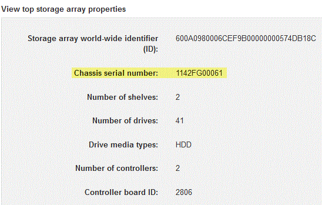
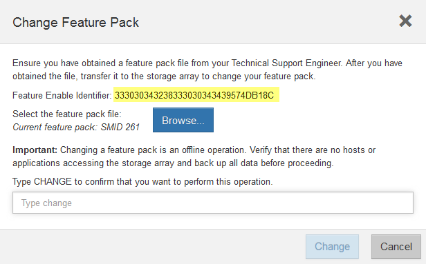

= EF300 또는 EF600의 호스트 프로토콜 변경
:allow-uri-read: 
:experimental: 
:icons: font
:imagesdir: ../media/

[role="lead"]
EF300, EF600, EF300C 또는 EF600C 어레이에서 호스트 포트 프로토콜을 변경하려면 다음 절차를 따르십시오. 이 절차는 Infiniband(IB) 또는 파이버 채널(FC)을 사용하는 호스트 인터페이스 카드(HIC)에만 적용됩니다.

== 1단계: 기능 팩 키를 얻습니다

기능 팩 키를 얻으려면 컨트롤러 쉘프의 일련 번호, 기능 활성화 코드 및 스토리지 어레이의 기능 활성화 식별자가 필요합니다.

.단계
. 일련 번호를 찾습니다.
+
.. SANtricity 시스템 관리자에서 지원 [지원 센터] 메뉴를 선택합니다.
.. 지원 리소스 * 탭을 선택한 상태에서 * 상위 스토리지 어레이 속성 보기 * 섹션으로 스크롤합니다.
.. 섀시 일련 번호 * 를 찾아 이 값을 텍스트 파일로 복사합니다.
+

. 피처 팩 하위 모델 ID * 를 찾습니다.
+
.. SANtricity 시스템 관리자에서 * 지원 * 을 선택합니다.
.. 지원 센터 * 타일을 선택합니다.
.. 지원 리소스 탭에서 * 스토리지 어레이 프로필 * 링크를 찾아 선택합니다.
.. 텍스트 상자에 * 피처 팩 하위 모델 ID * 를 입력하고 * 찾기 * 를 클릭합니다.
.. 시작 구성에 대한 피처 팩 하위 모델 ID를 찾습니다.
+
image::../media/storage_array_profile2_maint-ef600.gif[스토리지 배열 프로파일]

. 기능 팩 하위 모델 ID를 사용하여 시작 구성에 대한 해당 컨트롤러 하위 모델 ID를 찾고 다음 표에서 원하는 최종 구성에 대한 기능 활성화 코드를 찾습니다. 그런 다음 해당 기능 활성화 코드를 텍스트 파일로 복사합니다.
+
|===
2+| 구성을 시작하는 중입니다 2+| 설정을 종료하는 중입니다 .2+| 기능 활성화 코드 

| 컨트롤러 하위 모델 ID | HIC 포트 | 컨트롤러 하위 모델 ID | HIC 포트 

 a| 
443
 a| 
NVMe/FC, NVMe/RoCE 또는 iSCSI
 a| 
444
 a| 
NVMe/FC 또는 NVMe/IB
 a| 
DH5-HB4-ZK9QH

 a| 
448
 a| 
FC
 a| 
JHX-UB4-ZGTP1

 a| 
491
 a| 
iSER/IB
 a| 
0H1-675-Z5SII

 a| 
492
 a| 
SRP/IB
 a| 
NHD-V75-ZB6ZX

 a| 
444
 a| 
NVMe/FC 또는 NVMe/IB
 a| 
443
 a| 
NVMe/FC, NVMe/RoCE 또는 iSCSI
 a| 
YH3-XB4-ZJRIZ

 a| 
448
 a| 
FC
 a| 
2HU-BB4-ZFCG5

 a| 
491
 a| 
iSER/IB
 a| 
2H3-P75-Z6AQG

 a| 
492
 a| 
SRP/IB
 a| 
5HG-G75-ZDNEZ

 a| 
448
 a| 
FC
 a| 
443
 a| 
NVMe/FC, NVMe/RoCE 또는 iSCSI
 a| 
7HZ-EB4-ZHAYW

 a| 
444
 a| 
NVMe/FC 또는 NVMe/IB
 a| 
LHS-RB4-ZDV29

 a| 
491
 a| 
iSER/IB
 a| 
FH6-975-Z7Q7H

 a| 
492
 a| 
SRP/IB
 a| 
0HI-Z75-ZE4L5

 a| 
491
 a| 
iSER/IB
 a| 
443
 a| 
NVMe/FC, NVMe/RoCE 또는 iSCSI
 a| 
MHQ-M85-ZIJNT

 a| 
444
 a| 
NVMe/FC 또는 NVMe/IB
 a| 
4HS-685-ZJZ1U

 a| 
448
 a| 
FC
 a| 
YHU-P85-ZLHCX

 a| 
465
 a| 
FC/PTL
 a| 
AHX-985-ZMXMI

 a| 
492
 a| 
SRP/IB
 a| 
ZHZ-S85-ZNF4J

 a| 
492
 a| 
SRP/IB
 a| 
443
 a| 
NVMe/FC, NVMe/RoCE 또는 iSCSI
 a| 
EH3-C85-Z0V93

 a| 
444
 a| 
NVMe/FC 또는 NVMe/IB
 a| 
BH5-V85-ZQDQJ

 a| 
448
 a| 
FC
 a| 
1H8-F85-ZRT1V

 a| 
465
 a| 
FC/PTL
 a| 
1HA-Y85-ZSB7S

 a| 
491
 a| 
iSER/IB
 a| 
KHD-I85-ZUSMI

 a| 
465
 a| 
FC/PTL
 a| 
491
 a| 
iSER
 a| 
6H8-S75-Z98FH

 a| 
492
 a| 
SRP
 a| 
NHL-J75-ZFL3W

 a| 
516
 a| 
NVMe/FC, NVMe/RoCE 또는 iSCSI
 a| 
517
 a| 
NVMe/IB 또는 NVMe/FC
 a| 
LHF-285-ZV9YZ

 a| 
518
 a| 
FC
 a| 
ihi-L85-ZXQEP

 a| 
519
 a| 
iSER/IB
 a| 
RHK-585-ZY7P5

 a| 
520
 a| 
FC-PTL
 a| 
NHN-095-ZZ0XF

 a| 
521입니다
 a| 
SRP/IB
 a| 
GHP-895-Z25BD

 a| 
517
 a| 
NVMe/IB 또는 NVMe/FC
 a| 
516
 a| 
NVMe/FC, NVMe/RoCE 또는 iSCSI
 a| 
7HS-R95-Z3M06

 a| 
518
 a| 
FC
 a| 
UHU-B95-Z43X2

 a| 
519
 a| 
FC-PTL
 a| 
8HX-U95-Z5K6F

 a| 
520
 a| 
iSER/IB
 a| 
UHZ-E95-Z71LH

 a| 
521입니다
 a| 
SRP/IB
 a| 
SH2-X95-Z8IVS

 a| 
518
 a| 
FC
 a| 
516
 a| 
NVMe/FC, NVMe/RoCE 또는 iSCSI
 a| 
UH5-H95-Z9Z58

 a| 
517
 a| 
NVMe/FC 또는 NVMe/IB
 a| 
XH7-195-ZBGJC

 a| 
519
 a| 
FC-PTL
 a| 
FHA-K95-ZCXX0

 a| 
520
 a| 
iSER/IB
 a| 
JHC-595-ZDE3X

 a| 
521입니다
 a| 
SRP/IB
 a| 
0HF-095-ZFVFN

 a| 
519
 a| 
FC-PTL
 a| 
516
 a| 
NVMe/FC, NVMe/RoCE 또는 iSCSI
 a| 
YHH-895-ZGCXS

 a| 
517
 a| 
NVMe/FC 또는 NVMe/IB
 a| 
2HK-R95-ZHT83

 a| 
518
 a| 
FC
 a| 
1HM-BA5-ZJALA

 a| 
520
 a| 
iSER/IB
 a| 
YHP-UA5-ZKRXA

 a| 
521입니다
 a| 
SRP/IB
 a| 
MHR-EA5-ZL83V

 a| 
520
 a| 
iSER/IB
 a| 
516
 a| 
NVMe/FC, NVMe/RoCE 또는 iSCSI
 a| 
HHU-XA5-ZNPLT

 a| 
517
 a| 
NVMe/FC 또는 NVMe/IB
 a| 
YHW-HA2-Z07QK

 a| 
518
 a| 
FC
 a| 
WHZ-1A5-ZPN4U

 a| 
519
 a| 
FC/PTL
 a| 
7H2-KA5-ZR5C3

 a| 
521입니다
 a| 
SRP
 a| 
3H5-4A5-ZSLVX

 a| 
521입니다
 a| 
SRP/IB
 a| 
516
 a| 
NVMe/FC, NVMe/RoCE 또는 iSCSI
 a| 
1H7-NA5-ZT31W

 a| 
517
 a| 
NVMe/FC 또는 NVMe/IB
 a| 
XHA-7A5-ZVJGC

 a| 
518
 a| 
FC
 a| 
KHC-QA5-ZW1P3

 a| 
519
 a| 
FC/PTL
 a| 
CHE-AA5-ZXH2F

 a| 
520
 a| 
iSER/IB
 a| 
SHH-TA5-ZZYHS

|===
+

NOTE: 컨트롤러 하위 모델 ID가 목록에 없으면 에 문의하십시오 https://mysupport.netapp.com/site/["NetApp 지원"^].

. System Manager에서 Enable Identifier 기능을 찾습니다.
+
.. 설정 [시스템] 메뉴로 이동합니다.
.. 아래로 스크롤하여 * 추가 기능 * 을 찾습니다.
.. 기능 팩 변경 * 에서 * 기능 식별자 사용 * 을 찾습니다.
.. 이 32자리 숫자를 복사하여 텍스트 파일에 붙여 넣습니다.
+

. 로 이동합니다 http://partnerspfk.netapp.com["NetApp 라이센스 활성화: 스토리지 어레이 프리미엄 기능 활성화"^]을 누르고 기능 팩을 얻는 데 필요한 정보를 입력합니다.
+
** 섀시 일련 번호
** 기능 활성화 코드
** 기능 활성화 식별자 참고: 프리미엄 기능 활성화 웹 사이트에는 ""프리미엄 기능 활성화 지침" 링크가 포함되어 있습니다. 이 절차에 이러한 지침을 사용하지 마십시오.

. 기능 팩의 키 파일을 이메일로 받을지 또는 사이트에서 직접 다운로드할지 여부를 선택합니다.

== 2단계: 호스트 I/O 중지

호스트 포트의 프로토콜을 변환하기 전에 호스트에서 모든 입출력 작업을 중지합니다.

변환을 완료할 때까지 스토리지 배열의 데이터에 액세스할 수 없습니다.

.단계
. 스토리지 시스템과 접속된 모든 호스트 간에 입출력 작업이 발생하지 않도록 합니다. 예를 들어, 다음 단계를 수행할 수 있습니다.
+
** 스토리지에서 호스트로 매핑된 LUN이 포함된 모든 프로세스를 중지합니다.
** 스토리지에서 호스트로 매핑된 LUN에 데이터를 쓰는 애플리케이션이 없는지 확인합니다.
** 스토리지의 볼륨과 연결된 모든 파일 시스템을 마운트 해제합니다.
+

NOTE: 호스트 I/O 작업을 중지하는 정확한 단계는 호스트 운영 체제 및 구성에 따라 달라지며, 이 지침은 다루지 않습니다. 사용자 환경에서 호스트 I/O 작업을 중지하는 방법을 모르는 경우 호스트를 종료하는 것이 좋습니다.

+

CAUTION: * 데이터 손실 가능성 * -- I/O 작업이 진행되는 동안 이 절차를 계속하면 데이터가 손실될 수 있습니다.

. 캐시 메모리의 데이터가 드라이브에 기록될 때까지 기다립니다.
+
드라이브에 캐시된 데이터를 기록해야 하는 경우 각 컨트롤러 후면의 녹색 캐시 활성 LED가 켜집니다. 이 LED가 꺼질 때까지 기다려야 합니다.

. SANtricity 시스템 관리자의 홈 페이지에서 * 진행 중인 작업 보기 * 를 선택합니다.
. 다음 단계를 계속하기 전에 모든 작업이 완료될 때까지 기다리십시오.

== 3단계: 기능 팩을 변경합니다

기능 팩을 변경하여 호스트 포트의 호스트 프로토콜을 변환합니다.

.단계
. SANtricity 시스템 관리자에서 설정 [시스템] 메뉴를 선택합니다.
. 추가 기능 * 아래에서 * 기능 팩 변경 * 을 선택합니다.
+
image::../media/sam1130_ss_system_change_feature_pack_maint-ef600.gif[기능 팩을 변경합니다]

. 찾아보기 * 를 클릭한 다음 적용할 기능 팩을 선택합니다.
. 필드에 * change * 를 입력합니다.
. 변경 * 을 클릭합니다.
+
기능 팩 마이그레이션이 시작됩니다. 두 컨트롤러가 자동으로 두 번 재부팅되므로 새 기능 팩이 적용됩니다. 재부팅이 완료되면 스토리지 배열이 응답 상태로 돌아갑니다.

. 호스트 포트에 원하는 프로토콜이 있는지 확인합니다.
+
.. SANtricity 시스템 관리자에서 * 하드웨어 * 를 선택합니다.
.. Show back of shelf * 를 클릭합니다.
.. 컨트롤러 A 또는 컨트롤러 B의 그래픽을 선택합니다
.. 컨텍스트 메뉴에서 * 설정 보기 * 를 선택합니다.
.. Host Interfaces * 탭을 선택합니다.
.. 추가 설정 표시 * 를 클릭합니다.

.다음 단계
로 이동합니다 link:hpp-complete-protocol-conversion-task.html["호스트 프로토콜 변환을 완료합니다"].
